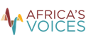

# Exploring Provenance Through Programming  
## Incorporating Data Provenance Into Heterogeneous Data Visualizations in the Context of Africa’s Voices Foundation

## Project Scope and Goals

In this project, students will explore how the provenance of data can be made explorable in visualizations for data of the Africa’s Voices Foundation (AVF) to support decision making beyond pre-figured questions. Therefore, the students will build a platform that supports new and unforeseen visualizations of data to be built, as well as constructing several examples.

-	Explore means for exploring the provenance of parts of visualizations
-	Implement a domain model for working with the AVF provenance data
-	Design and implement means to support programming visualizations which allow the exploration of data provenance
-	Design and implement means to use components developed from within Lively 4 independently
-	Design and Implement example interactive visualizations based on data from AVF

## Detailed Project Description

Africa’s Voices Foundation (AVF) is a non-profit organization based in Nairobi and Cambridge, constructing new modes of humanitarian and development response (www.africasvoices.org/). By creating conversations with citizens at scale, and listening intelligently to what they need, they can enable more effective engagements in the world. Over the past 4 years, AVF have given channels for over 250,000 citizens from African countries to raise their voice, and represented their views in projects ranging from water and emergency nutrition needs to retaining women in education in refugee camps.

AVF pursues this mission by using technology to scale their ability to interpret large volumes of unstructured text data in low-resource languages such as Sheng and Somali, that lack substantial existing NLP tooling. AVF has also built a provenance tracking system that allows decisions to be traced back through the complex processes of data management, analysis and interpretation to the voices of individual citizens. However, AVF’s ability to help create change in the world is limited by their ability to communicate their findings to others. To date this has been largely done in the form of writing reports containing static charts, and translated quotations from citizens. This pre-figures the kinds of questions that can be asked, and restricts what can be learnt.

Technology doesn’t have to be this way. This project explores using Lively 4 that allows dynamic changes to the objects that make up a project to allow data analysts and humanitarian organizations to explore the full information encoded in the provenance-tracing structures. Imagine, for example, being able to ‘zoom in’ on a bar chart and see how the statements of people contributed to the elements of the chart. The chart itself could then be reprogrammed to dynamically change the way in which the bar chart is built up, separating the responses by different demographic properties, or the citizens’ answers to other questions, or machine learning inferred properties of the data.

In this project, students will build a platform that supports these new and unforeseen visualizations of data to be built, as well as constructing several examples which, if successful, will be used with humanitarian partners to improve decision making on critical projects in Kenya and Somalia in early-mid 2020.

## Implementation Details

The implementation of the project will involve programming with the [Lively 4 programming system](https://lively-kernel.org/lively4/lively4-core/start.html) which supports a Smalltalk-style programming experience in the Web based on JavaScript. An agile, iterative process will be employed for software development. All source code will be published under the [MIT license](www.opensource.org/licenses/MIT).

## Organization

A group of about six to eight (6–8) students may participate in the project. Organization and tasks will be explored and mainly determined by the project participants. The project will be carried out at the Hasso Plattner Institute in Potsdam. Project participants are expected to communicate with our partner via the GitHub issues/wiki, e-mail, or video chat on a regular basis. Communication will be conducted in English. In the winter term 2019/20, participants will work on exploring the domain through first prototypes and familiarize themselves with the required infrastructure. Main steps in design and implementation of platform extensions and example visualizations are to be executed in the summer term 2020. Expected results include a working software accompanied by appropriate documentation.

## Partner and Contact

Luke Church, Africa’s Voices Foundation, Cambridge, United Kingdom 
Prof. Dr. Robert Hirschfeld, Dr. Jens Lincke, Patrick Rein
[Software Architecture Group](http://www.hpi.uni-potsdam.de/swa), Hasso Plattner Institute, Potsdam

 

