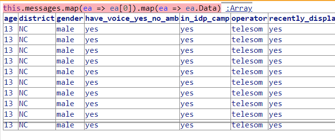

## Data Workspace


```javascript
var tallyMap = new Map()
var tally = function(keys) {
  var keysKey = "" + keys
  var count = tallyMap.get(keysKey) || 0
  tallyMap.set(keysKey, count + 1)
}


this.messages.forEach(eaMessageList => {
  eaMessageList.forEach(ea => tally(Object.keys(ea["Data"])))
})
Array.from(tallyMap.keys()).map((k) => tallyMap.get(k) + ":" + k  ).join("\n")
```

Meta Data should be ok, and so we can print it here...

``` 10:age,district,gender,have_voice_yes_no_amb,in_idp_camp,operator,recently_displaced,region,rqa_s04e01_CE,rqa_s04e01_NA,rqa_s04e01_NC,rqa_s04e01_NGOs_to_be_accountable_participatory,rqa_s04e01_NIC,rqa_s04e01_NR,rqa_s04e01_NS,rqa_s04e01_STOP,rqa_s04e01_WS,rqa_s04e01_access_to_water,rqa_s04e01_build_resilience_to_drought,rqa_s04e01_community_organisation,rqa_s04e01_cooperation_between_government_and_NGOs,rqa_s04e01_cooperation_between_government_and_people,rqa_s04e01_economic_development,rqa_s04e01_education,rqa_s04e01_farming_support,rqa_s04e01_food_nutrition,rqa_s04e01_good_governance,rqa_s04e01_greeting,rqa_s04e01_health_services,rqa_s04e01_hygiene,rqa_s04e01_information,rqa_s04e01_job_creation,rqa_s04e01_opt_in,rqa_s04e01_other,rqa_s04e01_peace_and_security,rqa_s04e01_protection_of_rights,rqa_s04e01_push_back,rqa_s04e01_question,rqa_s04e01_religion,rqa_s04e01_return_and_resettlement_of_IDPs,rqa_s04e01_shelter,rqa_s04e01_showtime_question,rqa_s04e01_stop_aid_dependency,rqa_s04e01_stop_clannism,rqa_s04e01_support_for_IDPs,rqa_s04e01_support_to_the_poor,rqa_s04e02_CE,rqa_s04e02_NA,rqa_s04e02_NC,rqa_s04e02_NGOs_to_be_accountable_and_transparent,rqa_s04e02_NIC,rqa_s04e02_NR,rqa_s04e02_NS,rqa_s04e02_STOP,rqa_s04e02_WS,rqa_s04e02_access_to_water,rqa_s04e02_cooperation_between_NGOs_people_government,rqa_s04e02_economic_development,rqa_s04e02_education,rqa_s04e02_food_nutrition,rqa_s04e02_government_stability,rqa_s04e02_greeting,rqa_s04e02_health_services,rqa_s04e02_information,rqa_s04e02_job_creation,rqa_s04e02_opt_in,rqa_s04e02_other,rqa_s04e02_peace_and_security,rqa_s04e02_push_back,rqa_s04e02_question,rqa_s04e02_resettlement_and_return_for_IDPs,rqa_s04e02_shelter,rqa_s04e02_showtime_question,rqa_s04e02_stop_aid_dependency,rqa_s04e02_support_for_agriculture,rqa_s04e02_support_the_poor_IDPs,state,suggestions_CE,suggestions_NA,suggestions_NC,suggestions_NIC,suggestions_NR,suggestions_NS,suggestions_STOP,suggestions_WS,suggestions_avoid_political_content,suggestions_consistent_radio_shows,suggestions_greeting,suggestions_honesty_from_radio_broadcast,suggestions_improve_quality_of_hage,suggestions_improve_radio_stations,suggestions_improved_participation,suggestions_increase_frequency_of_shows,suggestions_more_religious_messaging,suggestions_opt_in,suggestions_other,suggestions_push_back,suggestions_question,suggestions_showtime_question,zone
10:consent_withdrawn
40:
20:zone_coded
20:state_coded
20:region_coded
20:district_coded
20:mogadishu_sub_district_coded
10:rqa_s04e02_coded,suggestions_coded
10:have_voice_raw_correct_dataset
30:have_voice_yes_no_amb_coded
10:in_idp_camp_raw_correct_dataset
30:in_idp_camp_coded
10:recently_displaced_raw_correct_dataset
30:recently_displaced_coded
10:age_raw_correct_dataset
30:age_coded
10:gender_raw_correct_dataset
30:gender_coded
10:location_raw_correct_dataset
10:rqa_s04e01_raw_correct_dataset
12:rqa_s04e01_coded
10:have_voice_raw_id
10:in_idp_camp_raw_id
10:recently_displaced_raw_id
10:age_raw_id
10:gender_raw_id
10:location_raw_id
10:rqa_s04e01_raw_id
10:rqa_s04e01_raw,rqa_s04e01_raw_source,sent_on
20:rqa_s04e02_raw
10:age_raw,age_raw_source,age_time,gender_raw,gender_raw_source,gender_time,have_voice_raw,have_voice_raw_source,have_voice_time,in_idp_camp_raw,in_idp_camp_raw_source,in_idp_camp_time,location_raw,location_raw_source,location_time,recently_displaced_raw,recently_displaced_raw_source,recently_displaced_time
20:have_voice_yes_no_amb_coded_WS
10:have_voice_raw_WS_correct_dataset
10:have_voice_raw_id_WS
20:in_idp_camp_coded_WS
10:in_idp_camp_raw_WS_correct_dataset
10:in_idp_camp_raw_id_WS
20:recently_displaced_coded_WS
10:recently_displaced_raw_WS_correct_dataset
10:recently_displaced_raw_id_WS
20:age_coded_WS
10:age_raw_WS_correct_dataset
10:age_raw_id_WS
20:gender_coded_WS
10:gender_raw_WS_correct_dataset
10:gender_raw_id_WS
10:zone_coded_WS
10:state_coded_WS
10:region_coded_WS
10:district_coded_WS
10:mogadishu_sub_district_coded_WS
10:location_raw_WS_correct_dataset
10:location_raw_id_WS
10:rqa_s04e02_coded_WS
10:rqa_s04e02_raw_WS_correct_dataset
10:rqa_s04e02_raw_id_WS
10:age_raw,age_time,gender_raw,gender_time,have_voice_raw,have_voice_time,in_idp_camp_raw,in_idp_camp_time,location_raw,location_time,recently_displaced_raw,recently_displaced_time,rqa_s04e02_run_id,sent_on,uid
10:rqa_message,show_pipeline_key
10:operator_coded,operator_raw
10:Rqa_S04E02 (Category) - csap_s04e02_activation,Rqa_S04E02 (Name) - csap_s04e02_activation,Rqa_S04E02 (Run ID) - csap_s04e02_activation,Rqa_S04E02 (Text) - csap_s04e02_activation,Rqa_S04E02 (Time) - csap_s04e02_activation,Rqa_S04E02 (Value) - csap_s04e02_activation,avf_phone_id,run_created_on - csap_s04e02_activation,run_exit_type - csap_s04e02_activation,run_exited_on - csap_s04e02_activation,run_id - csap_s04e02_activation,run_modified_on - csap_s04e02_activation
```

## Insight every message and individual object in head files on first level has four keys: Data, Metadata, NestedTraceData and SHA 
```javascript
var tallyMap = new Map()
var tally = function(keys) {
  var keysKey = "" + keys
  var count = tallyMap.get(keysKey) || 0
  tallyMap.set(keysKey, count + 1)
}


this.messages.forEach(eaMessageList => {
  eaMessageList.forEach(ea => tally(Object.keys(ea)))
})
Array.from(tallyMap.keys()).map((k) => tallyMap.get(k) + ":" + k  ).join("\n") 
```
```
852:Data,Metadata,NestedTracedData,SHA
```

## Insight: this.messages are sorted... 

```javascript
this.messages.map(ea => ea[0]).map(ea => ea.Data)
```



## Warning: Following Query produces some non encoded raw data...

```javascript
this.individuals[1].map(ea => ea.Data)
``` 


### Individual RAW query


```javascript
var all = []
this.individuals.forEach(row => {
  row.forEach(entry => {
    if (entry.Data.age_raw) {
      all.push(entry.Data)
    }
  })  
})

all
```

### All Keys of Individuals Head File

```javascript
var tallyMap = new Map()
var tally = function(keys) {
  var keysKey = "" + keys
  var count = tallyMap.get(keysKey) || 0
  tallyMap.set(keysKey, count + 1)
}

function tallyObjectRecursively(obj) {
  for (let key in obj) {
    tally(key);
    if (obj[key] instanceof Array) {
      obj[key].forEach(ea => tallyObjectRecursively(ea))
    } else if (obj[key] instanceof Object) {
      tallyObjectRecursively(obj[key])
    }
  }
}

this.individuals.forEach(eaMessageList => {
  eaMessageList.forEach(ea => tallyObjectRecursively(ea))
})


Array.from(tallyMap.keys()).map((k) => tallyMap.get(k) + ":" + k  ).sort((a,b) => b.split(":")[0]-a.split(":")[0]).join("\n") 
```
```javascript
4005:Metadata
3832:Data
3832:Timestamp
3832:User
3832:NestedTracedData
3832:SHA
3832:Source
2369:Checked
2369:CodeID
2369:DateTimeUTC
2369:SchemeID
2369:OriginType
2369:OriginID
2369:Name
2369:Origin
896:Confidence
218:avf_phone_id
188:age_coded
181:gender_coded
170:district_coded
166:in_idp_camp_coded
162:recently_displaced_coded
157:state_coded
157:region_coded
157:zone_coded
152:mogadishu_sub_district_coded
152:have_voice_yes_no_amb_coded
145:location_time
142:sent_on
138:gender_coded_WS
132:gender_time
130:age_time
128:recently_displaced_time
128:in_idp_camp_time
128:district_coded_WS
127:recently_displaced_coded_WS
127:in_idp_camp_coded_WS
125:run_modified_on - csap_s04_demog
125:run_id - csap_s04_demog
125:run_created_on - csap_s04_demog
125:run_exited_on - csap_s04_demog
125:run_exit_type - csap_s04_demog
124:age_coded_WS
116:zone_coded_WS
116:state_coded_WS
116:region_coded_WS
114:rqa_s04e01_NA
110:rqa_s04e02_NA
108:rqa_s04e01_NC
107:suggestions_NA
107:mogadishu_sub_district_coded_WS
106:rqa_s04e01_coded
106:show_pipeline_key
106:rqa_s04e02_NC
106:consent_withdrawn
105:suggestions_NC
104:rqa_s04e02_information
104:rqa_s04e02_health_services
104:rqa_s04e02_greeting
104:rqa_s04e02_government_stability
104:rqa_s04e02_food_nutrition
104:suggestions_other
104:suggestions_opt_in
104:suggestions_more_religious_messaging
104:suggestions_increase_frequency_of_shows
104:suggestions_improved_participation
104:suggestions_improve_radio_stations
104:gender_raw_WS_correct_dataset
104:rqa_s04e02_education
104:rqa_s04e02_economic_development
104:rqa_s04e02_cooperation_between_NGOs_people_government
104:rqa_s04e02_access_to_water
104:suggestions_improve_quality_of_hage
104:rqa_s04e02_WS
104:suggestions_honesty_from_radio_broadcast
104:rqa_s04e02_NS
104:rqa_s04e02_NR
104:rqa_s04e02_NIC
104:rqa_s04e02_NGOs_to_be_accountable_and_transparent
104:suggestions_greeting
104:rqa_s04e02_CE
104:suggestions_consistent_radio_shows
104:suggestions_avoid_political_content
104:rqa_s04e01_support_to_the_poor
104:rqa_s04e01_support_for_IDPs
104:rqa_s04e01_stop_clannism
104:rqa_s04e01_stop_aid_dependency
104:rqa_s04e01_showtime_question
104:suggestions_WS
104:location_raw_WS_correct_dataset
104:location_raw_correct_dataset
104:location_raw_id
104:location_raw_id_WS
104:location_raw_source
104:suggestions_STOP
104:suggestions_NS
104:suggestions_NR
104:operator_coded
104:suggestions_NIC
104:rqa_s04e02_STOP
104:rqa_s04e01_shelter
104:rqa_s04e01_return_and_resettlement_of_IDPs
104:rqa_s04e01_religion
104:rqa_s04e01_question
104:rqa_s04e01_push_back
104:suggestions_showtime_question
104:suggestions_CE
104:rqa_s04e02_support_the_poor_IDPs
104:rqa_s04e01_protection_of_rights
104:rqa_s04e02_support_for_agriculture
104:rqa_s04e02_coded
104:rqa_s04e01_peace_and_security
104:rqa_s04e01_other
104:rqa_s04e01_opt_in
104:rqa_s04e01_job_creation
104:rqa_s04e01_information
104:rqa_s04e01_hygiene
104:rqa_s04e01_health_services
104:rqa_s04e02_stop_aid_dependency
104:run_created_on - csap_s04_evaluation
104:rqa_s04e01_greeting
104:rqa_s04e02_showtime_question
104:run_exit_type - csap_s04_evaluation
104:rqa_s04e01_good_governance
104:rqa_s04e02_shelter
104:run_exited_on - csap_s04_evaluation
104:rqa_s04e01_food_nutrition
104:rqa_s04e02_resettlement_and_return_for_IDPs
104:run_id - csap_s04_evaluation
104:rqa_s04e01_farming_support
104:rqa_s04e02_question
104:run_modified_on - csap_s04_evaluation
104:rqa_s04e01_education
104:rqa_s04e02_push_back
104:rqa_s04e02_peace_and_security
104:rqa_s04e02_other
104:rqa_s04e02_opt_in
104:suggestions_coded
104:rqa_s04e02_job_creation
104:suggestions_question
104:suggestions_push_back
104:rqa_s04e01_CE
104:rqa_s04e01_NGOs_to_be_accountable_participatory
104:rqa_s04e01_NIC
104:rqa_s04e01_NR
104:rqa_s04e01_NS
104:rqa_s04e01_STOP
104:rqa_s04e01_WS
104:rqa_s04e01_access_to_water
104:rqa_s04e01_build_resilience_to_drought
104:rqa_s04e01_community_organisation
104:rqa_s04e01_cooperation_between_government_and_NGOs
104:rqa_s04e01_cooperation_between_government_and_people
104:rqa_s04e01_economic_development
102:age_raw_correct_dataset
100:gender_raw_correct_dataset
99:rqa_message
96:recently_displaced_raw_id_WS
96:have_voice_time
96:age_raw_id_WS
96:in_idp_camp_raw_id_WS
96:age_raw_WS_correct_dataset
96:in_idp_camp_raw_WS_correct_dataset
96:recently_displaced_raw_WS_correct_dataset
96:gender_raw_id_WS
94:have_voice_yes_no_amb_coded_WS
93:survey_responses
92:gender_raw_id
92:gender_raw_source
88:age_raw_source
88:age_raw_id
88:rqa_s04e01_raw
87:run_exit_type - csap_s04e02_activation
87:run_created_on - csap_s04e02_activation
87:run_id - csap_s04e02_activation
87:run_modified_on - csap_s04e02_activation
87:run_exited_on - csap_s04e02_activation
85:in_idp_camp_raw_correct_dataset
85:in_idp_camp_raw_id
85:in_idp_camp_raw_source
84:recently_displaced_raw_correct_dataset
84:recently_displaced_raw_id
84:recently_displaced_raw_source
84:rqa_s04e01_raw_source
84:rqa_s04e01_raw_id
84:rqa_s04e01_raw_correct_dataset
83:location_raw
82:Rqa_S04E02 (Time) - csap_s04e02_activation
82:Rqa_S04E02 (Value) - csap_s04e02_activation
82:Rqa_S04E02 (Category) - csap_s04e02_activation
82:Rqa_S04E02 (Text) - csap_s04e02_activation
82:Rqa_S04E02 (Run ID) - csap_s04e02_activation
82:Rqa_S04E02 (Name) - csap_s04e02_activation
82:rqa_s04e02_run_id
82:rqa_s04e02_coded_WS
82:rqa_s04e02_raw_WS_correct_dataset
82:rqa_s04e02_raw_id_WS
81:rqa_s04e02_raw
79:District (Name) - csap_s04_demog
79:District (Category) - csap_s04_demog
79:District (Run ID) - csap_s04_demog
79:District (Text) - csap_s04_demog
79:District (Value) - csap_s04_demog
79:District (Time) - csap_s04_demog
77:age_raw
77:gender_raw
77:in_idp_camp_raw
77:recently_displaced_raw
71:Gender (Name) - csap_s04_demog
71:Recently_Displaced (Value) - csap_s04_demog
71:Recently_Displaced (Time) - csap_s04_demog
71:Recently_Displaced (Text) - csap_s04_demog
71:Recently_Displaced (Run ID) - csap_s04_demog
71:Recently_Displaced (Name) - csap_s04_demog
71:Gender (Value) - csap_s04_demog
71:Gender (Time) - csap_s04_demog
71:Gender (Text) - csap_s04_demog
71:Recently_Displaced (Category) - csap_s04_demog
71:Age (Category) - csap_s04_demog
71:Gender (Category) - csap_s04_demog
71:Idp_Camp (Value) - csap_s04_demog
71:Idp_Camp (Time) - csap_s04_demog
71:Idp_Camp (Text) - csap_s04_demog
71:Idp_Camp (Run ID) - csap_s04_demog
71:Idp_Camp (Name) - csap_s04_demog
71:Age (Name) - csap_s04_demog
71:Age (Run ID) - csap_s04_demog
71:Age (Text) - csap_s04_demog
71:Age (Time) - csap_s04_demog
71:Age (Value) - csap_s04_demog
71:Idp_Camp (Category) - csap_s04_demog
71:Gender (Run ID) - csap_s04_demog
70:have_voice_raw_source
70:have_voice_raw_id
70:have_voice_raw_WS_correct_dataset
70:have_voice_raw_id_WS
70:Have_Voice (Value) - csap_s04_evaluation
70:Have_Voice (Time) - csap_s04_evaluation
70:Have_Voice (Text) - csap_s04_evaluation
70:Have_Voice (Run ID) - csap_s04_evaluation
70:Have_Voice (Name) - csap_s04_evaluation
70:Have_Voice (Category) - csap_s04_evaluation
70:have_voice_raw_correct_dataset
53:have_voice_raw
42:uid
42:age
42:region
42:district
42:gender
42:have_voice_yes_no_amb
42:state
42:operator_raw
42:in_idp_camp
42:operator
42:recently_displaced
42:zone
31:folded_with
25:rqa_s04e02_raw_correct_dataset
25:rqa_s04e02_raw_source
25:rqa_s04e02_raw_id
25:Age (Category) - csap_s02_demog
25:Age (Name) - csap_s02_demog
25:Age (Run ID) - csap_s02_demog
25:Age (Text) - csap_s02_demog
25:Age (Time) - csap_s02_demog
25:Age (Value) - csap_s02_demog
25:Completed_Split (Category) - csap_s02_demog
25:Completed_Split (Name) - csap_s02_demog
25:Completed_Split (Run ID) - csap_s02_demog
25:Completed_Split (Text) - csap_s02_demog
25:Completed_Split (Time) - csap_s02_demog
25:Completed_Split (Value) - csap_s02_demog
25:District (Category) - csap_s02_demog
25:District (Name) - csap_s02_demog
25:District (Run ID) - csap_s02_demog
25:District (Text) - csap_s02_demog
25:District (Time) - csap_s02_demog
25:District (Value) - csap_s02_demog
25:District_Split (Category) - csap_s02_demog
25:District_Split (Name) - csap_s02_demog
25:District_Split (Run ID) - csap_s02_demog
25:District_Split (Text) - csap_s02_demog
25:District_Split (Time) - csap_s02_demog
25:District_Split (Value) - csap_s02_demog
25:Dummy_Age_Split (Category) - csap_s02_demog
25:Dummy_Age_Split (Name) - csap_s02_demog
25:Dummy_Age_Split (Run ID) - csap_s02_demog
25:Dummy_Age_Split (Text) - csap_s02_demog
25:Dummy_Age_Split (Time) - csap_s02_demog
25:Dummy_Age_Split (Value) - csap_s02_demog
25:Gender (Category) - csap_s02_demog
25:Gender (Name) - csap_s02_demog
25:Gender (Run ID) - csap_s02_demog
25:Gender (Text) - csap_s02_demog
25:Gender (Time) - csap_s02_demog
25:Gender (Value) - csap_s02_demog
25:Gendersplit (Category) - csap_s02_demog
25:Gendersplit (Name) - csap_s02_demog
25:Gendersplit (Run ID) - csap_s02_demog
25:Gendersplit (Text) - csap_s02_demog
25:Gendersplit (Time) - csap_s02_demog
25:Gendersplit (Value) - csap_s02_demog
25:Hh_Language (Category) - csap_s02_demog
25:Hh_Language (Name) - csap_s02_demog
25:Hh_Language (Run ID) - csap_s02_demog
25:Hh_Language (Text) - csap_s02_demog
25:Hh_Language (Time) - csap_s02_demog
25:Hh_Language (Value) - csap_s02_demog
25:Idp_Camp (Category) - csap_s02_demog
25:Idp_Camp (Name) - csap_s02_demog
25:Idp_Camp (Run ID) - csap_s02_demog
25:Idp_Camp (Text) - csap_s02_demog
25:Idp_Camp (Time) - csap_s02_demog
25:Idp_Camp (Value) - csap_s02_demog
25:Idp_Split (Category) - csap_s02_demog
25:Idp_Split (Name) - csap_s02_demog
25:Idp_Split (Run ID) - csap_s02_demog
25:Idp_Split (Text) - csap_s02_demog
25:Idp_Split (Time) - csap_s02_demog
25:Idp_Split (Value) - csap_s02_demog
25:Recently_Displaced (Category) - csap_s02_demog
25:Recently_Displaced (Name) - csap_s02_demog
25:Recently_Displaced (Run ID) - csap_s02_demog
25:Recently_Displaced (Text) - csap_s02_demog
25:Recently_Displaced (Time) - csap_s02_demog
25:Recently_Displaced (Value) - csap_s02_demog
25:Response_11 (Category) - csap_s02_demog
25:Response_11 (Name) - csap_s02_demog
25:Response_11 (Run ID) - csap_s02_demog
25:Response_11 (Text) - csap_s02_demog
25:Response_11 (Time) - csap_s02_demog
25:Response_11 (Value) - csap_s02_demog
25:Sub_District_Split (Category) - csap_s02_demog
25:Sub_District_Split (Name) - csap_s02_demog
25:Sub_District_Split (Run ID) - csap_s02_demog
25:Sub_District_Split (Text) - csap_s02_demog
25:Sub_District_Split (Time) - csap_s02_demog
25:Sub_District_Split (Value) - csap_s02_demog
25:run_created_on - csap_s02_demog
25:run_exit_type - csap_s02_demog
25:run_exited_on - csap_s02_demog
25:run_id - csap_s02_demog
25:run_modified_on - csap_s02_demog
22:suggestions_time
17:received_on
17:recovered_run_id
17:rqa_s04e01_coded_WS
17:rqa_s04e01_raw_WS_correct_dataset
17:rqa_s04e01_raw_id_WS
17:run_id
17:message
15:Suggestions (Category) - csap_s04_evaluation
15:Suggestions (Name) - csap_s04_evaluation
15:suggestions_raw
15:Suggestions (Text) - csap_s04_evaluation
15:Suggestions (Time) - csap_s04_evaluation
15:Suggestions (Value) - csap_s04_evaluation
15:suggestions_coded_WS
15:suggestions_raw_WS_correct_dataset
15:suggestions_raw_correct_dataset
15:suggestions_raw_id
15:suggestions_raw_id_WS
15:suggestions_raw_source
15:Suggestions (Run ID) - csap_s04_evaluation
```

### All id keys in individuals

```javascript
Array.from(tallyMap.keys()).filter((k,v) => k.includes("_id")).map((k) => tallyMap.get(k) + ":" + k  ).sort((a,b) => b.split(":")[0]-a.split(":")[0]).join("\n")  
```
```javascript
125:run_id - csap_s04_demog
104:location_raw_id
104:run_id - csap_s04_evaluation
104:location_raw_id_WS
96:in_idp_camp_raw_id_WS
96:age_raw_id_WS
96:gender_raw_id_WS
96:recently_displaced_raw_id_WS
92:gender_raw_id
88:age_raw_id
87:run_id - csap_s04e02_activation
85:in_idp_camp_raw_id
84:rqa_s04e01_raw_id
84:recently_displaced_raw_id
82:rqa_s04e02_run_id
82:rqa_s04e02_raw_id_WS
70:have_voice_raw_id_WS
70:have_voice_raw_id
25:rqa_s04e02_raw_id
25:run_id - csap_s02_demog
17:recovered_run_id
17:rqa_s04e01_raw_id_WS
17:run_id
15:suggestions_raw_id
15:suggestions_raw_id_WS
```

### Most used keys

```javascript
4005:Metadata
3832:Data
3832:Timestamp
3832:User
3832:NestedTracedData
3832:SHA
3832:Source
2369:Checked
2369:CodeID
2369:DateTimeUTC
2369:SchemeID
2369:OriginType
2369:OriginID
2369:Name
2369:Origin
896:Confidence
```

### Counting messages and individuals via age attribute

- Insight: messages and individuals seem to be ordered the same
- one individual contains all its messages with the complete pipeline (there are some data objects with 2000 lines of code in the beautified version, where the complete pipeline of the message is also saved) and some additional metadata

- individuals.length = 7902 vs 6604 ages within individuals
- messages.length = 16412 vs 17209 ages within messages

- "NA" := not available (when data is missing)
- "NS" := skip
- "NC" := not coded
- "NIC" := not internally consistent
- "WS" := wrong scheme (also variables get tagged with this, why?)
- "CE" := coding error
- "STOP" := consent withdrawn (according to Luke)

- yes_no_amb := when folding, yes + yes = yes, no + no = no and yes + no = amb (ambivalent)

[more control and meta codes](https://github.com/AfricasVoices/CoreDataModules/blob/master/core_data_modules/cleaners/codes/codes.py)

code for counting people and messages by having age:

```javascript
var agesIndividuals = []
for (let individual of this.individuals) {
  for (let data of individual) {
    if (data.Data.age_raw) {
      agesIndividuals.push(data.Data.age_raw);
      break;
    }
  }
}
agesIndividuals

var agesMessages = []
this.messages.forEach(messagesList => {
  messagesList.forEach(ea => {if (ea.Data.age) {
    agesMessages.push(ea.Data.age)
  }})
})
agesMessages
```

