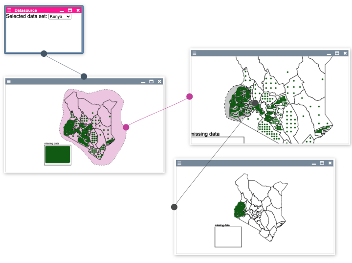

### Freehand Selection



Enables the user to draw freehand shapes on the canvas, which she then can use to create new panes from the selected points inside the shape.


#### Usage

##### widget.html
- Requires a Canvas on top of an SVG
- both need to always have the same size => maintaining that e.g. updating the extent / scaling responsibility lies with the component that uses the freeHandDrawer
- both need to be contained by a parentElement of type 'div'
- both need "position: absolute" css styling


```javascript
<style>
  .x-canvas, .x-svg {
    position: absolute;
  }
</style>

<div id="bp2019-x-root-container">      
    <div class="canvas-widget-control-panel-container" id="x-control-widget-container">
      <bp2019-x-control-widget id="bp2019-x-control-widget" ></bp2019-x-control-widget>
    </div>

    <div id="bp2019-x-widget-canvas-container">
      <svg id="bp2019-x-widget-free-hand-selection-svg" class="x-svg"></svg>
      <canvas id="bp2019-x-widget-drawing-canvas" class ="x-canvas"></canvas>
    </div>

</div>
```

----

##### widget.js

1. Create and initialize drawer in your widget:

```javascript
import FreehandDrawer from '../src/internal/individuals-as-points/common/drawFreehand.js'

constructor() {
  // ...
  this.canvasWindow = this.get("#bp2019-map-widget-canvas-container")
  this.drawingCanvas = this.get("#bp2019-map-widget-drawing-canvas")
  this.freehandSelectionSVG = this.get("#bp2019-map-widget-free-hand-selection-svg")
  
  this.drawer = new FreehandDrawer(this.canvasWindow, this.drawingCanvas, this.freehandSelectionSVG)
  this.drawer.addListener(this)
  this.drawer.start()
  // ...
}

```
This should enable you to draw lines on your canvas. When you stop drawing, an error message displays and says "freehandSelectionCreated is not a function". So let's implement that.

2. Implement Callbacks:

freehandSelectionCreated()
- gets called when you stopped drawing a line to draw a corresponding polygon on the svg.
- You will need to:
    - redraw your content on the canvas
    - let the freehandDrawer redraw its own selections (drawer.drawSelections()).

```javascript
freehandSelectionCreated() {
  this.canvas.draw()
  this.drawer.drawSelections()
}
```

freehandSelectionDeleted()
- gets called when a selection was deleted via its context menu. 
- You will need to:
  - redraw your content on the canvas
  - let the freehandDrawer redraw its own selections (drawer.drawSelections()) (same as freehandSelectionCreated)
  - dispatch an event "freehand-selection-deleted" to notify the panes prototype (so possible children of the selection can be deleted, too)
    - you get passed the selection, so you literally can copy the dispatchEvent function, to be able to dispatch an event the 'this' context needs to be a component 

```javascript
freehandSelectionDeleted(selection) {
  this.canvas.draw()
  this.drawer.drawSelections()

  this.dispatchEvent(new CustomEvent("freehand-selection-deleted", {
    detail: {
      selection: selection
    },
    bubbles: true
  }))
}
```

freehandSelectionOnContextMenu()
- gets called when a context menu has been opened on a selection.
- You will need to:
  - calculate all the individuals that are within the drawn shape (given to via the linePoints in selection.linePoints)
  - dispatch an event ('freehand-selection-contextmenu') to notify your pane about them
  - you can use the function "inside" to test whether the position of an individual is within the linePoints of the selection (see example usage below) 

```javascript
import inside from "../src/internal/individuals-as-points/common/npm-point-in-polygon.js"

freehandSelectionOnContextMenu(evt, selection, selectionSVG) {
  let linePointsArray = selection.linePoints.map(point => [point.x, point.y])
  let selectedIndividuals = this.data.filter(point => inside([point.drawing.currentPosition.x, point.drawing.currentPosition.y], linePointsArray))

  this.dispatchEvent(new CustomEvent("freehand-selection-contextmenu", {
    detail: {
      freehandSelectionSVGElement: selectionSVG,
      clientX: evt.clientX,
      clientY: evt.clientY,
      individualsSelection: {selectedIndividuals: selectedIndividuals, selectionColor: selection.color}
    },
    bubbles: true
  }))
}
```

Your freehandDrawer should now be functional and integrated with your pane.

3. Further functionality

3.1 Starting / Stopping the drawer e.g. for enabling selection mode
  - the drawer can be started and stopped via drawer.start() / drawer.stop()
  - this basically just registers / unregisters the needed Event Listeners
```javascript
  start() {
    this.canvas.addEventListener('mousemove', boundDraw)
    this.canvas.addEventListener('mousedown', boundSetPosition)
    this.canvas.addEventListener('mouseup', boundOnDrawStop)
  }

  stop() {
    this.canvas.removeEventListener('mousemove', boundDraw)
    this.canvas.removeEventListener('mousedown', boundSetPosition)
    this.canvas.removeEventListener('mouseup', boundOnDrawStop)
  }
```
  - for example usage for a selection mode look to the map prototype
  
3.2 Scaling / Transforming Selections
  - the freehandDrawer offers two methods for applying the same scaling / transformations that have been applied to the visualization to the selections, too
  - applyScaling(factor) with factor = {x: xScaleFactor, y: yScaleFactor} where each point in a selection just needs to be multiplied by the corresponding factors
  - applyTransform(transform) with a transform ({x:0, y:0, k:1}) in the format used by d3. If you use d3 for any navigation on your canvas such as zooming and panning, you can also apply the same transform to the polygons on the svg and the self drawn line on your canvas. For that, you will need to call applyTransform() everytime you called drawer.drawSelections() as well as when you have changed your transform on your canvas, e.g. through zooming or panning.

```javascript

// Implementation
  applyScaling(factor) {
    this.selections.forEach(selection => {
      selection.linePoints = selection.linePoints.map(point => {
        return {"x": point.x * factor.x, "y": point.y * factor.y}
      })  
    })
    this.drawSelections()
  }
  
  applyTransform(transform) {
    this.transform = transform
    d3.select(this.svg).selectAll("polygon")
      .attr("transform", transform)
  }
```