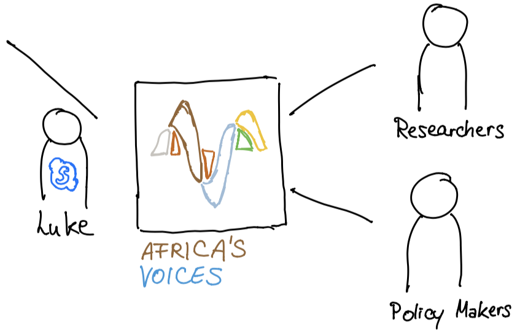
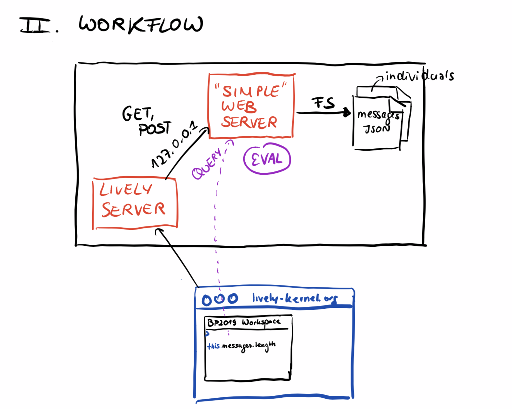

<!-- markdown-config presentation=true -->
<link rel="stylesheet" type="text/css" href="./style.css"  />

  BP2019RH1 - Project Partner Visit

  Wanda Baltzer, Theresa Hradilak, Lara Pfennigschmidt, Luc Prestin, Moritz Spranger, Simon Stadlinger, Leo Wendt

  2019 
   
  Software Architecture Group  Hasso Plattner Institute  University of Potsdam, Germany

---

# Welcome back

{width="650" style="display: block;margin-left: auto; margin-right: auto; width: 70%;"}

---

# What is our project about again?

- Get **public opinion** polls where getting representative data from citizens is hard 
- People responding with SMS to questions asked on radio show
- Africa's Voices:
  - compiles, translates and aggregates responses
  - uses that data to **inform policy makers**
- And we?
  - **generate visualizations** that can help understand and 
    **explore** the obtained qualitative data 

---
# We had a visit
- Week before last week Luke (our project partner) visited the Fachgebiet
 

---

# What we thought our goals were going to be

### Africa's Voices Researcher
Goal => Help to ease their process
1. Generate diagrams automatically.
2. Generate explorable diagrams.
3. Generate explorable diagrams to answer emerging questions.

### Africa's Voices Policy maker
Goal => Provide valuable information for decision making 
{ style="float:right" alt="drawing" width="280"}
1. Build a tool to show data to policy makers.
2. Explore with policy maker / let policy maker explore.
3. Answer questions that emerge during exploration.

---

# What we think our goals are going to be now

0. **Understand** provided data / domain 
1. **Brainstorm** / Design visualizations (a lot of them)
  - Unconventional
  - Explorable
  - Individual-centered
  - No completeness of data
2. **Implement** the best ideas

(3. Synthesize similarities into a framework)

---

# We have data

- Data privacy agreement
- Two files in JSON format
  - Messages (1.2 GB)
  - Individuals (1 GB) 
- Each line in data files represents an individual/message => provenance
- Nested structure to show merge with other tracedata
- Objects contain:
  - raw data (responses and personal information)
  - coding of responses
  - processing metadata
---

# We are working on workflows

{style="display: block;margin-left: auto; margin-right: auto; width: 75%;"}

---

# We are working on workflows    

{style="display: block;margin-left: auto; margin-right: auto; width: 70%;"}

---

# We have done research
### Literature/Books
The Functional Art - Alberto Cairo (Leo)

The Truthful Art - Alberto Cairo (Wanda)
- "Getting the information as right as possible comes first"
- "Show a summary first, but also let people explore as many layers of depth and breadth as is appropriate"

A Small Matter Of Programming - Bonnie A. Nardi (Simon, Moe)

Factfulness - Hans Rosling

---

# We have done research
### Literature/Books
The Design of everyday Things - Donald A. Norman (Luc)

Information is Beautiful - David McCandless (Lara)

Unflattening - Nick Sousanis (Lara)

Things come apart - Todd McLellan (Lara)

---

# We have done research
### Papers
The Gamma: Programming tools for open data-driven storytelling
- Treating data visualizations as scripts, as reproducible programs
- Offering methods to construct query which will produce visualization

The Practices of Programming - Ilias Bergström, Alan F. Blackwell

Herding Cats: Observing Live Coding in the Wild - Thor Magnusson

Incremental Relational Lenses - Rudi Horn, Roly Perera, James Cheney

Exploratory and Live, Progamming and Coding - SWA Lehrstuhl

---

# We have a couple of ideas
- Sketch ideas for diagrams
- **Design Thinking** workshop to get new ideas, creative session
- Collect a list of "parameters"
  - Elements to use in visualizations
  - Interactions
- Get more **input**, more interesting books or papers

