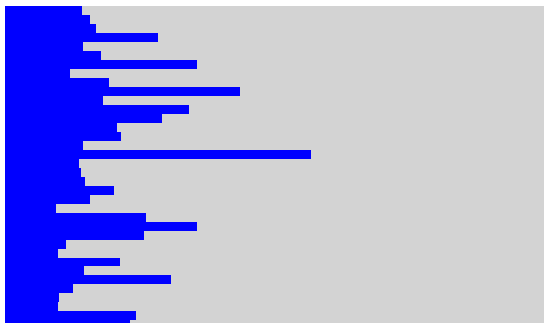

<!-- markdown-config presentation=true -->
<link rel="stylesheet" type="text/css" href="./style.css"  />

  BP2019RH1 - Introduction, Motivation, Current Status

  Wanda Baltzer, Theresa Hradilak, Lara Pfennigschmidt, Luc Prestin, Moritz Spranger, Simon Stadlinger, Leo Wendt

  2019 
   
  Software Architecture Group  Hasso Plattner Institute  University of Potsdam, Germany

---

# Welcome

---

# We are

---

# Project Partner

- Cooperation with local radio stations to get meaningful insights from citizens
- People responding with SMS to questions asked on radio show
- Africa's Voices compiles, translates and aggregates responses

[More Infos](https://www.africasvoices.org/)

---

# How their current system works

---

# Stakeholders

---

# Stakeholders / field software architecture

#### Doing research
- Mapping visualization to code. 
- Enable developer to trace back responsible code.

#### Doing software development
- Make the customer happy.
- Make the code reader happy.
---

# Stakeholders / africa's voices

#### Researcher
Goal => Help to ease their process
1. Generate diagrams automatically.
2. Generate explorable diagrams.
3. Generate explorable diagrams to answer emerging questions.

#### Policy maker
Goal => Provide with valuable information for decision making
1. Build tool that can be used within workshops with policy makers to show data.
2. Explore together with policy maker / let policy maker explore.
3. Together with policy maker answer questions that emerge during exploration.

---

# Stakeholders / africa's voices - new system

  
---

# Stakeholders / we

#### Students
- Have fun.
- Learn new ways of writing code, using code to actually help people.
- Eventually get our bachelors degree with very good marks.

#### Why we have chosen you
- Experienced a very <b>enjoyable atmosphere</b> during lectures and projects done.
- Versatile and open Project but also <b> customer oriented </b>.
- Project done well could have impact. There is a deeper meaning to it.

---

# What we've done so far

1st week: Research: How do others visualise data?  
2nd week: Scratching to get familiar with Lively and JavaScript  
3rd week: Research: Which libraries exists that we could use?  

---

# What we've done so far - 1st week

## Research: How do others visualise data?

- How does the user experience the visualisation?
- How is the data mapped to the visualisation?
- How can the user interact with the visualisation?  

Visualisations we explored:
- [Explorable Explanations](https://explorabl.es/)
- [Gapminder](https://www.gapminder.org/)
- [New York Times interactive data visualizations](https://getdolphins.com/blog/interactive-data-visualizations-new-york-times/)
- [ObservableHQ](https://observablehq.com/)
- [Sunburn](https://typeshift.io/sunburn/)

---

# What we've done so far - 2nd week

## Scratching to get familiar with Lively and JavaScript

 | 

---- | ----

 | 

Y Max: 
 | 

Y Min: 
 | 

---

# What's up next

"Und dann werfen wir Farbe ins Wasser" - Jens Lincke  

### Exploring...
1. Provenance of aggregated data -> qualitative data
2. Provenance of visualisation -> code

### Next week
1. Experimenting with frameworks focusing on visualisation provenance
2. Which specific diagrams does our partner need?
3. Experimenting with diagrams
4. Brainstorming for user interactions

---

# What we've done so far - 3rd week

## Research: Which libraries exists that we could use?

- Licence?
- Use case?
- Special features?
- Customisable?

[Libraries we looked at](browse://../BP2019RH1/doc/research-libraries/index.md)

[ChartJS](browse://../BP2019RH1/doc/research-libraries/chartJS.md) -> Fancy animations  
[D3](browse://../BP2019RH1/doc/research-libraries/d3js.md) -> easy user interaction  
[Raphael](browse://../BP2019RH1/doc/research-libraries/raphaelJS.md) -> reproduced zooming interaction  

---

# See ya :-)

  
---
<!-- #TODO pull this up into presentation? -->
