<!-- markdown-config presentation=true -->
<link rel="stylesheet" type="text/css" href="./style.css"  />

  BP2019RH1 - Introduction, Motivation, Current Status

  Wanda Baltzer, Theresa Hradilak, Lara Pfennigschmidt, Luc Prestin, Moritz Spranger, Simon Stadlinger, Leo Wendt

  2020 
   
  Software Architecture Group  Hasso Plattner Institute  University of Potsdam, Germany

---

# Welcome People!!
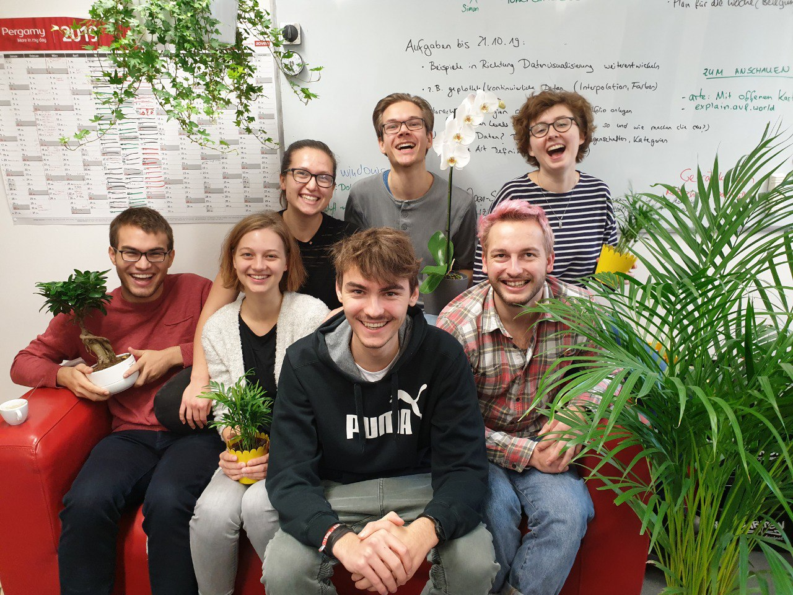{width="650" style="display: block;margin-left: auto; margin-right: auto; width: 70%;"}

---

# Creative Session 16.12.19

- Brainstorming on whiteboards

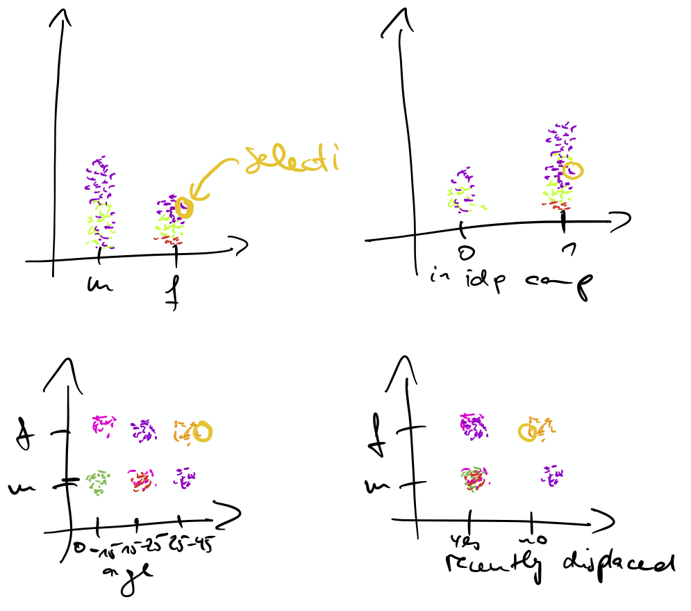{"height=200"}
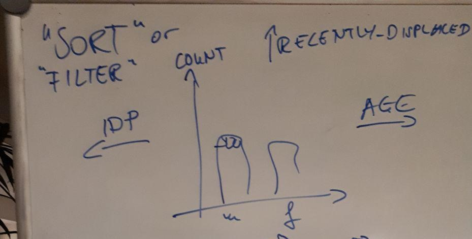
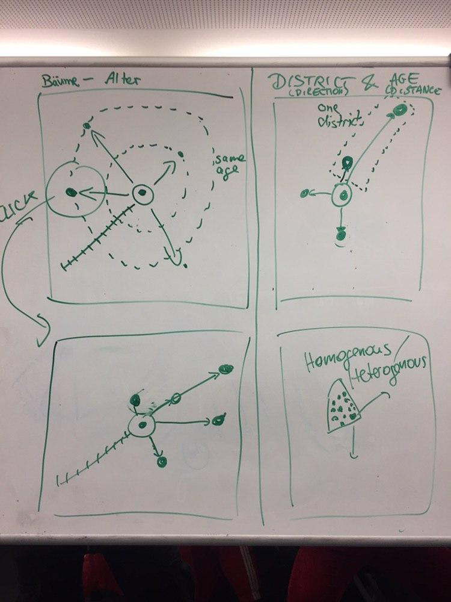{height="200"}

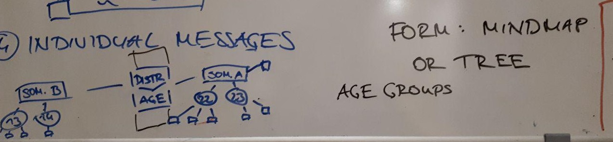

[More diagrams](https://lively-kernel.org/lively4/BP2019RH1/doc/visualization-brainstorming/monday12-16.md#@0)

---

## Taxonomy

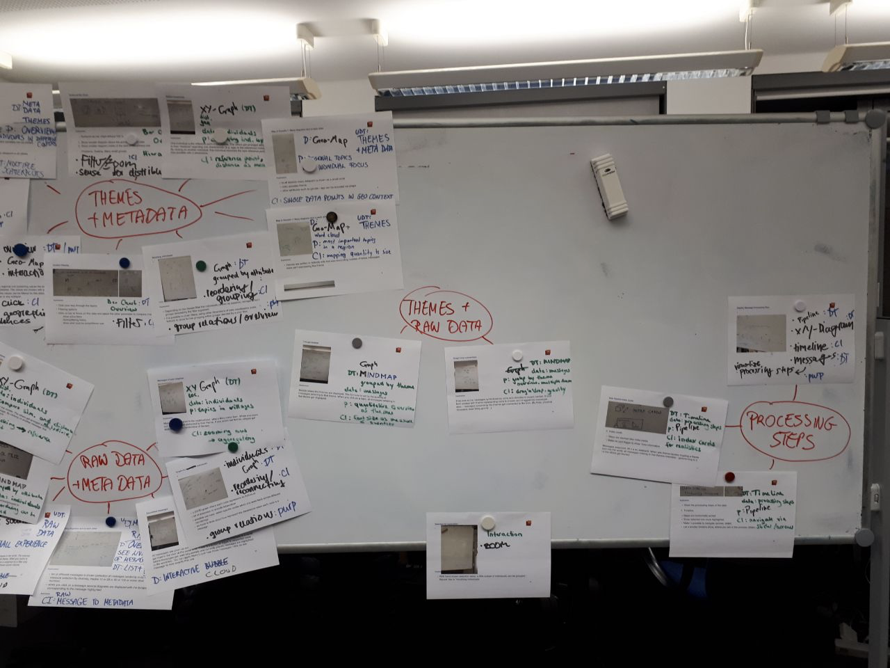{height="500"}

---

## Storyboards

- Picked two visualization ideas
- Tried to make it more concrete

 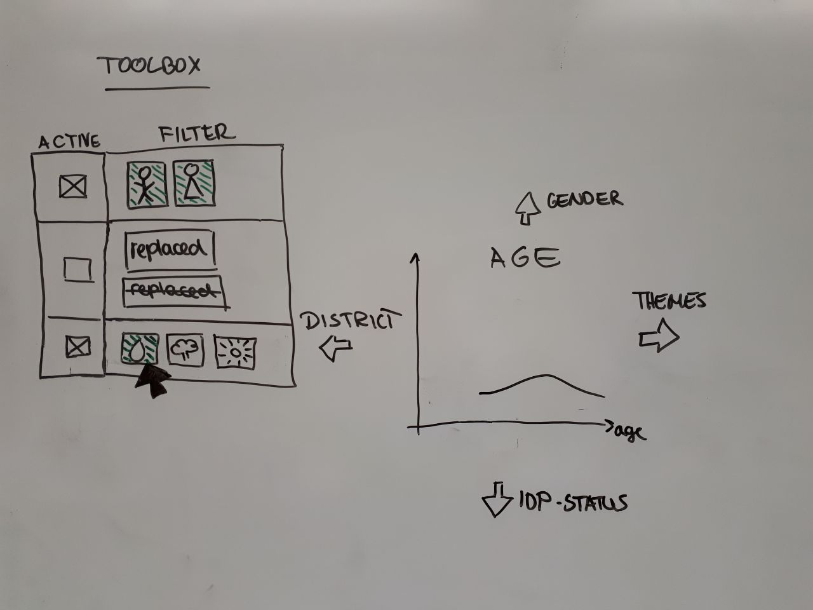{"height=400"}

---

# Design Thinking Workshop 27.01.20

1. Described "Tom", a researcher

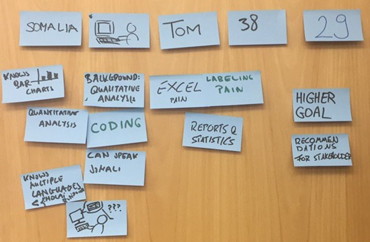{"height=300"}

2. Investigated his needs
    - e.g. "For Tom, it would be life changing, if he could see insights at one glance, because gaining insights out of Excel is difficult."

---

# Design Thinking Workshop 27.01.20

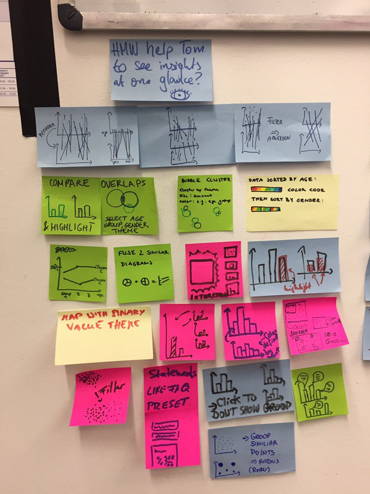{"height=400", style="float:right"}

3. Posed "How might we...?" questions
    - How might we make the process that led to his recommendations comprehensible to other people?
    - How might we help Tom to see insights at one glance?

4. Brainstormed based on those questions to create new visualization ideas 

---

# Data Analysis

#### Next Slides
- Updated / more detailed Context
- Generated Output
- Pipeline analysis

---

# Updated Context 1/2

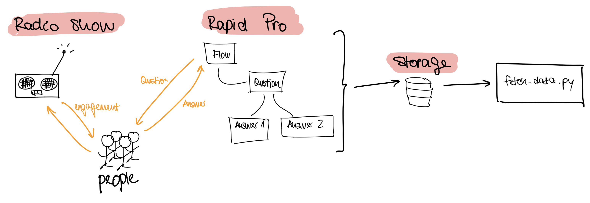{height="350"}

#### Useful links
- RapidPro: https://rapidpro.io/
---

# Updated Context 2/2

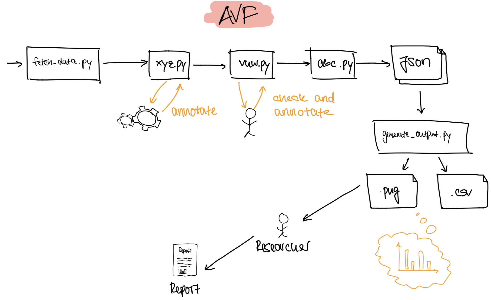{height="300"}
#### Useful links
- Jupyter Notebook: https://github.com/hpi-swa-lab/BP2019RH1-data/tree/master/DataExploration
- Scripts of AvF:
  - Generate Outputs: https://github.com/AfricasVoices/Project-OCHA/blob/master/generate_outputs.py
  
---

# Pipeline Analysis Foundation

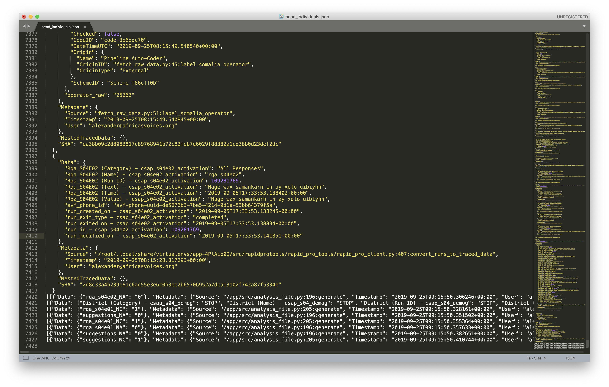{height="550"}

---

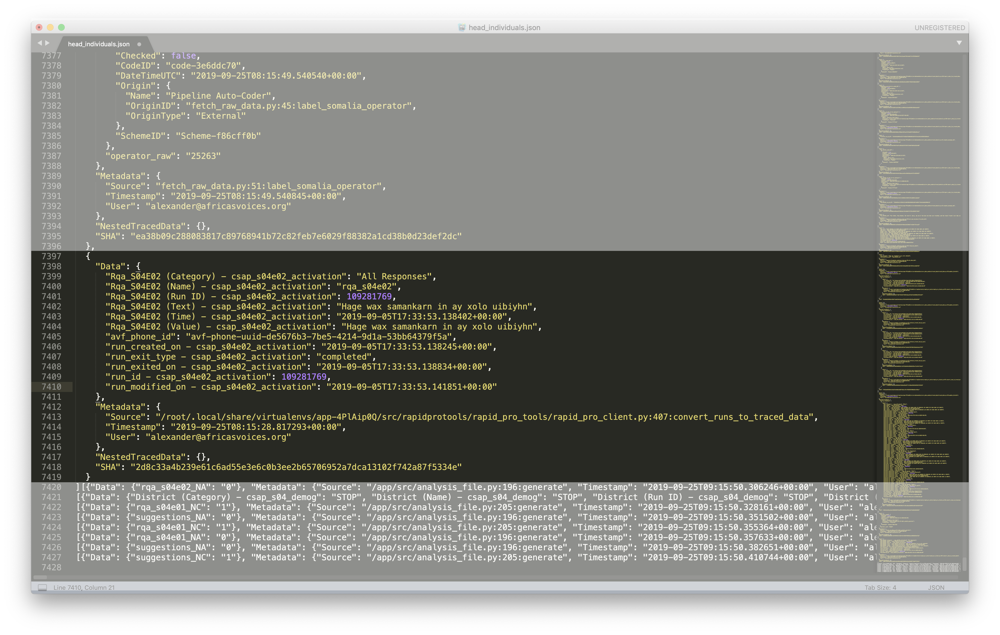{height="600"}

---

# Data analysis from us

#### Jupyter Notebook

#### Questions to think about:
- With regards to the visualizations we showed: How can we make use of history of attributes?
- With regards to scripts that can be seen: How can we make use of the scripts to visualize the pipeline?
- With regards to the serialized data object chain: How can we make use of the traced Data Object to visualize the pipeline?

---

# Generated Output 1/3

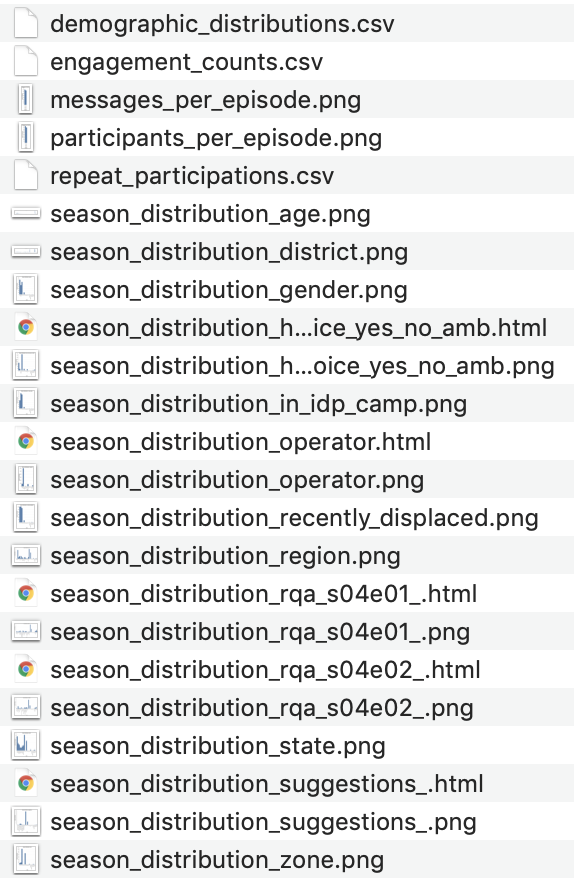{height="500"}

---

# Generated Output 2/3
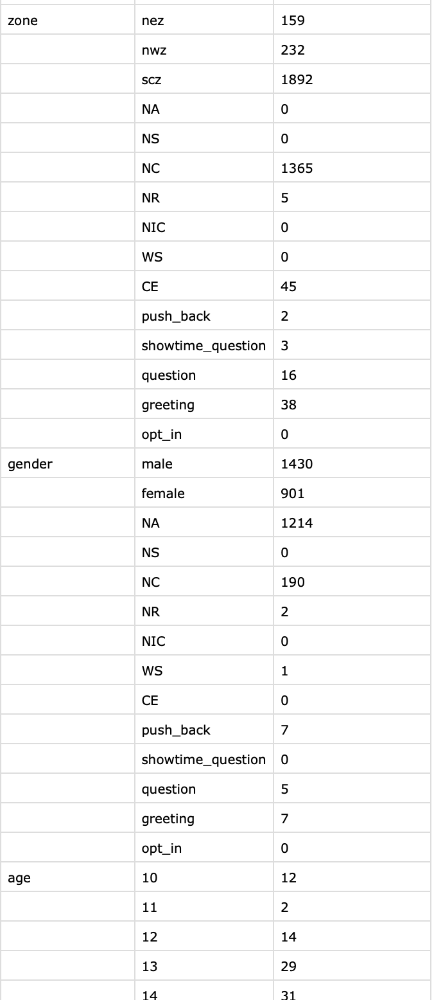{height="500"}

---

# Generated Output 3/3
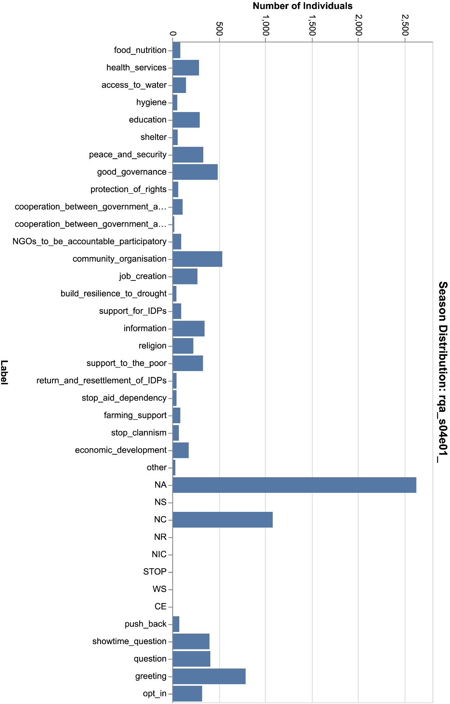{height="500"}

---

# Generated Output Problems
- Losing rich structured information about individuals.
  - Long pipeline that keeps together information about one individual
  - Throwing away in last step from information to research basis.
  
  
Output, aggregated Data is not very useful for our work.

---

# Further Research Insights

#### Structure of Reports:
- Structured by insights gained from radio show
- Then supported through diagrams, single messages
- Comparison between this year and last year
- Focusing on majority of opinions
- Footnotes explaining chart/scales

---

# Why do we do all this and where are we now?

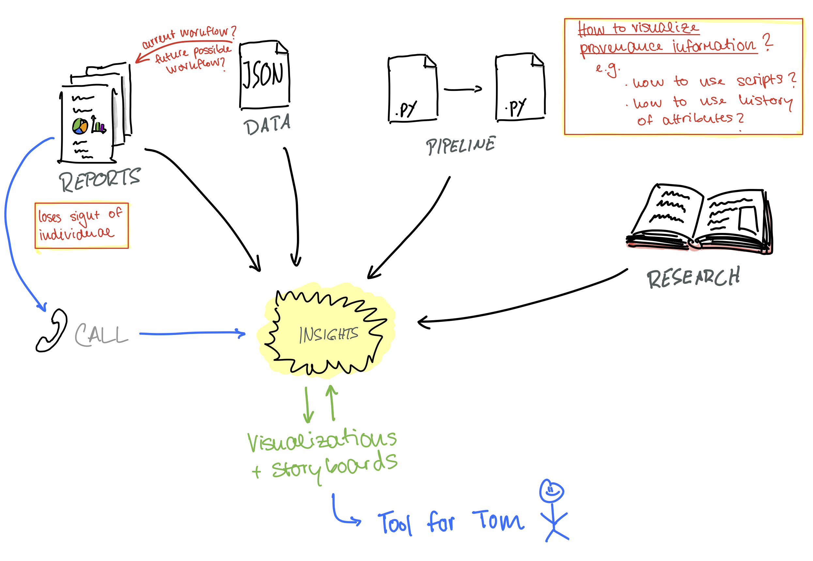{height="500"}

---

# What's next?

- Mid February: 50-70 visualization ideas, 10 storyboards
- Talk with researchers, validate ideas 