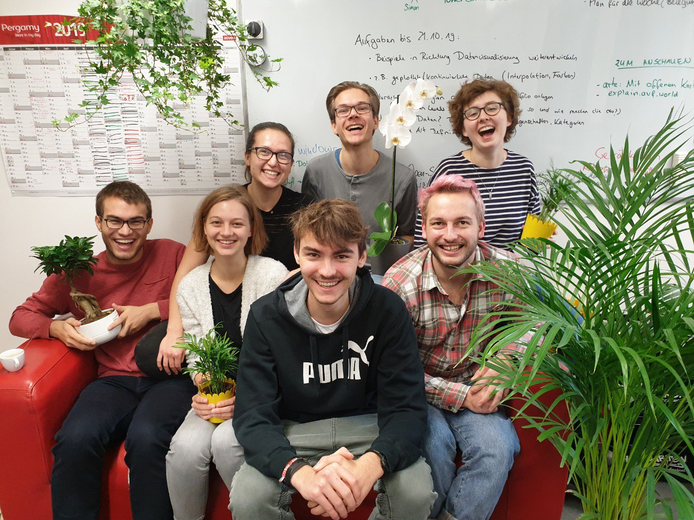

<!-- markdown-config presentation=true -->
<link rel="stylesheet" type="text/css" href="./style.css"  />

  BP2019RH1 - Visualizing Africa's Voices

  Wanda Baltzer, Theresa Hradilak, Lara Pfennigschmidt, Luc Prestin, Moritz Spranger, Simon Stadlinger, Leo Wendt

  2019 
   
  Software Architecture Group  Hasso Plattner Institute  University of Potsdam, Germany

---

# Welcome
{width="650" style="display: block;margin-left: auto; margin-right: auto; width: 70%;"}

---

# Context

**Our Goal:** Create explorable visualizations for

Africa's Voices **collects opinions** of citizens by making a radio show and receiving SMSs as answers.

They use the data to **inform** policy makers.

---

# Stakeholder 

{width="700" height="500"}

---

## How did we approach this goal over the last months?

In **January** we tried to understand the data.

In **January** and **February** we brainstormed a lot and designed many new visualizations.

In **March** we researched on how to display points and started working on our first prototypes.

In **April** we worked on prototypes and integrating them into one system.

---

# What happened since last time?

## Covid-19
- new procedures within AVF (one-to-one conversations)
- new data sets for Somalia and Kenya
- weekly calls with Luke, more user testing, more feedback
- he might even show it to researchers

So we integrated a lot of feedback and started improving old and coming up with new prototypes.
We also worked on a system that could connect all prototypes together in one application.

---

# Scenario

We want to find out whether:
- something related to demographics and themes
- something geographical (rural / urban contrast maybe?)
- urban males are more interested in govt than ???

---
# Demo

#### All In One 
<link rel="stylesheet" href="https://stackpath.bootstrapcdn.com/bootstrap/4.3.1/css/bootstrap.min.css" integrity="sha384-ggOyR0iXCbMQv3Xipma34MD+dH/1fQ784/j6cY/iJTQUOhcWr7x9JvoRxT2MZw1T" crossorigin="anonymous">

<button class="btn" id="openApplication">Open</button>

#### Further Prototypes
- Anthill
- t-sne

---

# What next?

- keep Luke happy
- keep Jens happy
- keep ÖA happy
- start bachelor thesis

---

