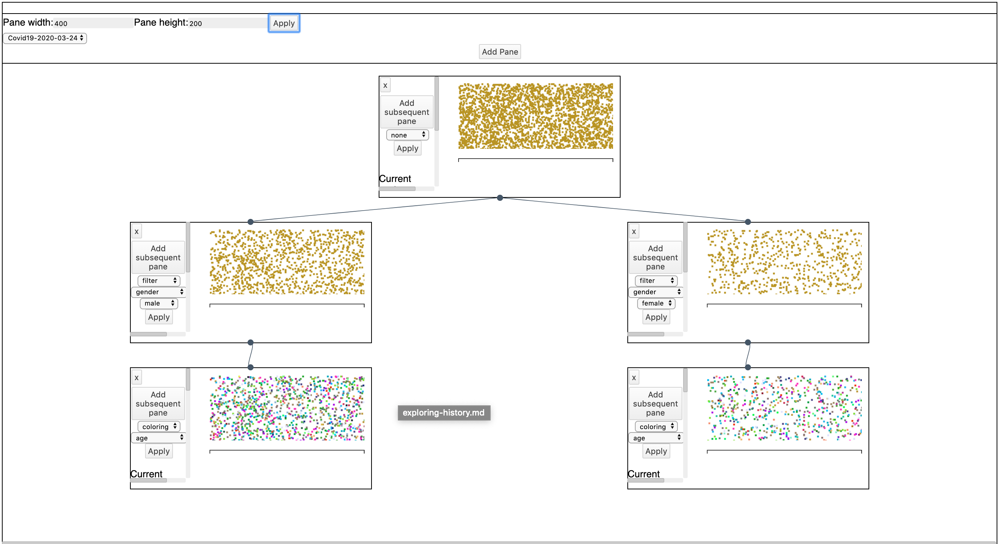

<!-- markdown-config presentation=true -->
<link rel="stylesheet" type="text/css" href="./style.css"  />

# Coming to an end

We have until the end of July.

But there are now more aspects that are part of our bachelor project:
  - PR: poster, press release (28.06.)
  - Final presentation (09.07.)
  - Bachelor theses (22.07.)

=> Around 4 to 5 weeks time to work on the project, but it is difficult to estimate as most of these tasks are new for us

---
# 1. Keep on going as before
### Option A:

Keep improving All-in-One with remaining feedback

### Option B:

Spike new prototypes

### Option B.2:

Build in standard visualizations like (stacked/multidimensional) bar charts, sankey diagram, bundle view

---
# 2. Pick up some old ideas and try something new
### Option C:

Build a window architecture (going back to the pane prototype) to use visualizations independently of each other but with shared state

{height="260", style="float:right"}
### Option D:

Work on a solution to keep state persistent

### Option E:

Improve stability and loading time of All-in-One (and everything component based)

### Option F:

Work on a solution for you to input your own data

---
# Explaining Option B: Ideas for new prototypes

- Sankey diagram
- 3D graph that connects individuals to themes 
- Experiment with fake messages
- [Mindmap storyboard](https://lively-kernel.org/lively4/BP2019RH1/doc/visualizations/storyboards/mindmap.md)
- Bar charts

Interactions:
- Highlight similar individuals
- Lasso selection / filtering
