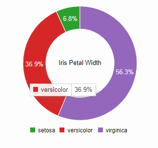
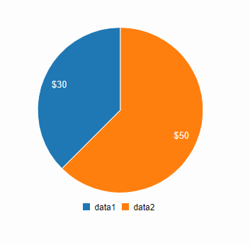

# C3
## context
-	easy to generate D3-based charts by wrapping the code required to construct the entire chart. We don't need to write D3 code any more.
-	gives some classes to each element when generating, so you can define a custom style by the class and it's possible to extend the structure directly by D3.
-	provides a variety of APIs and callbacks to access the state of the chart. By using them, you can update the chart even after it's rendered.

-	Last release: October 2019
-	GitHub: <https://github.com/c3js/c3>
-	Website: <https://c3js.org/>
-	Type of visualization: svg (in divs)
-	Setup: <https://c3js.org/gettingstarted.html#setup> 

## examples
### Donut Chart



```javascript
var chart = c3.generate({
    data: {
        columns: [
            ['data1', 30],
            ['data2', 120],
        ],
        type : 'donut',
        onclick: function (d, i) { console.log("onclick", d, i); },
        onmouseover: function (d, i) { console.log("onmouseover", d, i); },
        onmouseout: function (d, i) { console.log("onmouseout", d, i); }
    },
    donut: {
        title: "Iris Petal Width"
    }
});

setTimeout(function () {
    chart.load({
        columns: [
            ["setosa", 0.2, 0.2, 0.2, 0.2, 0.2, 0.4, 0.3, 0.2, 0.2, 0.1, 0.2, 0.2, 0.1, 0.1, 0.2, 0.4, 0.4, 0.3, 0.3, 0.3, 0.2, 0.4, 0.2, 0.5, 0.2, 0.2, 0.4, 0.2, 0.2, 0.2, 0.2, 0.4, 0.1, 0.2, 0.2, 0.2, 0.2, 0.1, 0.2, 0.2, 0.3, 0.3, 0.2, 0.6, 0.4, 0.3, 0.2, 0.2, 0.2, 0.2],
            ["versicolor", 1.4, 1.5, 1.5, 1.3, 1.5, 1.3, 1.6, 1.0, 1.3, 1.4, 1.0, 1.5, 1.0, 1.4, 1.3, 1.4, 1.5, 1.0, 1.5, 1.1, 1.8, 1.3, 1.5, 1.2, 1.3, 1.4, 1.4, 1.7, 1.5, 1.0, 1.1, 1.0, 1.2, 1.6, 1.5, 1.6, 1.5, 1.3, 1.3, 1.3, 1.2, 1.4, 1.2, 1.0, 1.3, 1.2, 1.3, 1.3, 1.1, 1.3],
            ["virginica", 2.5, 1.9, 2.1, 1.8, 2.2, 2.1, 1.7, 1.8, 1.8, 2.5, 2.0, 1.9, 2.1, 2.0, 2.4, 2.3, 1.8, 2.2, 2.3, 1.5, 2.3, 2.0, 2.0, 1.8, 2.1, 1.8, 1.8, 1.8, 2.1, 1.6, 1.9, 2.0, 2.2, 1.5, 1.4, 2.3, 2.4, 1.8, 1.8, 2.1, 2.4, 2.3, 1.9, 2.3, 2.5, 2.3, 1.9, 2.0, 2.3, 1.8],
        ]
    });
}, 1500);

setTimeout(function () {
    chart.unload({
        ids: 'data1'
    });
    chart.unload({
        ids: 'data2'
    });
}, 2500);
```

- You can hover over the different parts of the chart. This part is then displayed a bit larger and everything else turns transparent. Moreover a box appears with some information. 

### Pie Label Format



```javascript

var chart = c3.generate({
    data: {
        columns: [
            ['data1', 30],
            ['data2', 50]
        ],
        type: 'pie'
    },
    pie: {
        label: {
            format: function (value, ratio, id) {
                return d3.format('$')(value);
            }
        }
    }
});

```

- clicking on the legend the corresponding part of the chart is hidden, a second click makes it visible again

## experience
- fast and easy visualization of data, APIs make it possible to add some interactivity
- customization: 
  - additional axis
  - show axis label
  - change chart type
  - format value
  - using APIs data can be loaded/unloaded, shown/hidden

- documentation: not complete (<https://c3js.org/gettingstarted.html>), more information can be found here: <https://c3js.org/examples.html>
