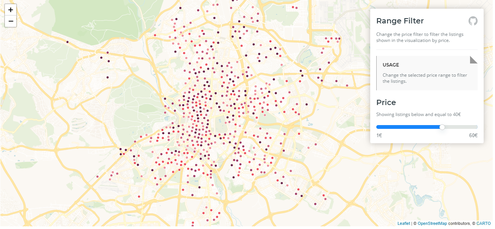

# Carto.js

## Context 
- no longer actively developed, but major bugs will be addressed  
- uses the carto engine api (cartoDB)
- open source software based on PostGIS and PostgreSQL. It is now a software as a service cloud computing platform for GIS, web mapping and spatial data science tools. <https://carto.com/developers/carto-js/support/contribute/>
- offers Data Ingestion, Data Enrichment, Analysis, Solutions and Visualizations as well as Integrations to help business analyze their spatial data and to find solutions.
- requires using an API key
- produced visualization: a map with layers, 

 rendered using Leaflet or Google Maps 
- Developers: CARTODB.Inc

## Users
- DHL
- Vodafone
- Mastercard
- Bloomberg
- BCG
- Telefonica

## Categorisation
- what is possible:  
  - define different layers
  - tooltips
  - country selector widget
  - listening to Data Changes on the Dataview
  - different filters
- develop own visualisations

  
## Experience
- support: <https://carto.com/developers/carto-js/support/support-options/>
- detailed documentation: <https://carto.com/developers/carto-js/guides/overview/>
- I experimented a bit with examples and it creates the feeling of not being very intuitive. It would need a closer reading to completely understand how to create maps with this library