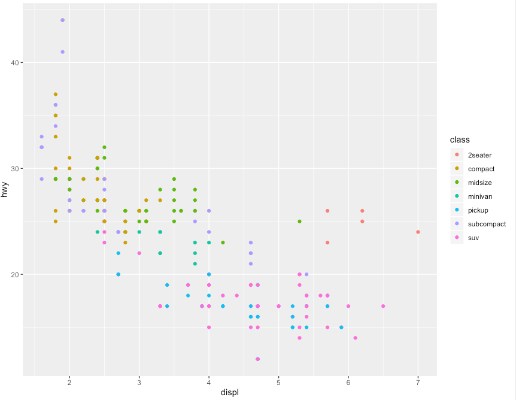

# ggplot2

-----

Stopped working on it for a while, we will continue later on.

-----

- context:
  - Who uses it? Which other projects use this library? Use cases?
    - part of tinyverse package bundle for scientific usage in R
    - statisticians
    - ggplot in python
    - plotly is based on it
  - Who wrote it?
    - Hadley Wickham
    - is implementation of book "Grammar of Graphics" by Leland Wilkinson - a general scheme for data visualisations which breaks up graphs into semantic components such as scales and layers

- 2 or 3 examples (code snippets & screenshots)

### Basic example from tutorials
```R
library(ggplot2)
ggplot(mpg, aes(displ, hwy, colour = class)) + geom_point()
```



The line 'library(ggplot2)' imports the library. 
The next line produces the plot above. 'mpg' is a predefined dataset (It contains a subset of the fuel economy data that the EPA makes available on http://fueleconomy.gov.) 'aes' returns an "aesthetic mapping" which defines the values that are mapped to the x and y axes and further properties like color ('colour = class' defines the color mapping). The '+ geom_point()' defines how the points are plotted and therefore the kind of visualization. For example with 'geom_boxplot()' it looks like this:


- Experience
  - writing text
  - customize to needs 
  