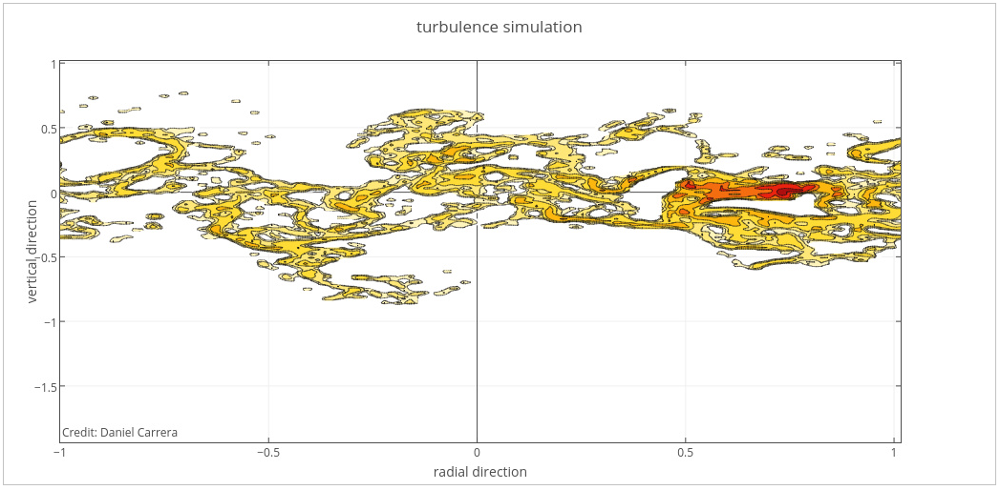
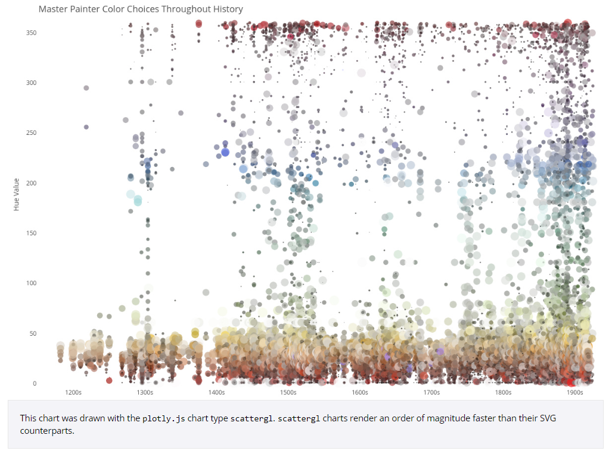
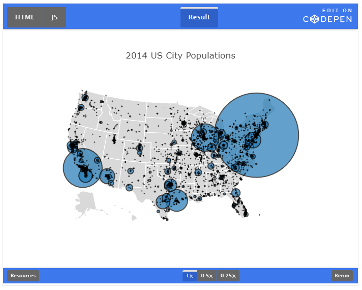

# Plotly.js

<https://plot.ly/javascript/>

## Context
Built on top of d3.js and stack.gl  
high-level, declarative charting library  
includes 20 chart types, containing 3D charts, statistical graphs, SVG maps

open source  
"instigated" (meaning started) by Dr. Alex Johnson  
has been in development for over 3 years  

charts are described as JSON objects, to customise, one can set the corresponding JSON attribute ([list of attributes here](https://plot.ly/javascript/reference/))

most graphs are drawn with svg, but then performance is limited. Therefore plotly uses stack.gl for high performance


```javascript
Plotly.d3.json('https://plot.ly/~DanielCarrera/13.json', function(figure){
                  var trace = {
                    x: figure.data[0].x, y: figure.data[0].y, z: figure.data[0].z,
                    type: 'contour', autocolorscale: false,
                    colorscale: [[0,"rgb(  0,  0,  0)"],[0.3,"rgb(230,  0,  0)"],[0.6,"rgb(255,210,  0)"],[1,"rgb(255,255,255)"]],
                    reversescale: true, zmax: 2.5, zmin: -2.5
                  };
                  var layout = {
                    title: 'turbulence simulation',
                    xaxis: {title: 'radial direction', showline: true, mirror: 'allticks', ticks: 'inside'},
                    yaxis: {title: 'vertical direction', showline: true, mirror: 'allticks', ticks: 'inside'},
                    margin: {l: 40, b: 40, t: 60},
                    annotations: [{
                      showarrow: false,
                      text: 'Credit: Daniel Carrera',
                      x: 0, y: 0, xref: 'paper', yref: 'paper'
                    }]
                  }
                  Plotly.plot(document.getElementById('contour-plot'), [trace], layout, {showLink: false});
                });
```

most graphs are drawn with svg, but then performance is limited. Therefore plotly uses stack.gl for high performance



3D-Charts are rendered with WebGL

is used as a browser-based charting library for Python, R and MATLAB.

# Example: Bubble Chart



```javascript
Plotly.d3.csv('https://raw.githubusercontent.com/plotly/datasets/master/2014_us_cities.csv', function(err, rows){

    function unpack(rows, key) {
        return rows.map(function(row) { return row[key]; });
    }

    var cityName = unpack(rows, 'name'),
        cityPop = unpack(rows, 'pop'),
        cityLat = unpack(rows, 'lat'),
        cityLon = unpack(rows, 'lon'),
        color = [,"rgb(255,65,54)","rgb(133,20,75)","rgb(255,133,27)","lightgrey"],
        citySize = [],
        hoverText = [],
        scale = 50000;

    for ( var i = 0 ; i < cityPop.length; i++) {
        var currentSize = cityPop[i] / scale;
        var currentText = cityName[i] + " pop: " + cityPop[i];
        citySize.push(currentSize);
        hoverText.push(currentText);
    }

    var data = [{
        type: 'scattergeo',
        locationmode: 'USA-states',
        lat: cityLat,
        lon: cityLon,
        hoverinfo: 'text',
        text: hoverText,
        marker: {
            size: citySize,
            line: {
                color: 'black',
                width: 2
            },
        }
    }];

    var layout = {
        title: '2014 US City Populations',
        showlegend: false,
        geo: {
            scope: 'usa',
            projection: {
                type: 'albers usa'
            },
            showland: true,
            landcolor: 'rgb(217, 217, 217)',
            subunitwidth: 1,
            countrywidth: 1,
            subunitcolor: 'rgb(255,255,255)',
            countrycolor: 'rgb(255,255,255)'
        },
    };

    Plotly.plot(myDiv, data, layout, {showLink: false});

});
```