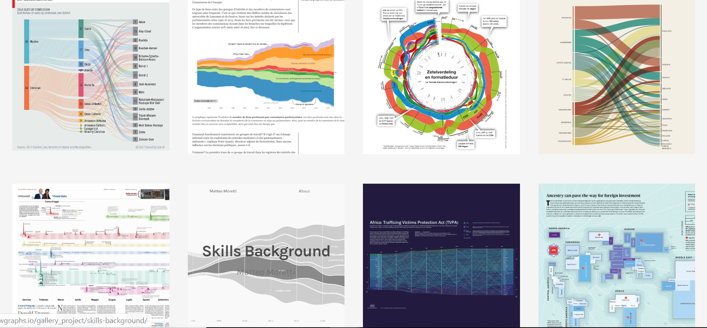
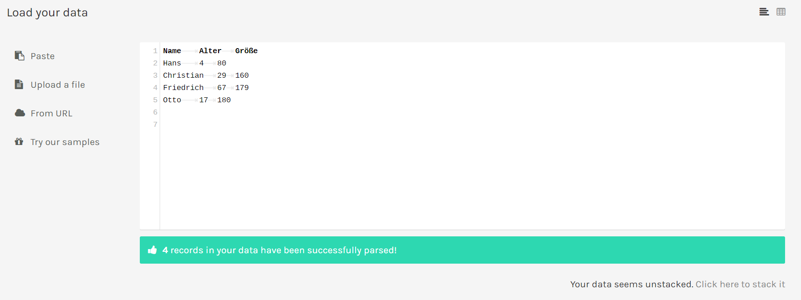
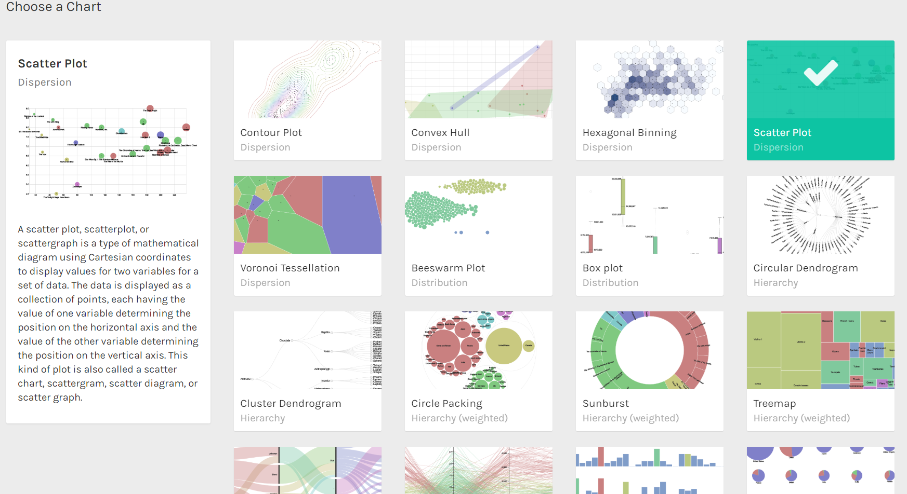
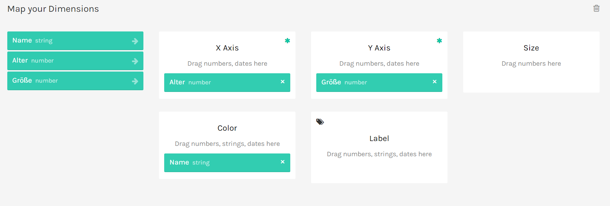
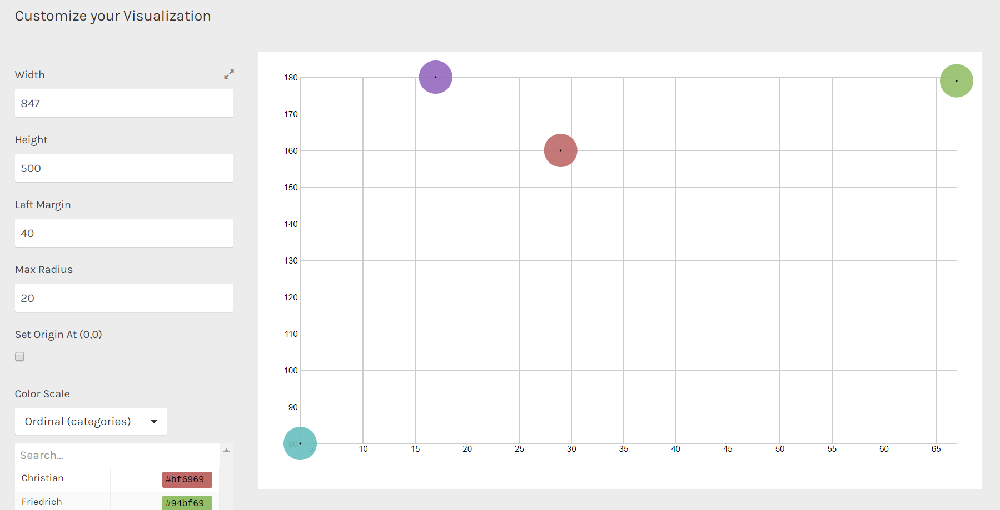

# RawGraphs

## Context
  
  - What is it about?
    - create custom vector-based visualizations on top of the amazing d3.js library
    - tool for designers and vis geeks, RAW aims at providing a missing link between spreadsheet applications and vector graphics editors 
    - works with delimiter-separated values (i.e. csv and tsv files) as well as with copied-and-pasted texts from other applications
    - data is processed only by the web browser: no server-side operation or storage are performed - no one will see, touch or copy your data!
    - highly customizable and extensible, accepting new custom charts defined by users

  - developed at the Density Design Research Lab (Giorgio Caviglia, Michele Mauri, Giorgio Uboldi, Matteo Azzi)
  - last release: June 2018 
  - open source: <https://github.com/rawgraphs/raw>
  - type of visualisation: a svg
  - free installation: <https://github.com/rawgraphs/raw#installation>
    

## Categorisation

  - examples:
  

  - possible to create new charts: <https://github.com/rawgraphs/raw/wiki/Developer-Guide>
  - to visualise your data fast and easy
  - how to create a chart:
  
  

  You can upload or paste your data into the tool.
  
    
  
  Then you can choose the type of chart you want to use.
  
  
  
  Afterwards you have to map your data to the elements of the chart.
  
  
  
  Finally you can customize your chart, adapting the different elements of the chart.
  

## Experience
  
  - App page: <https://app.rawgraphs.io>
  - Project official page: <https://rawgraphs.io>
  - Documentation: <https://github.com/densitydesign/raw/wiki>
  - Google group: <https://groups.google.com/forum/#!forum/densitydesign-raw>
  
  - nice tool to visualize your data, but not really useful to create your own interactive charts