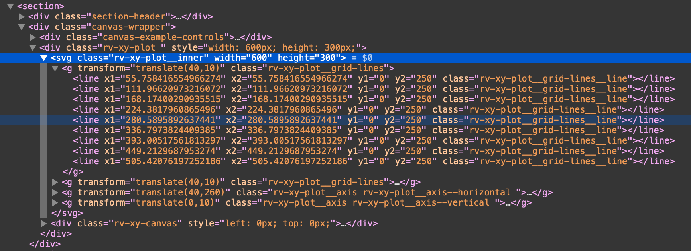
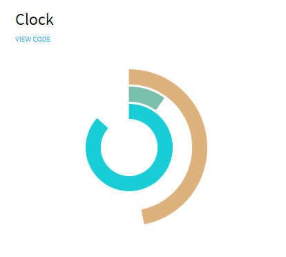
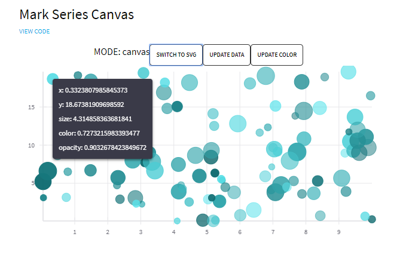
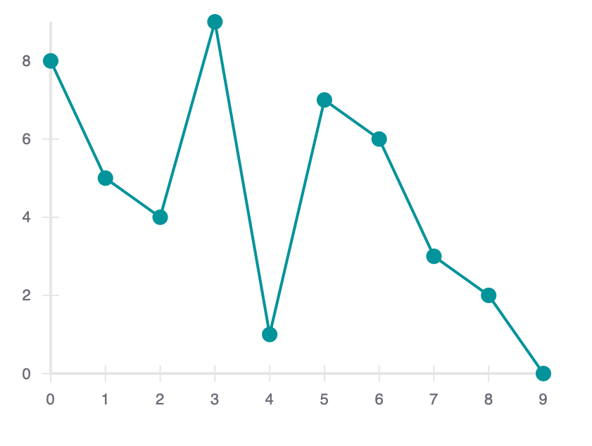

# React-vis

## Context
- a lot of contributors, for names please visit:
<https://uber.github.io/react-vis/>
- open source (isn't explicitly stated, but everyone is welcome to join): <https://github.com/uber/react-vis>
- last release April 2019
- usage: install via npm, free of charge
- People, who use react, most likely also use react-vis
- Uber Technologies Inc. developed it and uses it 

- produced visualisation:

  - it is possible to show it as svg or canvas

## Contents
A collection of react components to render common data visualization charts, such as 
- line/area/bar charts 
- heat maps
- scatterplots
- contour plots
- hexagon heatmaps
- pie and donut charts
- sunbursts
- radar charts
- parallel coordinates
- tree maps.

## Features
Some notable features:
- Simplicity: react-vis doesn't require any deep knowledge of data visualization libraries to start building your first visualizations.
- Flexibility: react-vis provides a set of basic building blocks for different charts. For instance, separate X and Y axis components. This provides a high level of control of chart layout for applications that need it.
- Ease of use: The library provides a set of defaults which can be overridden by the custom user's settings.
- Integration with React: react-vis supports the React's lifecycle and doesn't create unnecessary nodes.

## Examples

### Clock



```javascript
import React from 'react';

import {XYPlot, ArcSeries} from 'index';

import {EXTENDED_DISCRETE_COLOR_RANGE} from 'theme';

const PI = Math.PI;

function getSeconds() {
  return Math.floor(new Date().getTime() / 1000);
}

export default class ClockExample extends React.Component {
  state = {
    time: 0
  };

  componentDidMount() {
    this._timerId = setInterval(() => this.setState({time: getSeconds()}), 100);
  }

  componentWillUnmount() {
    clearInterval(this._timerId);
    this.setState({timerId: false});
  }

  render() {
    const {time} = this.state;
    const seconds = time % 60;
    const minutes = (time / 60) % 60;
    const hours = (time / (60 * 24)) % 24;
    return (
      <XYPlot
        xDomain={[-3, 3]}
        yDomain={[-3, 3]}
        width={300}
        getAngle={d => d.time}
        getAngle0={d => 0}
        height={300}
      >
        <ArcSeries
          animation={{
            damping: 9,
            stiffness: 300
          }}
          radiusDomain={[0, 3]}
          data={[
            {time: (seconds / 60) * 2 * PI, radius0: 1, radius: 1.5, color: 0},
            {
              time: (minutes / 60) * 2 * PI,
              radius0: 1.6,
              radius: 2.1,
              color: 1
            },
            {time: (hours / 24) * 2 * PI, radius0: 2.2, radius: 2.7, color: 2}
          ]}
          colorRange={EXTENDED_DISCRETE_COLOR_RANGE}
        />
      </XYPlot>
    );
  }
}
```

### Bubbles



```javascript
import React from 'react';
import ShowcaseButton from '../showcase-components/showcase-button';

import {
  XYPlot,
  XAxis,
  YAxis,
  VerticalGridLines,
  HorizontalGridLines,
  MarkSeries,
  MarkSeriesCanvas,
  Hint
} from 'index';

function getRandomData() {
  return new Array(100).fill(0).map(row => ({
    x: Math.random() * 10,
    y: Math.random() * 20,
    size: Math.random() * 10,
    color: Math.random() * 10,
    opacity: Math.random() * 0.5 + 0.5
  }));
}
const colorRanges = {
  typeA: ['#59E4EC', '#0D676C'],
  typeB: ['#EFC1E3', '#B52F93']
};

const randomData = getRandomData();
const nextType = {
  typeA: 'typeB',
  typeB: 'typeA'
};

const nextModeContent = {
  canvas: 'SWITCH TO SVG',
  svg: 'SWITCH TO CANVAS'
};

const drawModes = ['canvas', 'svg'];

export default class Example extends React.Component {
  state = {
    drawMode: 0,
    data: randomData,
    colorType: 'typeA',
    value: false
  };

  render() {
    const {drawMode, data, colorType} = this.state;
    const markSeriesProps = {
      animation: true,
      className: 'mark-series-example',
      sizeRange: [5, 15],
      seriesId: 'my-example-scatterplot',
      colorRange: colorRanges[colorType],
      opacityType: 'literal',
      data,
      onNearestXY: value => this.setState({value})
    };

    const mode = drawModes[drawMode];
    return (
      <div className="canvas-wrapper">
        <div className="canvas-example-controls">
          <div>{`MODE: ${mode}`}</div>
          <ShowcaseButton
            onClick={() => this.setState({drawMode: (drawMode + 1) % 2})}
            buttonContent={nextModeContent[mode]}
          />
          <ShowcaseButton
            onClick={() => this.setState({data: getRandomData()})}
            buttonContent={'UPDATE DATA'}
          />
          <ShowcaseButton
            onClick={() => this.setState({colorType: nextType[colorType]})}
            buttonContent={'UPDATE COLOR'}
          />
        </div>
        <XYPlot
          onMouseLeave={() => this.setState({value: false})}
          width={600}
          height={300}
        >
          <VerticalGridLines />
          <HorizontalGridLines />
          <XAxis />
          <YAxis />
          {mode === 'canvas' && <MarkSeriesCanvas {...markSeriesProps} />}
          {mode === 'svg' && <MarkSeries {...markSeriesProps} />}
          {this.state.value ? <Hint value={this.state.value} /> : null}
        </XYPlot>
      </div>
    );
  }
}
```

For more examples 
## Experience
- detailed documentation: <https://uber.github.io/react-vis/documentation/welcome-to-react-vis>

- via [Codepen](https://codepen.io/ubervisualization/pen/BZOeZB)


Javascript:
```javascript
const {
  HorizontalGridLines,
  VerticalGridLines,
  XAxis,
  XYPlot,
  YAxis,
  LineMarkSeries
} = reactVis;

function Chart({data}) {
  return <XYPlot width={400} height={300}><XAxis/><YAxis/>
    <HorizontalGridLines />
    <VerticalGridLines />
    <LineMarkSeries data={data} />
    </XYPlot>;
}

const data = [
  {x: 0, y: 8},
  {x: 1, y: 5},
  {x: 2, y: 4},
  {x: 3, y: 9},
  {x: 4, y: 1},
  {x: 5, y: 7},
  {x: 6, y: 6},
  {x: 7, y: 3},
  {x: 8, y: 2},
  {x: 9, y: 0}
];

const chart = <Chart data={data}/>;
ReactDOM.render(chart, document.querySelector('#root'));
```

HTML:
```html
<div id='root' />
```

CSS:
```css
.rv-xy-plot {
  font-family: sans-serif;
}
```

This is a minimal example on how to get started. You can set the height and the width of the chart, as well as what kind of chart it should be (the XYPlot contains the Chart). You can also add gridlines, set the scales directly (otherwise they are set dynamically to fit the data), set colours, add event handlers like proximity handlers, mouse over and click event handlers. There seems to be a difference between "series", "values" and "XYPlot" event handlers. You can also choose animations for example for rearranging or updating data (with lots of wobbling or just a little). Usually the styles are set in an extra stylesheet but you can also set the styles inline with classes or by using the style property.