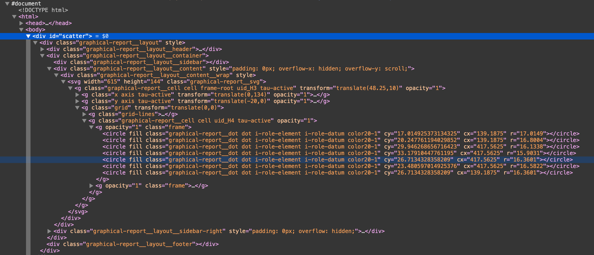
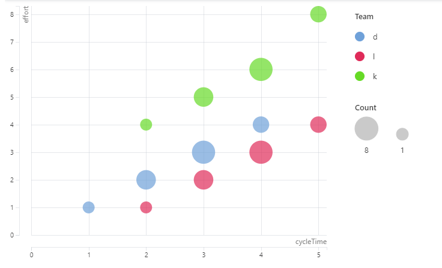
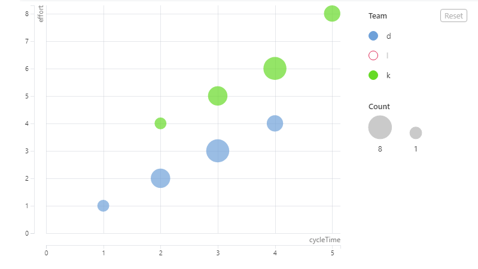

# tauCharts

## Description & Context 
- based on the D3 framework and 'Grammar of Graphics' concepts.
- perfect visual design, flexible and powerful, can be extended with plugins.
- can draw some really complex and interactive visualizations.

- requires the source data to be provided in a form of structured table which can be expressed in javascript as an array of same-typed objects (e.g. in example above: name, age, gender, hasChild).
- usage: with CDN, with Bower or with npm; free of charge
- what is produced as a visualization? div and svg (?)



- open source, last release from July 2019

Detailed documentation: [https://api.taucharts.com/basic/]()

GitHub source: [https://github.com/TargetProcess/tauCharts]()

Website: [https://taucharts.com]()


## Categorisation
- customisability: you can adapt design, ux, ui and product requirements according to your own needs (by creating new plugins)
- what applies more as a use case: develop own visualizations or visualize your data fast and easy? => both

## Users
- targetprocess (visual management software)
- vizydrop (information visualization software)
- KUKU.io (social media management tool)
- SQLPAD
- R Widgets

## Examples

### Scatterplot chart



- When hovering over the bubbles, you get an infobox showing all attributes of that bubble. 
- When you click on a bubble, it is highlighted and you get the option to exclude this bubble from the chart. 


- When hovering over the bubbles of the legend, the bubbles with this attribute are highlighted whereas the other bubbles turn transparent. Moreover, you can click on the bubbles in the legend to exclude or include the according bubbles. The chart zooms in or out to create an appropriate perspective. It is possible to reset the changes.

javascript:

```javascript
var defData = [{
    "team": "d",
    "cycleTime": 1,
    "effort": 1,
    "count": 1,
    "priority": "low"
  }, {
    "team": "d",
    "cycleTime": 2,
    "effort": 2,
    "count": 5,
    "priority": "low"
  }, {
    "team": "d",
    "cycleTime": 3,
    "effort": 3,
    "count": 8,
    "priority": "medium"
  }, {
    "team": "d",
    "cycleTime": 4,
    "effort": 4,
    "count": 3,
    "priority": "high"
  }, {
    "team": "l",
    "cycleTime": 2,
    "effort": 1,
    "count": 1,
    "priority": "low"
  }, {
    "team": "l",
    "cycleTime": 3,
    "effort": 2,
    "count": 5,
    "priority": "low"
  }, {
    "team": "l",
    "cycleTime": 4,
    "effort": 3,
    "count": 8,
    "priority": "medium"
  }, {
    "team": "l",
    "cycleTime": 5,
    "effort": 4,
    "count": 3,
    "priority": "high"
  },
  {
    "team": "k",
    "cycleTime": 2,
    "effort": 4,
    "count": 1,
    "priority": "low"
  }, {
    "team": "k",
    "cycleTime": 3,
    "effort": 5,
    "count": 5,
    "priority": "low"
  }, {
    "team": "k",
    "cycleTime": 4,
    "effort": 6,
    "count": 8,
    "priority": "medium"
  }, {
    "team": "k",
    "cycleTime": 5,
    "effort": 8,
    "count": 3,
    "priority": "high"
  }
];
var chart = new Taucharts.Chart({
  data: defData,
  type: 'scatterplot',
  x: 'cycleTime',
  y: 'effort',
  color: 'team',
  size: 'count',
  plugins: [Taucharts.api.plugins.get('tooltip')(), Taucharts.api.plugins.get('legend')()]
});
chart.renderTo('#scatter');
```

CSS:

```css
html,
body,
#scatter {
  width: 100%;
  height: 100%;
  margin: 0;
  padding: 0;
}

#scatter>svg {
  display: block;
}
```

HTML:

```html
<div id="scatter"></div>
```

For more examples visit the website or documentation.


  

  