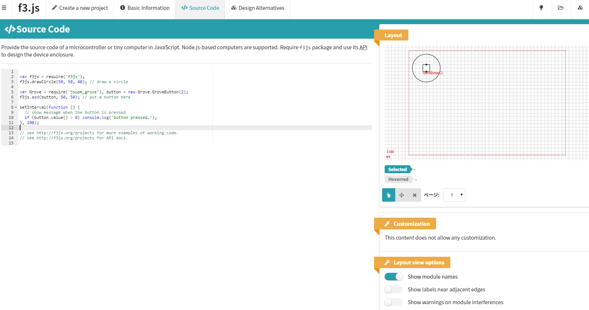
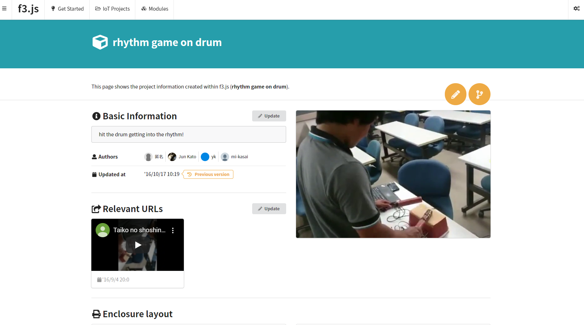
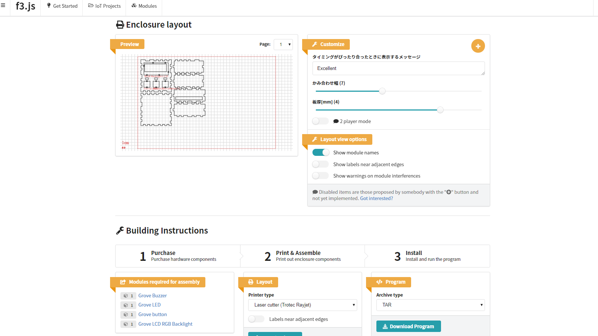
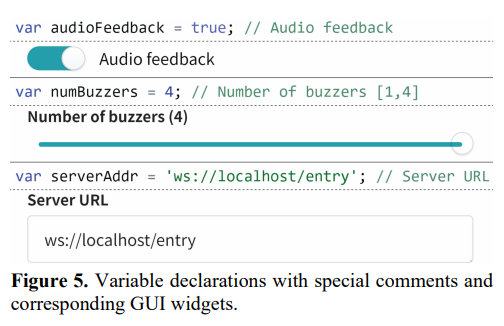

# f3.js

- Code-centric development process & web-based design tool

  - One code base 
  - GUI-like APIs for hardware layout and software
- Example implementation to combine Layouts and programs

1. Interaction designers write code, declare parameters to produce the layout and programs

2. End-users adapt the parameters in UI:
    - Search for an interesting project
    - Explore device variations through GUI-widgets
      -> Updates variable declarations in the code base
      

3. End-users downloads detailed, dynamically generated instructions for device assembly including:
    - What to buy
    - Pdf for the laser cutter
    - Program to install and run on the target platform
  

[Paper](https://junkato.jp/publications/dis2017-kato-f3js.pdf): 
- f3.js provides 
    - a **code editor** to write JavaScript source code that produces both the layouts and programs for physical computing devices. 
        - capable of live programming that continuously evaluates the code and keeps the interface builder up-to-date.
    - **interface builder** next to the editor just as IDEs for GUI applications do. The editor is  The 
        - shows a development view of the device and visualizes warnings of interference between sensor and actuator modules, which are calculated from module metrics information.
        - supports direct manipulation, such as the selection of shapes, the addition or removal of modules, and the dragging-anddropping of modules to change their positions. 
        - operations are reflected back in the code to maintain a bidirectional relationship between the code and view.
- When a variable declaration is made with a **text comment** in the code editor, a corresponding lightweight **GUI widget** is instantly populated below the interface builder. The type of the widget is dependent on the type of the initial value of the variable and the text comments.

- When the GUI widgets are manipulated, the source code is edited to reflect the updated values. Manipulating the widget can affect every aspect of the device to be generated
- **Implementation:**
  - Web-based application consisting of a **Web server** and an **HTML/JavaScript-based client**.
  - can be accessed with any Web standard-compliant browser on a desktop computer, tablet, or smartphone.
  - automatically executes the Node.js code with its JavaScript interpreter after every edit on the cod

[Description](https://junkato.jp/f3js/) &
[Website with projects](http://f3js.org/)

