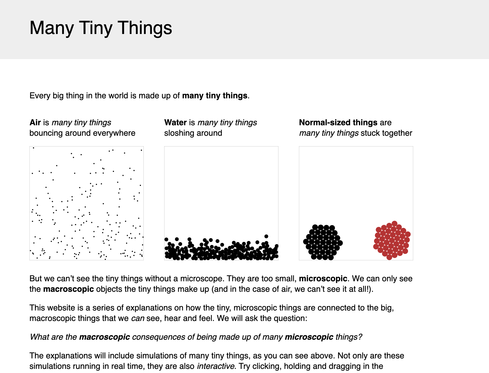
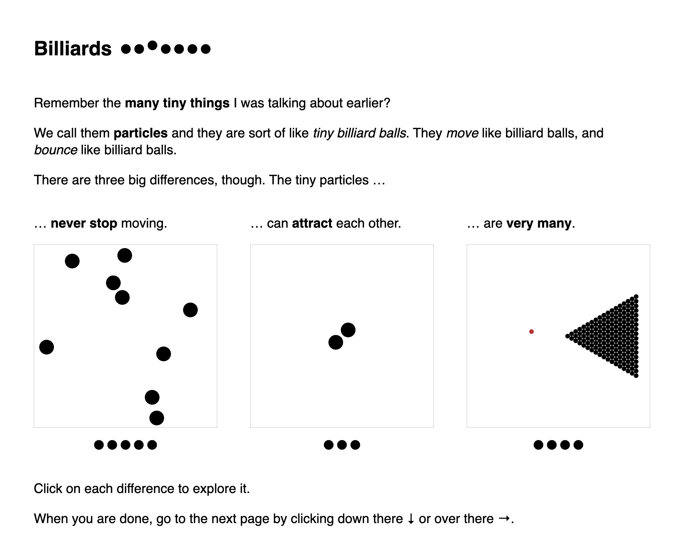

# Explorable Explanations

[Explorable Explanations Website](https://explorabl.es/)
developed by Nicky Case 

serves all  kinds of explorable stories/explanations for a topic (3 random chosen)

## e.g Many Tiny Things

#### "reading" the Visualization
  - written text explaining a topic, animated particles within a bordered field
  - can click on a field containing an image with particles to continue "tutorial"
  - bubbles below the button visualize how many units are already learned
  - also hierarchical units (units within units)
  - within one tutorial you have tasks with a checkbox 
  - text asks questions that encourage trying out stuff
  - checkbox ticks off itself when the task has been completed
  - only showing answer or explanation when it has been already discovered by user through fulfilling the task
  - more tasks may show up
  - user can click on margin right or below to move to next unit
  
  
  
#### what kind of visualization
  - text explaining either context in the real world, tasks or how to use
  - field for particle simulation
  - live graph based on user input (height of ball)
  
#### what data
  - simulated particles (speed, bouncing, colliding with other particles/borders, friction)
  
#### mapping data to visualization
  - simulated data is shown within a field
  - user input influences simulation (e.g. friction -> speed)
  
#### what kind of interaction for the user
  - within simulation: moving (directly dragging), moving through dragging an arrow for force, creating new particles, attracting particles
  - reset button
  - slider (ice - mud, influencing friction)
  - slider for amount of particles / made by zooming out and showing more
  