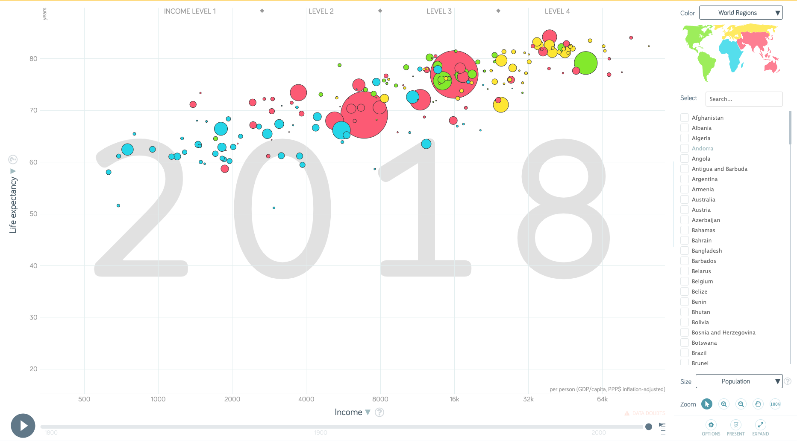
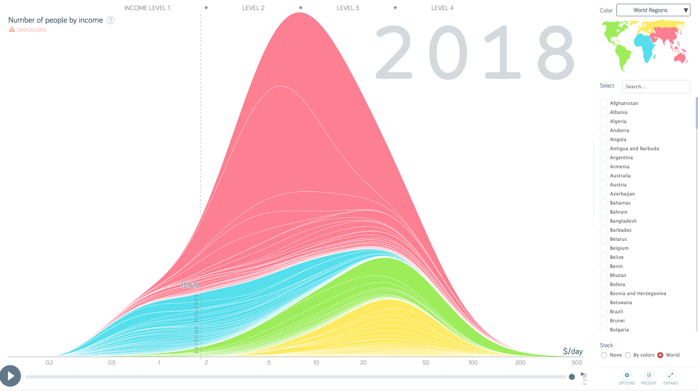
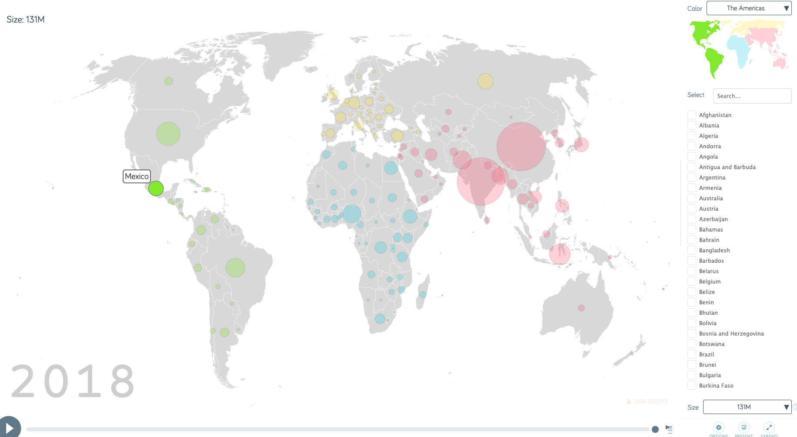

# Gapminder Graphics

## Bubbles

### Reading the visualization
First of all, the wide central coordinates system dominates the visualization. Quickly after approaching the Graphic, the relatively big play/pause button at the bottom left corner grabs the attention and after clicking, the coordinate system with bubbles on it comes to life. As the time slider triggered by the play/pause button moves forward, the bubbles start to change their position and size. After watching the smooth animation, the next move we did, was hovering the mouse over some bubbles, which lets the rest of the bubbles decrease their opacity. The text appearing next to the bubble denotes the country the bubble is representing. 
After dragging the slider by hand several times and identifying some major historical events like world war 1 and two, the customize able axis were noticed. After this, we explored the country picker and its functionality and the ability to toggle trails and choose between zooming, dragging and pointing when it comes to the functionality of the mouse 

### What kind of visualization 
#### Visual elements
- Bubbles located on x and y axis(Different size, different color)
- Grid lines
- Coordinates system
- Watermark Year
- World map with different colors
- Trails between bubbles of a country

### Data
- Database fetched from the server over API.
- UN Tables / Database.

### Mapping data to visualization
- Data, that is plotted, can be chosen by the user. 
- Data transforms / is plotted live as the time slider moves forward.
- Simple projection

### User interaction
- Freely choose axis metric / color coding with advanced drop down menu.
- When you choose a specific country with a dedicated country picker, the graph connects the yearly bubble of the chosen country with lines of the same color as the bubbles.
- Toggle Trails of countries. Chose more than one countries at a time -> Comparable trails.
- Time slider:
  - Animated Time-traveling with pause and play button
  - Draggable slider for faster time travel
- Change functionality of mouse, for more explorability of the coordinate system (zooming, moving, pointing)

## Income

### Reading the visualization
With the bubbles graphics in mind, the income visualization is processed much quicker. A familiar time slider with dragging and play / pause button at the bottom of the visualization is noticed. On the right hand side of a sufficiently wide browser window the same world map with the same colors coloring the continents and country picker as in the bubble chart is rendered. However the dominating chart has only one explicit axis; the x-axis. The $/day label of this axis can be seen clearly on the bottom right of the chart. The chart itself shows a stacked area chart of the worlds population distributed on different income levels shown on the x-axis. The continents are stacked over each other. As the time moves forward the areas smoothly shift and transform towards the right of the chart. After exploring the hovering feature, which is quite similar to the one found in the bubbles graphic, a red warning right beneath the chart title is noticed, which states that the data may not be correct or complete.

### What kind of visualization 
#### Visual elements
- coordinate system / main graphic
- Color coding 
- Income Levels with overlay
- Watermark year
- Extreme poverty line 
- Data doubts warning

#### Mechanics
- time traveling
- curve shifting / transformation

### Datatype
- Fetched from Database (Table)

### Mapping the visualization
- Not live
- Automated
- Data points of table are projected and smoothed out to form bell shaped curves.

### User interaction
- Drop down menus to select color coding
- Country picker
  - Highlights selected countries in main graphic
  - Information about population is displayed on upper left side of main graphic
- Time slider 
  - Play / Pause button
  - Draggable by hand
- Income level hover
- Detailed country hover

## Maps

### Reading the visualization
The dominating graphic shows a gray world map with familiar colored bubbles (per country) and country borders. The time slider is the same as in the other charts encountered before, as well as the color coding and country picker. Whats new is the drop down for choosing what the size of the bubbles encodes.

### What kind of visualization 
#### Visual elements
- World map / main graphic
- Color coding 
- Watermark year
- Bubbles
- Data doubts warning

#### Mechanics
- time traveling

### Datatype
- Fetched from Database (Table)

### Mapping the visualization
- Not live
- Automated
- Projected

### User interaction
- Drop down menus to select color coding
- Country picker
  - Highlights selected countries in main graphic
  - Information about population is displayed on upper left side of main graphic
- Time slider 
  - Play / Pause button
  - Draggable by hand
- Detailed country hover

## Remaining Charts
There are more chart types with similar interaction patterns, e.g. ranks, population pyramid and graphs.

