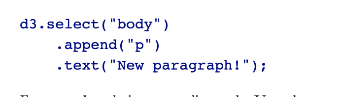
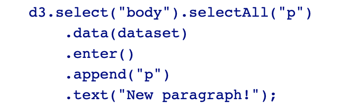
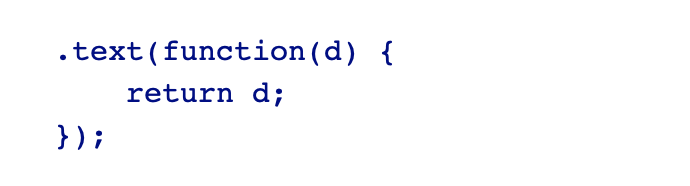

- basic system:
  - working on DOM elements
  
  
    0. reference D3 object
    1. Select DOM element to work on (using a CSS selector)
    2. Append / Create new DOM element 
    3. Insert string between the opening and closing tags of the current selection / do whatever else you want to do e.g. change .style(), .attr()
    
  - ok, great! I can manipulate DOM elements. And what now? 
    - Bind your data to DOM elements of course! (So you can work with it.)
    - D3js natively works with a whole bunch of data (arrays, objects, JSON, GeoJSON, built-in methods to load CSV)
    - with var dataset = [5, 10, 15, 20, 25];
    
    
    0. Select d3 object and place in DOM hierachy where you want to create new data bound DOM elements
    1. .data() counts and parses data
    2. .enter() creates new, data-bound elements. (If there are more data values than corresponding DOM elements, then enter() creates a new placeholder element)
    3. .append() and .text() - work on each of the new data-bound elements / placeholder elements 
    
    - data gets saved in \_\_data\_\_ attribute of created data-bound element
  - one last thing - how to access my data?
    - when chaining methods together anytime **after** you call data(), you can create an anonymous function that accepts **d** as input and then use d as a variable that holds the data you bound to your current DOM element
    
