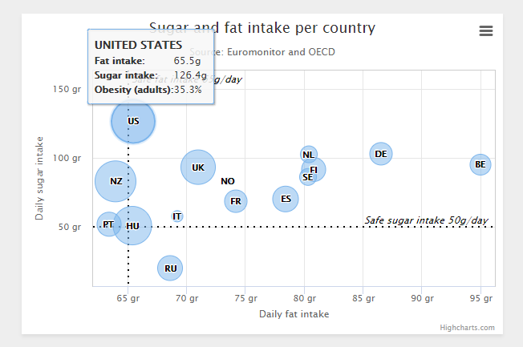
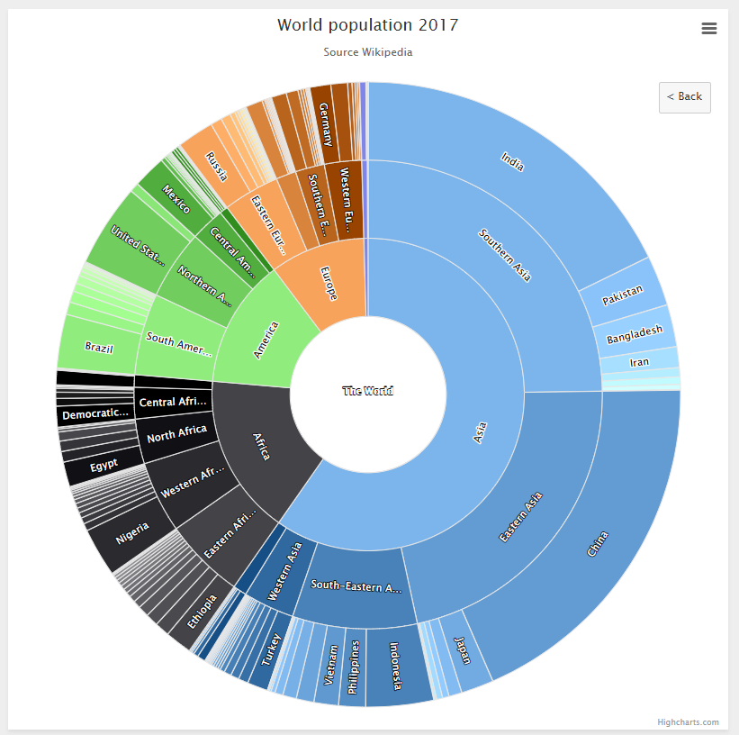
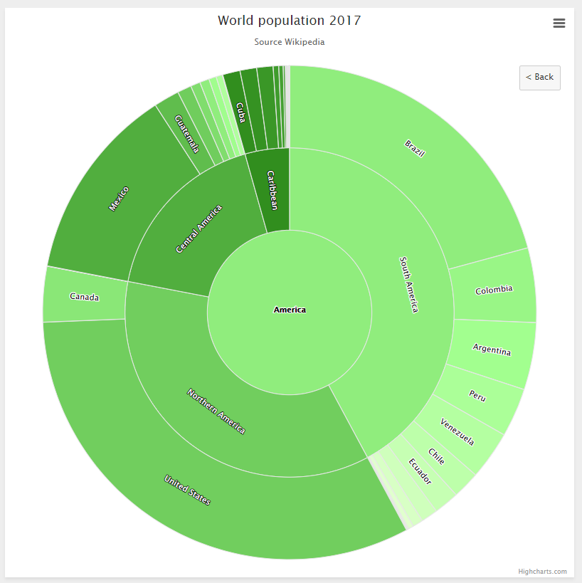
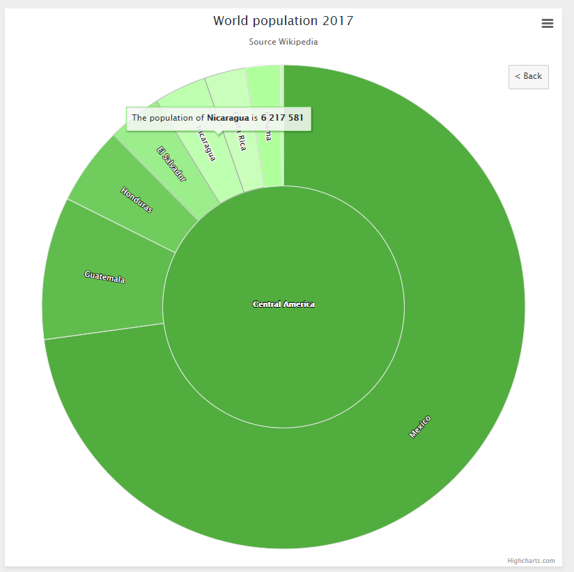

# Highcharts

## context

- set up interactive charts for web pages
- charts, maps, stocks
- there is a free version, but it is not quite clear what this version includes
- free for non-commercial organizations under a Creative Commons Attribution-NonCommercial license 
- open source with commercial options: for all license types, you are allowed to download the source code and make your own edits. This allows for personal modifications and a great flexibility.

- type of visualization: svg
- last release: October 2019

## example: bubble chart

- <https://www.highcharts.com/demo/bubble>



Javascript: 

```javascript
Highcharts.chart('container', {

  chart: {
    type: 'bubble',
    plotBorderWidth: 1,
    zoomType: 'xy'
  },

  legend: {
    enabled: false
  },

  title: {
    text: 'Sugar and fat intake per country'
  },

  subtitle: {
    text: 'Source: <a href="http://www.euromonitor.com/">Euromonitor</a> and <a href="https://data.oecd.org/">OECD</a>'
  },

  xAxis: {
    gridLineWidth: 1,
    title: {
      text: 'Daily fat intake'
    },
    labels: {
      format: '{value} gr'
    },
    plotLines: [{
      color: 'black',
      dashStyle: 'dot',
      width: 2,
      value: 65,
      label: {
        rotation: 0,
        y: 15,
        style: {
          fontStyle: 'italic'
        },
        text: 'Safe fat intake 65g/day'
      },
      zIndex: 3
    }]
  },

  yAxis: {
    startOnTick: false,
    endOnTick: false,
    title: {
      text: 'Daily sugar intake'
    },
    labels: {
      format: '{value} gr'
    },
    maxPadding: 0.2,
    plotLines: [{
      color: 'black',
      dashStyle: 'dot',
      width: 2,
      value: 50,
      label: {
        align: 'right',
        style: {
          fontStyle: 'italic'
        },
        text: 'Safe sugar intake 50g/day',
        x: -10
      },
      zIndex: 3
    }]
  },

  tooltip: {
    useHTML: true,
    headerFormat: '<table>',
    pointFormat: '<tr><th colspan="2"><h3>{point.country}</h3></th></tr>' +
      '<tr><th>Fat intake:</th><td>{point.x}g</td></tr>' +
      '<tr><th>Sugar intake:</th><td>{point.y}g</td></tr>' +
      '<tr><th>Obesity (adults):</th><td>{point.z}%</td></tr>',
    footerFormat: '</table>',
    followPointer: true
  },

  plotOptions: {
    series: {
      dataLabels: {
        enabled: true,
        format: '{point.name}'
      }
    }
  },

  series: [{
    data: [
      { x: 95, y: 95, z: 13.8, name: 'BE', country: 'Belgium' },
      { x: 86.5, y: 102.9, z: 14.7, name: 'DE', country: 'Germany' },
      { x: 80.8, y: 91.5, z: 15.8, name: 'FI', country: 'Finland' },
      { x: 80.4, y: 102.5, z: 12, name: 'NL', country: 'Netherlands' },
      { x: 80.3, y: 86.1, z: 11.8, name: 'SE', country: 'Sweden' },
      { x: 78.4, y: 70.1, z: 16.6, name: 'ES', country: 'Spain' },
      { x: 74.2, y: 68.5, z: 14.5, name: 'FR', country: 'France' },
      { x: 73.5, y: 83.1, z: 10, name: 'NO', country: 'Norway' },
      { x: 71, y: 93.2, z: 24.7, name: 'UK', country: 'United Kingdom' },
      { x: 69.2, y: 57.6, z: 10.4, name: 'IT', country: 'Italy' },
      { x: 68.6, y: 20, z: 16, name: 'RU', country: 'Russia' },
      { x: 65.5, y: 126.4, z: 35.3, name: 'US', country: 'United States' },
      { x: 65.4, y: 50.8, z: 28.5, name: 'HU', country: 'Hungary' },
      { x: 63.4, y: 51.8, z: 15.4, name: 'PT', country: 'Portugal' },
      { x: 64, y: 82.9, z: 31.3, name: 'NZ', country: 'New Zealand' }
    ]
  }]

});
```

CSS: 

```css
.highcharts-tooltip h3 {
  margin: 0.3em 0;
} ?>
```

HTML: 

```html
<script src="https://code.highcharts.com/highcharts.js"></script>
<script src="https://code.highcharts.com/highcharts-more.js"></script>
<script src="https://code.highcharts.com/modules/exporting.js"></script>
<script src="https://code.highcharts.com/modules/export-data.js"></script>

<div id="container" style="height: 400px; min-width: 310px; max-width: 600px; margin: 0 auto"></div>
```

- it is possible to **zoom** in 
- an info box appears when hovering over a bubble 
- different themes: dark, sand, light
- the chart can be downloaded as png, jpeg, pdf, svg
- the chart can be displayed in full screen

## example: sunburst

- <https://www.highcharts.com/demo/sunburst>



- you can click on a continent and the chart changes, now showing only the countries and regions on this continent





## customisability

- APIs make it possible to add interactivity

## experience
- documentation: <https://www.highcharts.com/docs/index>
- support: <https://www.highcharts.com/blog/support/> 
- API reference: <https://api.highcharts.com/highcharts/>