# The Functional Art by Alberto Cairo

## Foundations
### Introduction Visualization and Infographics
- brain doesn’t just process information that comes though the eyes. It also creates mental visual images that allow us to reason and plan actions that facilitate survival
- Infographics and visualization exist on a continuum
  - Infographics --------- Visualization
  - Presentation --------- Exploration

mainly presentation:
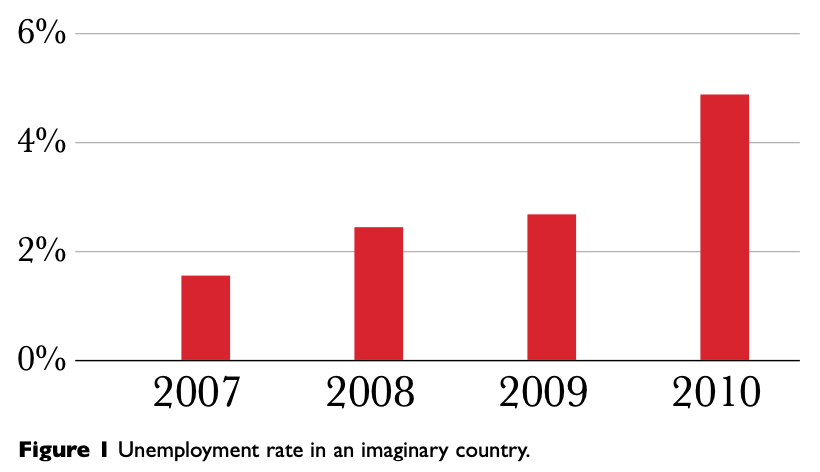

mainly exploration:
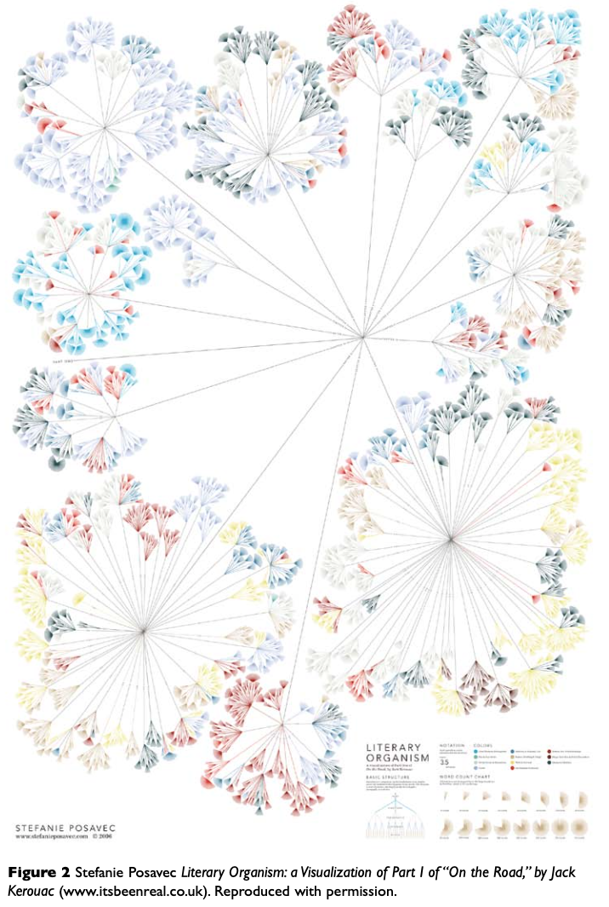

but every graphic has both:
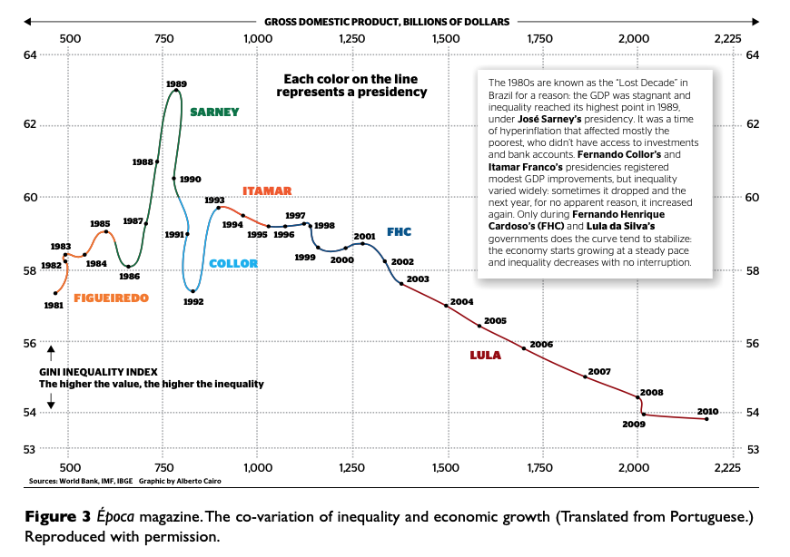

- The Functional Art: Graphics, charts, and maps aren’t just tools to be seen, but to be read and scrutinized
- the relationship between visualization and art, which is similar to the linkage of journalism and literature
- __main take-away: visualizations shouldn't just "look good", but be functional to convey a message__

### Why Visualize: From Information to Wisdom
- Example profile of visualization in book: "The Rational Optimist" by Matt Ridley
- argument about world population: Both doomsayers (too high fertility rates in poor countries and too low fertility rates in rich countries because of opposing trends in both poor and rich countries)

Graphic to support his point:
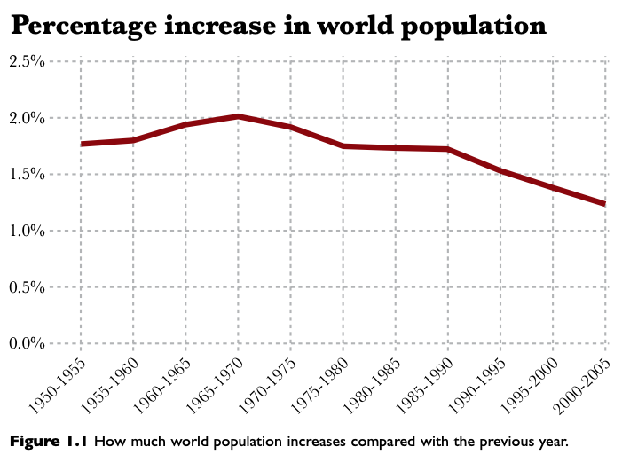

- __Problem: Graphic is aggregate of data of all countries, impedes ability to see support for discussed trends__
- first and main goal of any graphic and visualization is to be a tool for your eyes and brain to perceive what lies beyond their natural reach

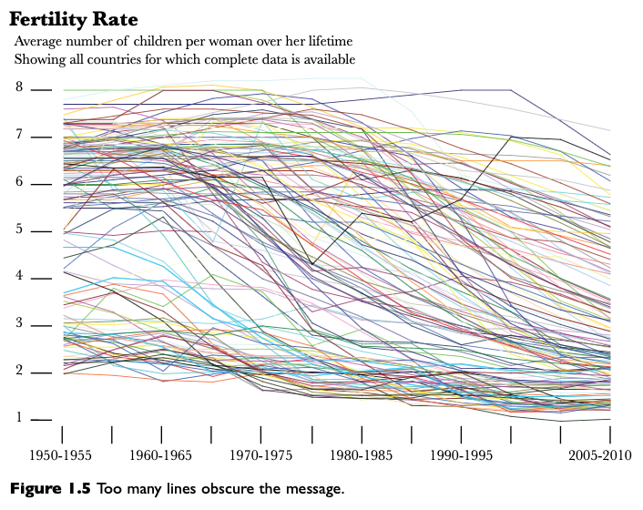

- what you show can be as important as what you hide

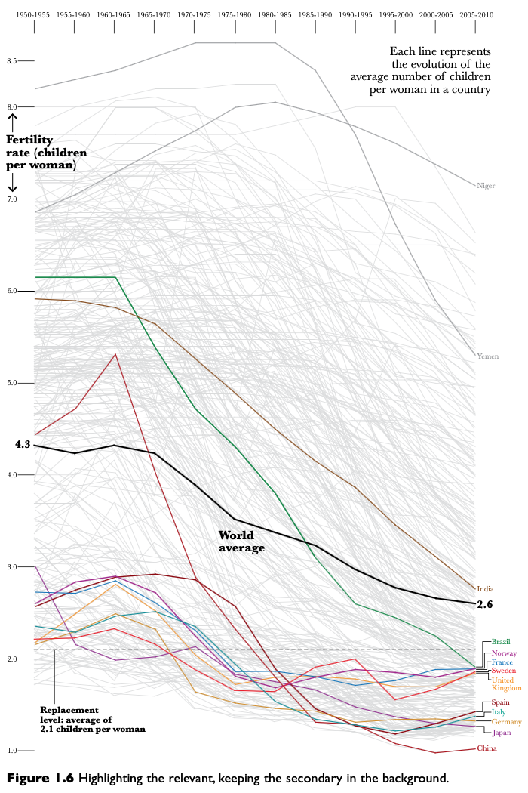

- **if you don’t present your data to readers so they can see it, read it, explore it, and analyze it, why would they trust you**
- the new graphic allows readers to present the claims by Ridley so they can verify them

#### From Information to Wisdom
- amount of information is getting bigger by each day
- information must be organized (e.g. by "information architects") 
- you have to help users avoid _information anxiety_, the black hole between data and knowledge

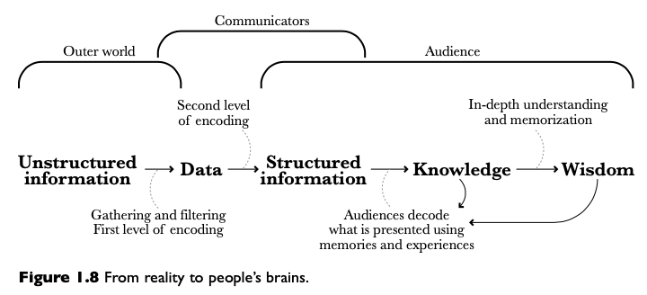

- flow is from "reality" to people's wisdom
- role of an information architect is to anticipate this process and generate order before people’s brains try to do it on their own
- visualization design is a form of information architecture and information design
- Definition for visualize: "to make certain phenomena and portions of reality visible and understandable; many of these phenomena are not naturally accessible to the bare eye, and many of them are not even of visual nature." by Joan Costa in La esquematica: visualizar la informacion
- Why not visual nature? -> graphical displays can be __figurative__ or __non-figurative__
- figurative: map as scaled portrait of geographical area
- non-figurative: no mimetic correspondence between what is being represented and its representation

### Formas and Functions: Visualization as a Technology:
- the function constrains the form
- always ask yourself: __what does the designer want me to do with this graphic?__

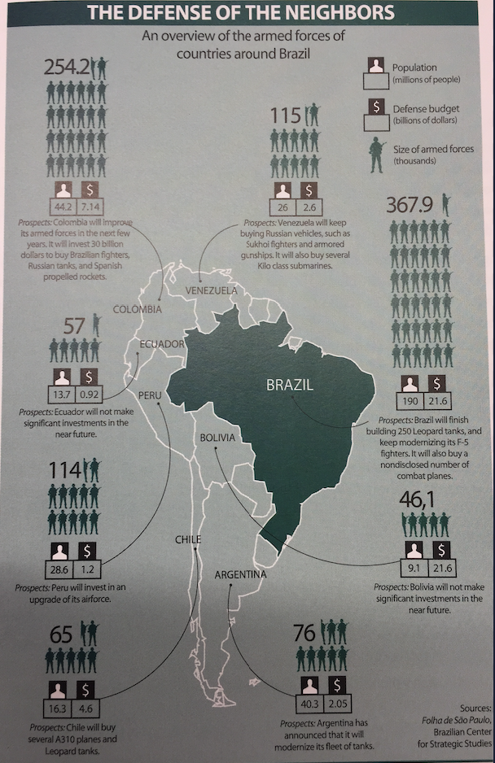

- possible tasks for this example:
1. present several variables - armed forces personnel, population to be defended, defense budget, ...
2. allow comparisons at a glance (who has the biggest, who the smallest, which one is bigger,...)
3. help organize countries, from biggest to smallest, ..
4. make correlations or relationships between variables apparent
- this one only solves 1.

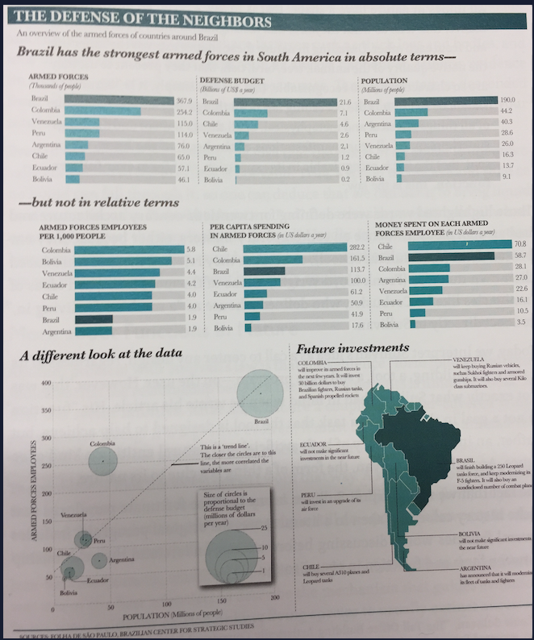

- in most cases there is not just one way of encoding a particular set of data
- the better defined the goals of an artifact, the narrower the variety of forms it can adopt

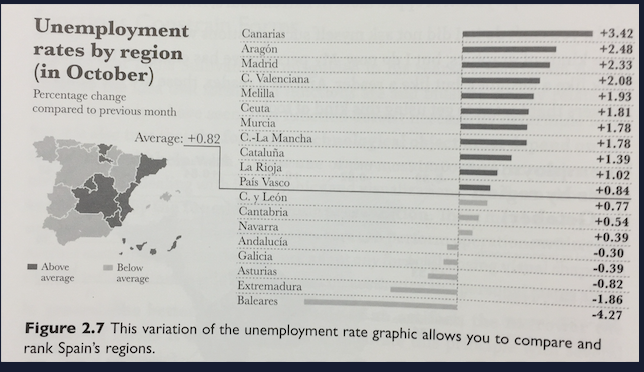

- bubbles are bad for comparisons

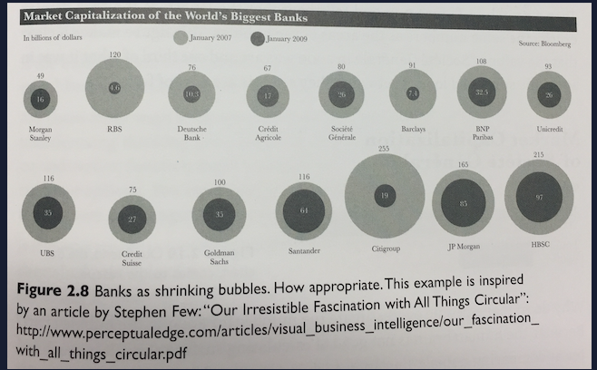

- but if you don't need that, you can use them 

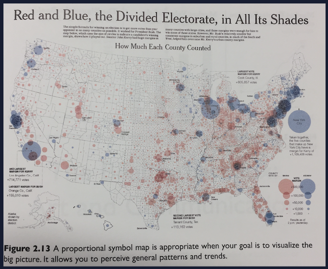

## Cognition

## Practice

## Profiles