# The Truthful Art
#### by Alberto Cairo

## Some sentences from the back of the book

In *The Truthful Art*, Cairo transforms elementary principles of data and scientific reasoning into tools that you can use in daily life to interpret data sets and extract stories from them.   

*The Truthful Art* explains: 

- The role infographics and data visualization play in our world
- Basic principles of data and scientific reasoning that anyone can master
- How to become a better critical thinker
- Step-by-step processes that will help you evaluate any data visualization (including your own)
- How to create and use effective charts, graphs, and data maps to explain data to any audience

## A really short summary of what I have read so far

**A good visualization is:**
1. reliable
2. visually encoded
3. organized
4. attractive

**First insights:**
- Getting the information right comes first
- Do not oversimplify
- Combine Words with graphics

There are **five qualities of great visualizations**:
1. truthful: it's based on thorough research
  	- read the visualization, don't only look at it
2. functional: it constitutes an accurate depiction of data
    - help the audience to interpret it correctly
3. beautiful: it attractive, intriguing, aesthetically pleasing
    - simplicity is very important
4. insightful: it reveals evidence
    - makes it possible to reveal valuable insights
5. enlightening: it will change our minds for the better
    - do good with your (good) data

Don't rush to design a visualization: 
- Stop and think
- **Look for other sources** to escape from tunnel vision and confirmation bias
- **Explore your information** at multiple levels of depth and breadth.
- Then: Make a decision about what to say, how to say it

**More insights:**
- Show a summary first, but also let people explore as many layers of depth and breadth as is appropriate
- We will never know what "absolutely true" really means
- There is always a certain degree of randomness/uncertainty

To find the **right graphic form:**
1. Think about the task(s) you want to enable: **Plot what you need to plot.** If you don't know what that is, plot many features of your data until the stories they may hide rise up
2. Try different graphic forms
3. Arrange the components of the graphic so it is as easy as possible to extract meaning from it. When appropriate: add exploration
4. Test the outcomes

**Useful insights in Part II:**
- **Finding stories** is sometimes a matter of repeatedly asking ourselves what would happen if we **plot our data in a different way**
- Organizing the data in different ways may result in different questions. E.g. arrange states alphabetically, by region, from highest to lowest, ...
## A visual summary

The following two pictures are a visual summary of the Introduction, Part I (chapters I, II) and chapter III. If you would rather like to read a few sentences/bullet points, just scroll a bit down. 

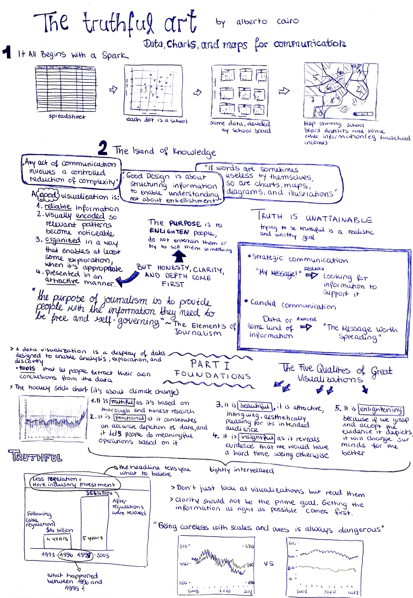

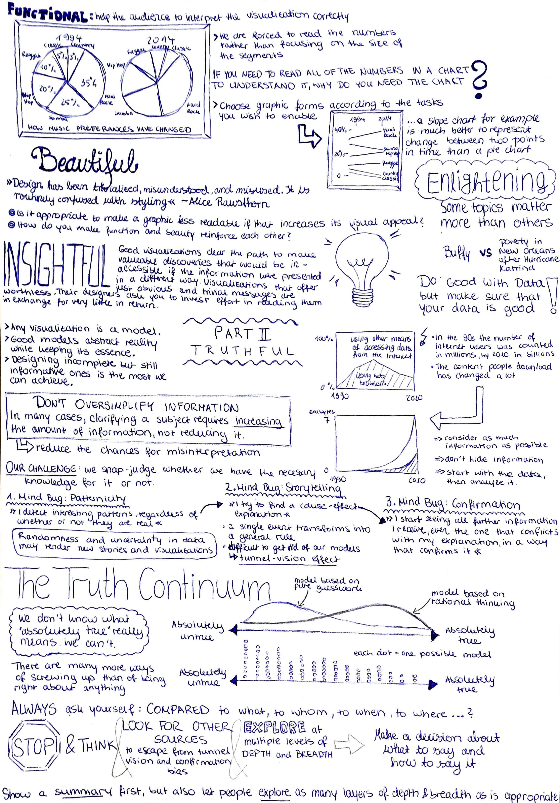

## Introduction

**First insights:**
- Getting the information right comes first: The quality of your graphics depends on the quality of your research.
- Try being concise and clear, but do not oversimplify.
- Good Design is about structuring information to enable understanding: aesthetic can be helpful, as it can make our message more attractive.
- Graphics are cognitive aids
- Words can be useless by themselves, as can charts, maps, diagrams.
- Good data visualizations communicate information and may prompt exploration, so that they lead to new questions

**A good visualization is:**
1. *reliable* information
2. visually *encoded* so relevant patterns become noticeable
3. *organized* in a way that enables at least some exploration, when it's appropriate
4. presented in an *attractive* manner (**But:** honesty, clarity, and depth come first. Enlighten people, but do not entertain them or try to sell them something)

**Types of communication**
1. strategic communication: you have a message and then look for information to support it
2. candid communication: you have the information first, then you analyze it to discover the messages

## Part I: Foundations

### The five qualities of great visualizations

1. Truthful
2. Functional
3. Beautiful
4. Insightful
5. Enlightening

The five qualities are tightly interrelated. E.g. to create a truthful graphic, you also need to pay attention to its functions.

### 1. Truthful

**...it's based on thorough and honest research**

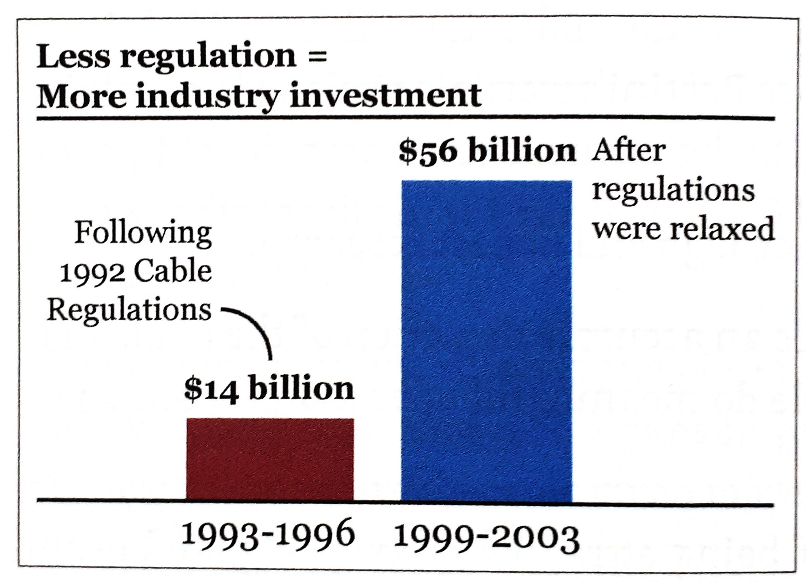

This is not a truthful graphic: 
- the heading tells you what to believe
- what happened between 1996 and 1999?
- the first bar covers 4 years, the second one 5 years 

**Learnings:** 

- do not just look at visualizations, but *read* them
- if someone hides data from you, it's probably because he has something to hide
- clarity should not be the prime goal. Getting the information as right as possible comes first

### 2. Functional

**...it constitutes an accurate depiction of data, and lets people do meaningful operations based on it**

- help the audience to interpret it correctly

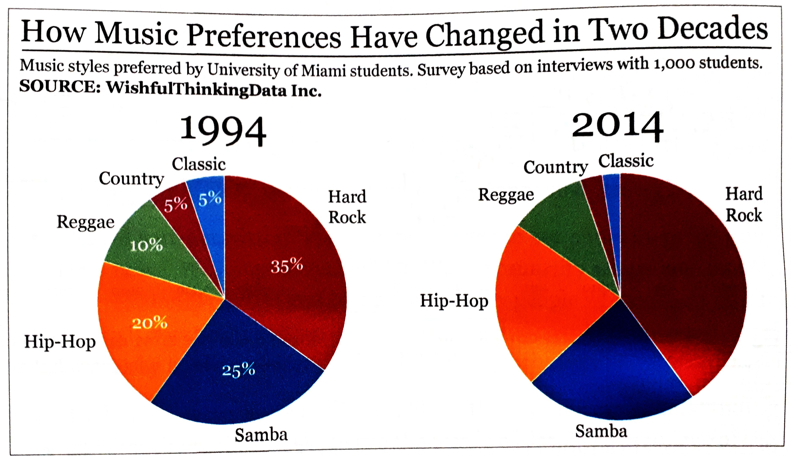

This is not a functional graphic: 
- we are forced to read the numbers rather than focusing on the size of the segments
- comparing slices is really difficult

**Learnings:** 

- pie charts are not functional
- choose graphic forms according to the tasks you wish to enable
  - A slope chart is much better to represent change between two points in time than a pie chart.
  
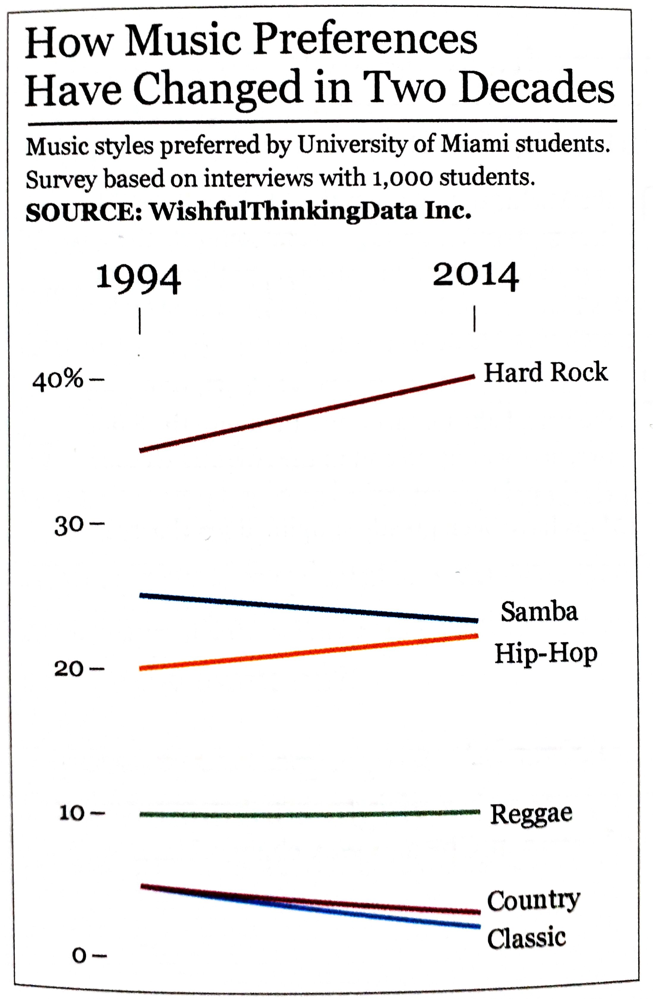

### 3. Beautiful

**...it is attractive, intriguing, aesthetically pleasing for its intended audience**

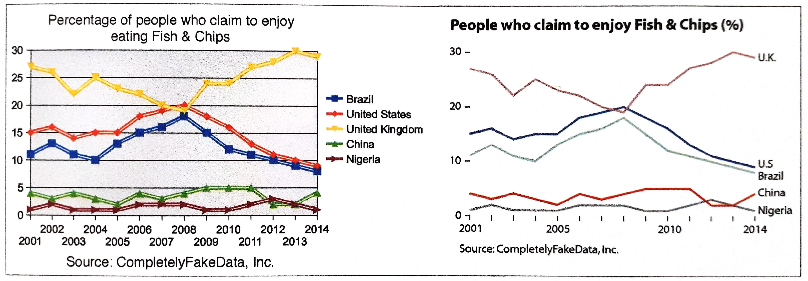

- what matters is that the object is experienced as beautiful by as many people as possible
  - e.g. in the graphic above, the majority of readers would describe the second chart as more aesthetically pleasing
- simplicity is very important: data visualization is not the same as data decoration

### 4. Insightful

**...it reveals evidence that we would have a hard time seeing otherwise**

- visualizations that offer obvious messages are worthless
- good visualizations clear the path to making valuable discoveries

**Two kinds of insight:**
1. spontaneous insight: "a-ha" moment; it is sudden, surprising, unexpected 
2. knowledge-building insight: gradual process of exploration of the information 

These two kinds of insights are related and can lead to newly generated insights

### 5. Enlightening

**...it will change our minds for the better, if we grasp and accept the evidence it depicts**

- some topics matter more than others because they are more critical to the well-being of more people.
- do good with data, but only after you have thoroughly made sure your data is good!

## Part II: Truthful

- any visualization is a *model*
- good models abstract reality while keeping its essence

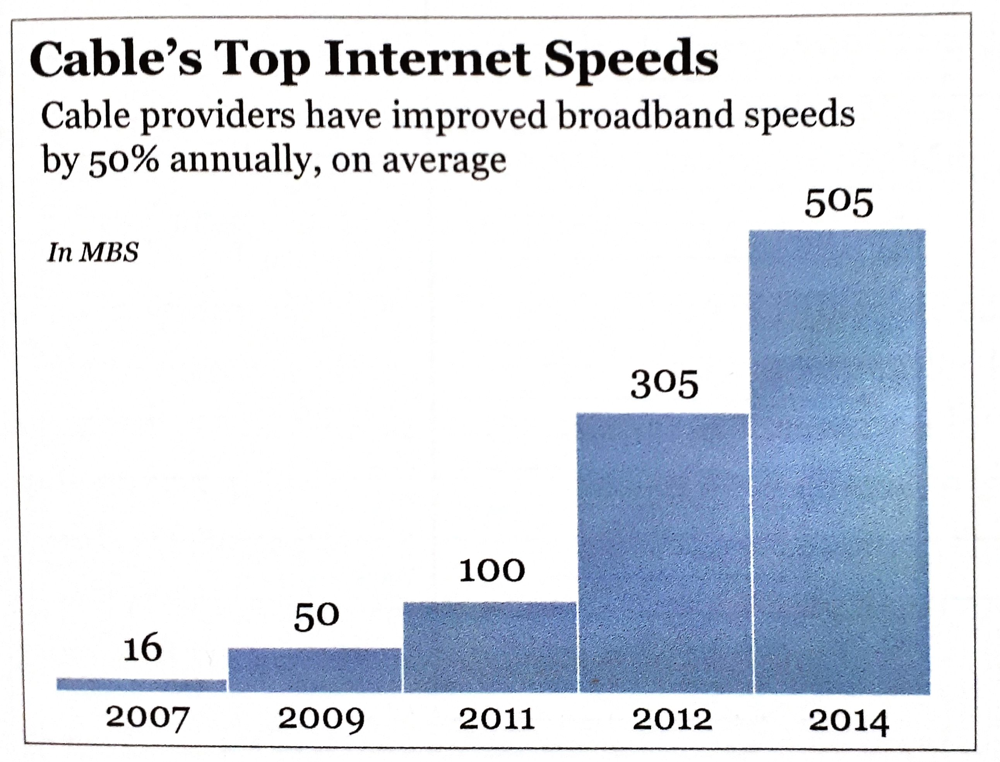

This example is not a good model for understanding the overall growth of Internet access speeds:
- only shows top speeds
- important information missing (average, minimum speeds ...)
- does not show all years

=> misleading your audience may yield benefits in the short term, but may destroy your credibility

Most of the time it is more complicated than it seems
- do not oversimplify information: in many cases, clarifying a subject requires increasing the amount of information, not reducing it 
- what you design is never exactly what your audience ends up interpreting, so reducing the chances for misinterpretation becomes crucial: e.g. add a textual explanation

**Why we are so often mistaken:** 
1. *patternicity bug*: I detect interesting patterns, regardless of whether or not they are real
    - randomness and uncertainty in data may render news stories completely meaningless
2. *storytelling bug*: I try to find a cause-effect explanation
    - a single event transforms into a general view
    - tunnel-vision effect
3. *confirmation bug*: I start seeing all information I receive in a way that confirms it, even the one that conflicts with my explanation
    - the way we present information matters as much as the soundness of the information itself

### The Truth Continuum 

- designing *incomplete* but still *informative* ones is the most we can achieve

When creating a model, you want it to be as close to the *truth* as possible.

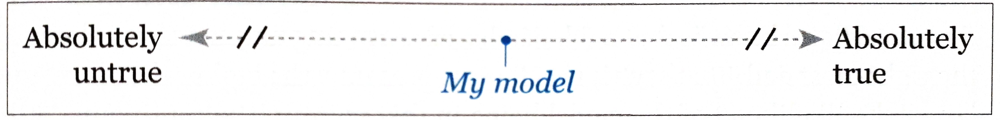

By applying logic, statistics, experiments you can move the model to the right. **But we will never know what "absolutely true" really means!**

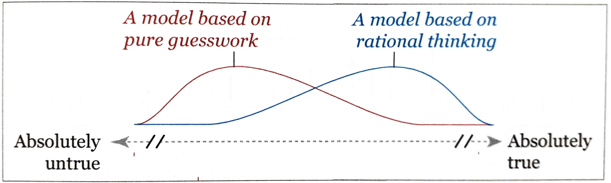

The higher the curve, the larger the likelihood of the model being in that point of the continuum. But it is always possible that the model is inadequate or that you have your lucky day, that's why the line extends all the way to the left/right. 

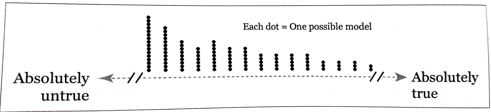

There are many more ways of screwing up than of being right about anything. 

*Always* ask yourself: **Compared** to what, to whom, to when, to where, ...?

Don't rush to design a visualization: 
- Stop and think
- **Look for other sources** to escape from tunnel vision and confirmation bias
- **Explore your information** at multiple levels of depth and breadth.
- Then: Make a decision about what to say, how to say it, and what amount of detail you need to use.

Show a **summary** first, but also let people **explore** as many layers of depth and breadth as is **appropriate**! 

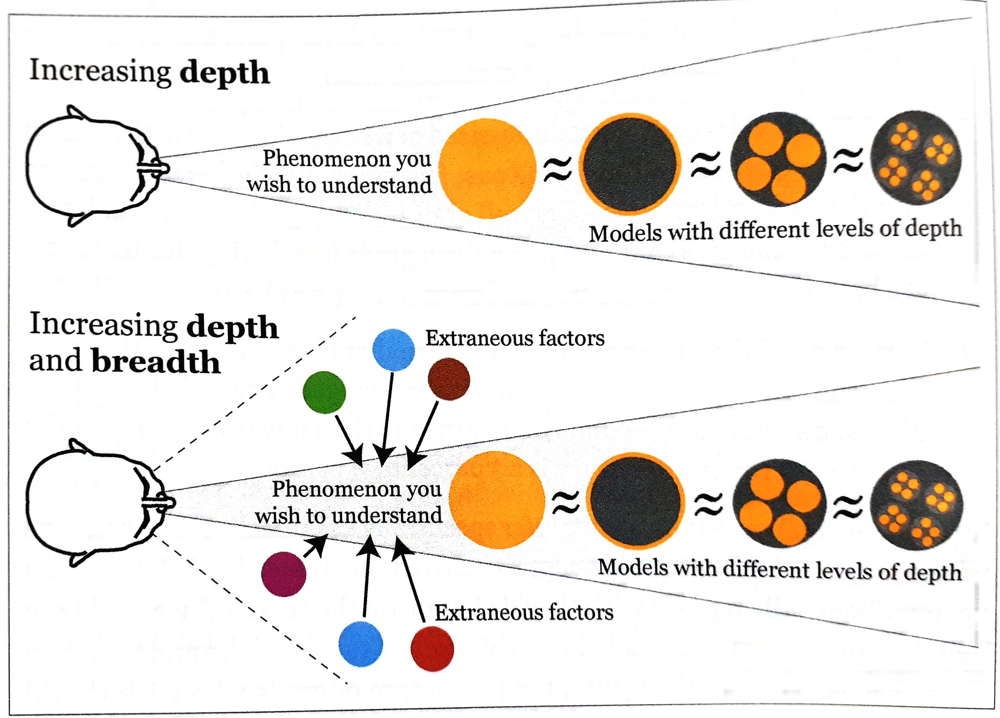

### Of Conjectures and Uncertainty

Knowing the methods of science, helps us to not get fooled by our sources. **Science** is a set of methods, a body of knowledge, and the means to communicate it. 

**Scientific discovery algorithm:**
- Formulate a conjecture, an informed hunch, about a phenomenon
- Formulate a hypothesis
- Study the phenomenon, and test your hypothesis
- Draw conclusions
- Put a theory together

=> Good answers lead to good questions that lead us closer to the right in the truth continuum.

*Conjectures* first need to make sense and need to be testable. Its components should be connected to each other. If you change one of it, the whole conjecture should need to be rebuilt.

*Hypothesis* is a conjecture formalized to be tested empirically. What and how are you going to measure?

**Variables** 
- crucial when working with data
- help pick methods of representation for visualizations

**Classification** of variables:
- *nominal scale:* distinguished just by their identity (e.g. gender, location)
- *ordinal scale:* ranked/organized according to a magnitude, but without revealing their exact size in comparison to each other
- *interval scale:* based on increments of the same size and on the lack of a true zero point (e.g. measuring temperature in °F)
- *ratio scale:* everything of the above and an actual zero point (e.g. weight, height, speed)

Variable types:
- *discrete:* can only adopt certain values (e.g. cousins)
- *continuous:* can adopt any value on the used scale of measurement
- *extraneous:* not the value studied, can affect the result
  - *confounding:* can be integrated into the model
  - *lurking:* its existence or connection to the phenomenon is unknown to us
  
Always be **suspicious** of studies whose samples have not been **randomly** chosen. Ask yourself: Did the authors search for lurking variables or are there other factors they ignored?

With data there is always some uncertainty due to randomness.

## Part III: Functional

### Basic principles of visualization

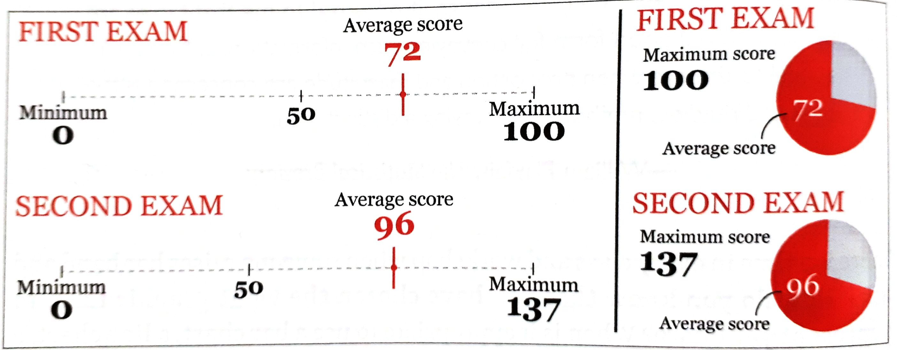

96 of 137 feels much higher than 72 of 100. Only when this is envisioned, they can grasp the truth. **That's why visualizations work.**

#### Choosing graphic forms

- mapping data into visual properties

To find the right graphic form:
1. Think about the task(s) you want to enable: **Plot what you need to plot.** If you don't know what that is, plot many features of your data until the stories they may hide rise up
2. Try different graphic forms
3. Arrange the components of the graphic so it is as easy as possible to extract meaning from it. When appropriate: add exploration
4. Test the outcomes

- Multiple forms may enable multiple tasks
- To show both the big picture and the details: E.g. show the map and the chart
- Use logical and meaningful baselines

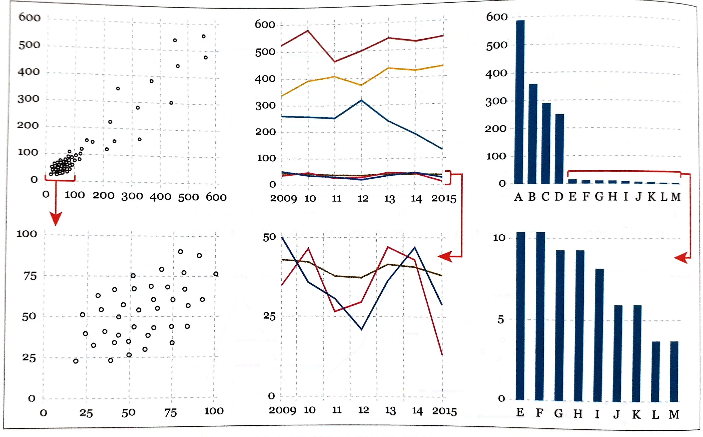

If your data vary so much that presenting them all on a single chart renders it useless, plot your data in several charts with dissimilar scales.

- Try all kinds of graphic forms and compare them

### Exploring Data with simple charts

- Do not focus on how much people earn on average but on *how much the average person earns*
- mean vs. median 
- When calculating the mean scores of groups of different sizes, calculate the **weighted mean** 

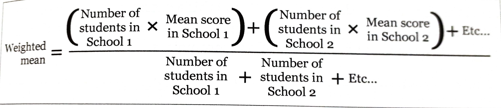

- **Finding stories** is sometimes a matter of repeatedly asking ourselves what would happen if we **plot our data in a different way**.
- Organizing the data in different ways may result in different questions. E.g. arrange states alphabetically, by region, from highest to lowest, ... 
- It all depends on what we want to see.

### Visualizing Distributions

### Revealing Change

### Seeing Relationships

### Mapping Data

### Uncertainty and Significance

## Part IV: Practice

### On Creativity and Innovation

