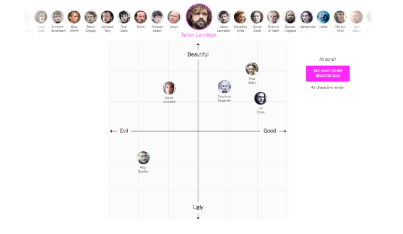
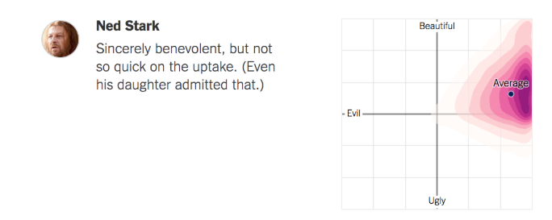

# NYT visualization list

We chose three or less interesting examples
## Game of thrones sentiment

### Reading the visualization
The visualization is divided in two parts. The part where you input your data and one where you see a heat map of all votes. The general form of visualization is a coordinate system, on the x-axis is from evil to good, the y-axis from ugly to beautiful.

### What kind of visualization 
#### Visual elements
- coordinate systems

### Data
- 2d data

### Mapping data to visualization
- live
- projected

### User interaction
- input data for each character

