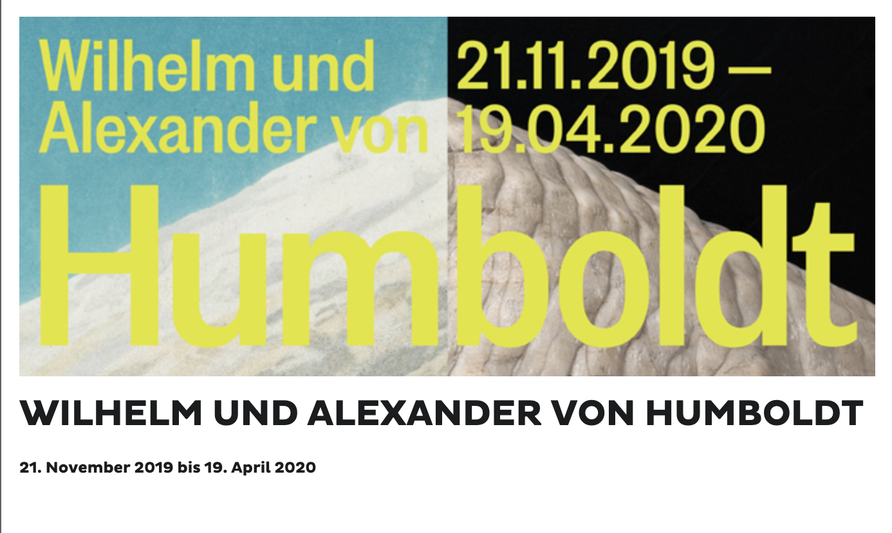
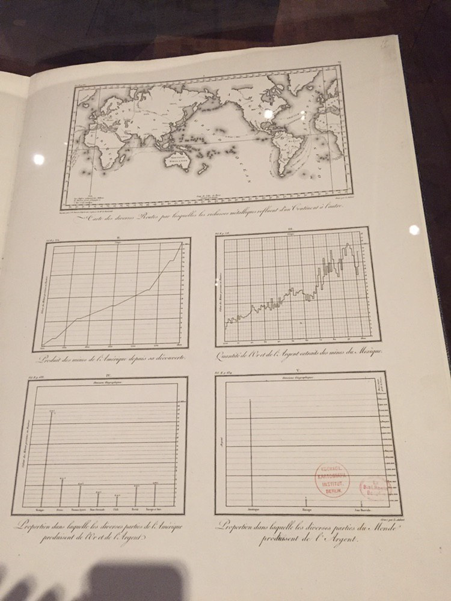
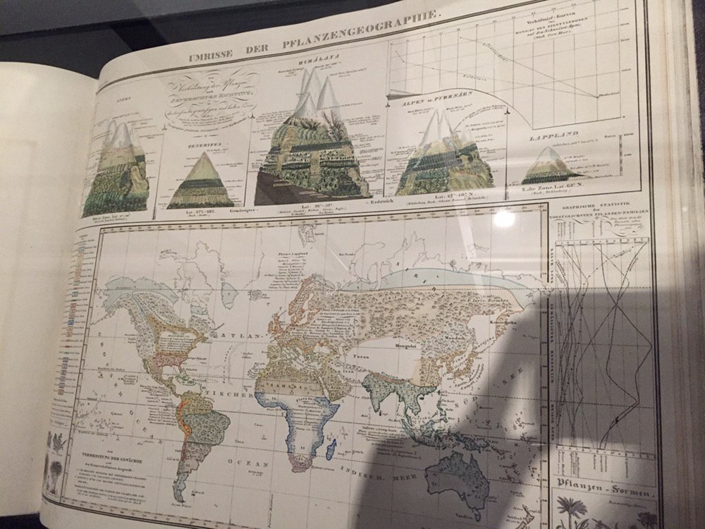
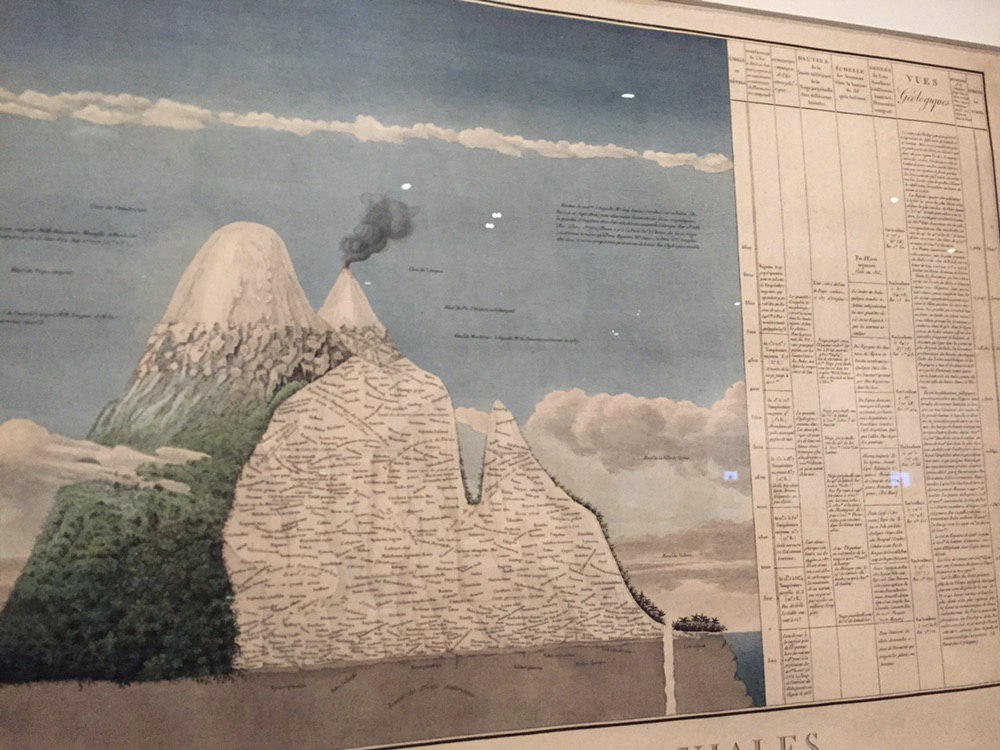
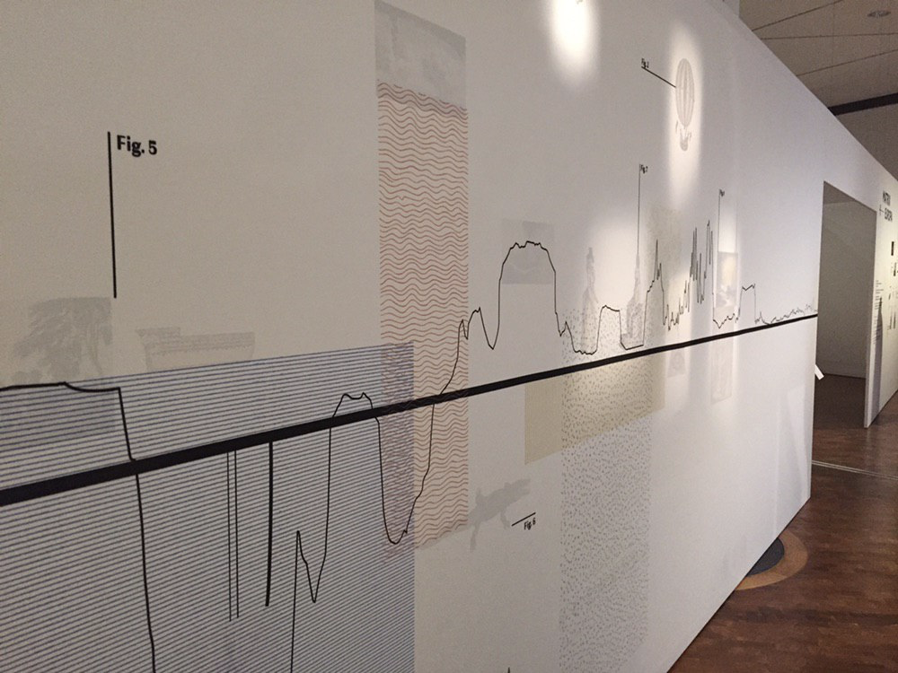
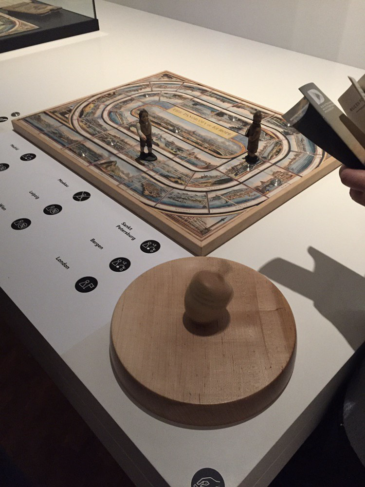

## Exploring Humboldt

#### Visited at: 22.12.19

The exhibition was supposedly about both brothers - however I could not help but feel that Alexander von Humboldt was favored quite a bit. Seems that expeditions into the "wild" sell better than educational reforms and linguistic studies. The exhibition was well curated and very interactive. (If you have the time I recommend a visit.)

The part dedicated to Alexander von Humboldts journeys featured some of his own documentation of his findings. And he also used diagrams to do that. Before I was informed of the No Pictures Policy I myself was able to document some of these. :D 

### Humboldt's visualizations

#### Scientific Plots To Show Results

- working with comparisons and multiple diagrams shown together
- mainly scientific plots

#### Overview About A Whole Scientific Field

- Humboldt sure liked his "Overview about everything" pages
- not suited to convey information easy and fast 
- it's probably interesting to take a "deep dive" and actually explore it 
  - I would guess there is some interesting connections to find there
  - however exploration needs to be done completely on own's own -> no guidance whatsoever 

#### Overview About One Environment 

- usage of a word cloud 
  - context shown by form of word cloud (it's environment)
- table as a a way of conveying structured information

### Bonus 1: Exhibition art or visualization?

Found at the entrance to the exhibition. I found the usage of different textures interesting. However I could not find an explanation or map legend, so the user interface did not live up to expectations.

### Bonus: Educational games in the 1800's

Educational game from the Humboldt brothers youth that I found too entertaining to not share. Basically you try to get from Bergen to London on a journey through Europe. To get forward you use the dice with 8 sides shown on the bottom of the picture and step according to its value. Whenever you reach a new city you read the educational information about the new city in a accompanying booklet. Some times special actions happen, often times explained by the booklet according to special "features" of the city. 
My favorite: When you reach Moskau you are "just like Napoleon" kicked out of the game. 