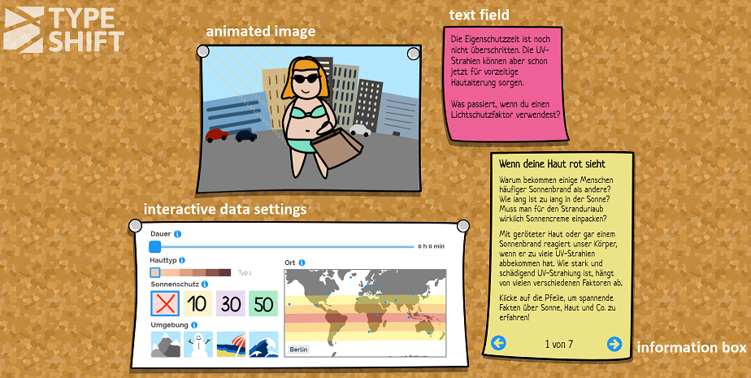

# Sunburn

[Sunburn Website](https://typeshift.io/sunburn/) by Doreen Stahr (D-School) and Robin Schreiber (IT Systems Engineering)

  
  
#### "reading" the Visualization
  - first we noticed the animated image
  - second we tried to manipulate the data
  - then we noticed the text field changing
  - lastly, we noticed the info box

#### what kind of visualization
  - animated image
  - text field 
  - information fields
  - text field with static information

#### what data
  - time duration as slider
  - distinct data (skin type, sun screen, environment)
  - world map with selected location and tropical and subtropical zone as overlay
  
  - probably hard coded
  
#### mapping data to visualization
  - user changes data, e.g. moves slider or selects an option, visualization is directly adapted
  - the image changes (background, sun rays, skin)
  - the text changes, computes a new value (intrinsic protection time) and suggests new action for user
  
#### what kind of interaction for the user
  - slider 
  - buttons
