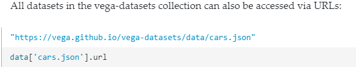
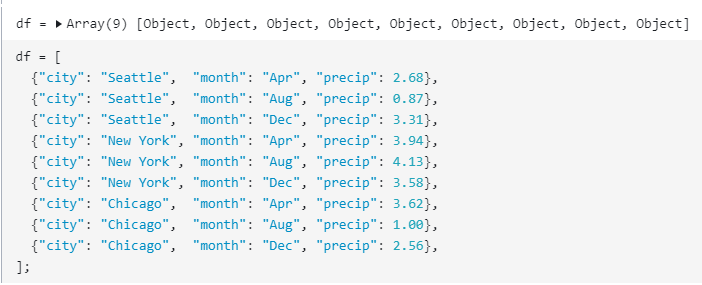
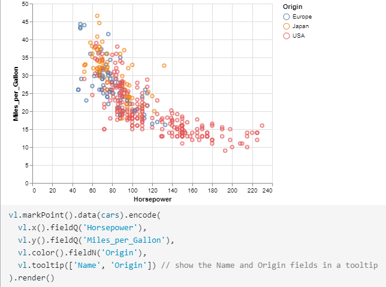
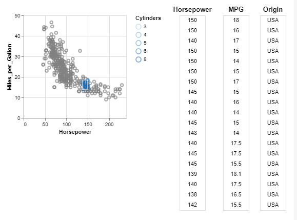
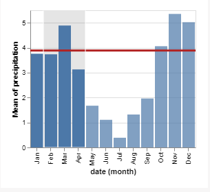

# Vega-Lite

- a declarative language for interactive data visualization

- possibility for generating projected and interactive graphics

- data import possible via json files

- or directly inside script on webpage with dataframes

- create different visualizations with scripts and calls to the vega-lite api

- different diagrams: e.g. bar charts, scatter and strip plots, line charts ...
[Examples can be found here](https://vega.github.io/vega-lite/examples/)

- various transform methods (aggregate, filter ...)
[Documentation can be found here](https://vega.github.io/vega-lite/docs/)

## Example: Brush table

### Reading the visualization

- on first glance appears to be usual Scatterplot graph with table of data points beside it
- reading the description we realized you can select a group of points and see the corresponding data points 

### What kind of visualization

- bar chart with red line for average

### What data

- shows mean of precipitation per month in Seattle
- data from vega seattle-weather.csv

### Mapping to Visualization

- projected
- automated

### What kind of interaction for the user

- select data points to be shown (first 20 that you select)

## Example: Interactive Average

### Reading the visualization

### What kind of visualization

- Scatterplot and table of data points

### What data

- shows the relationship between "Miles per Gallon" and "Horsepower" for a dataset of international cars
- data set is from v1 library, "cars.json"
- in theory data could be replaced by own dataframe with optional direct input / live changes on data

### Mapping to Visualization

- projected
- automated

### What kind of interaction for the user

- select data points to be shown (first 20 that you select)

