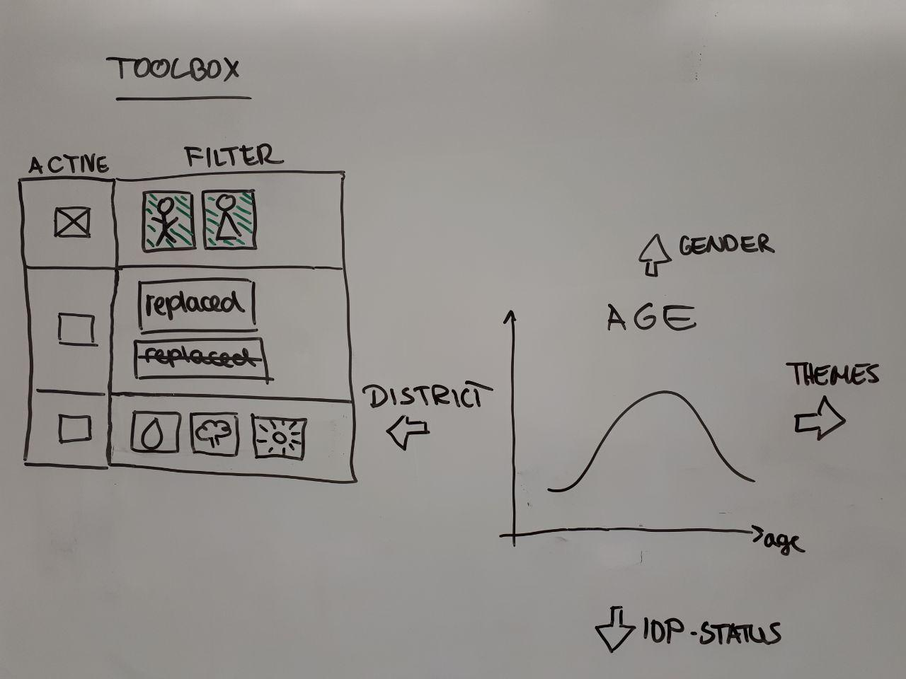
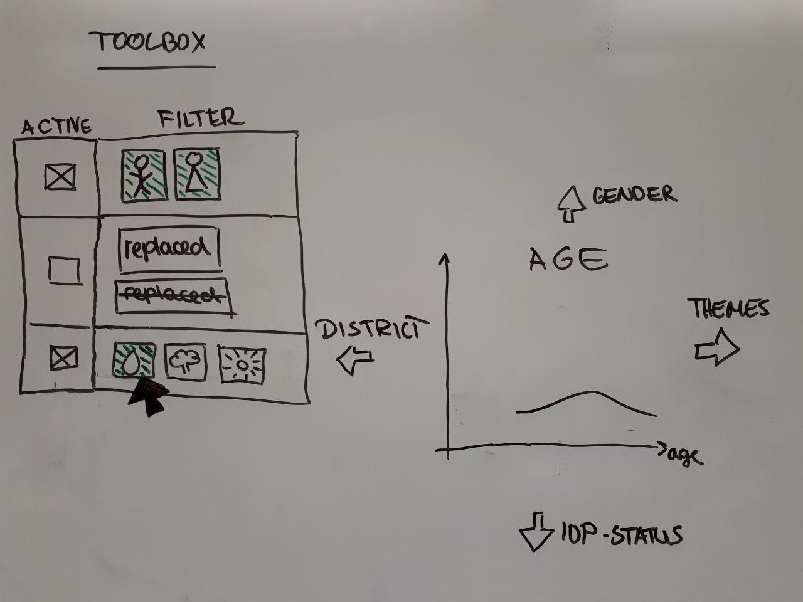
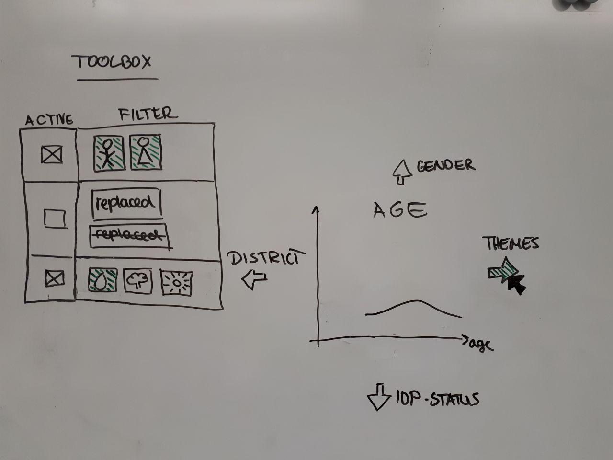
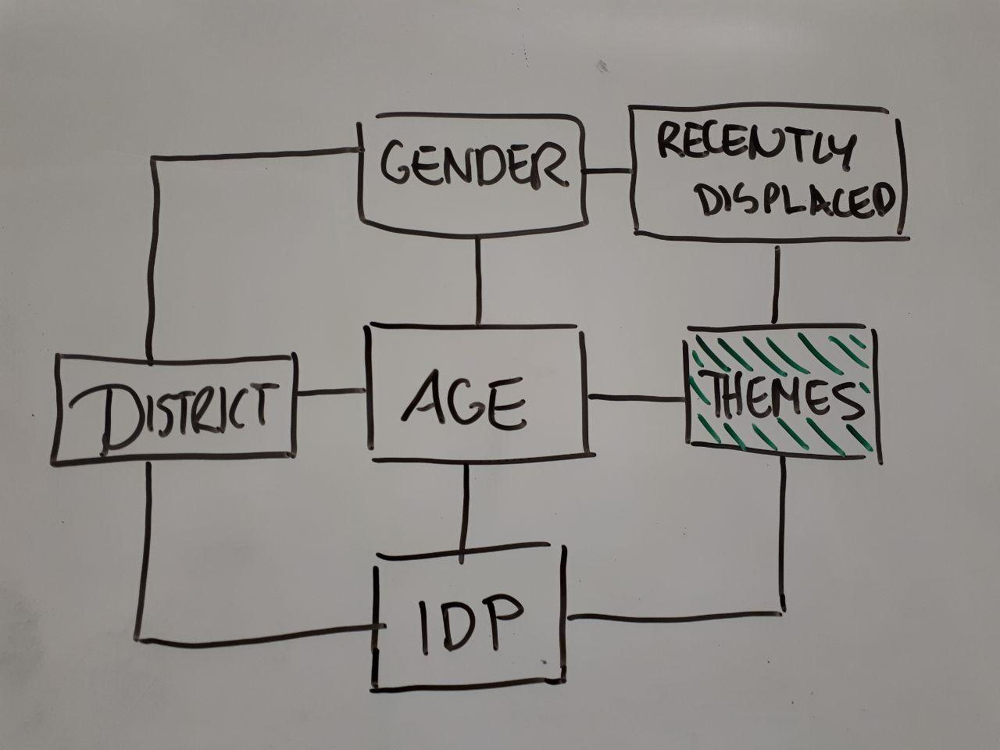
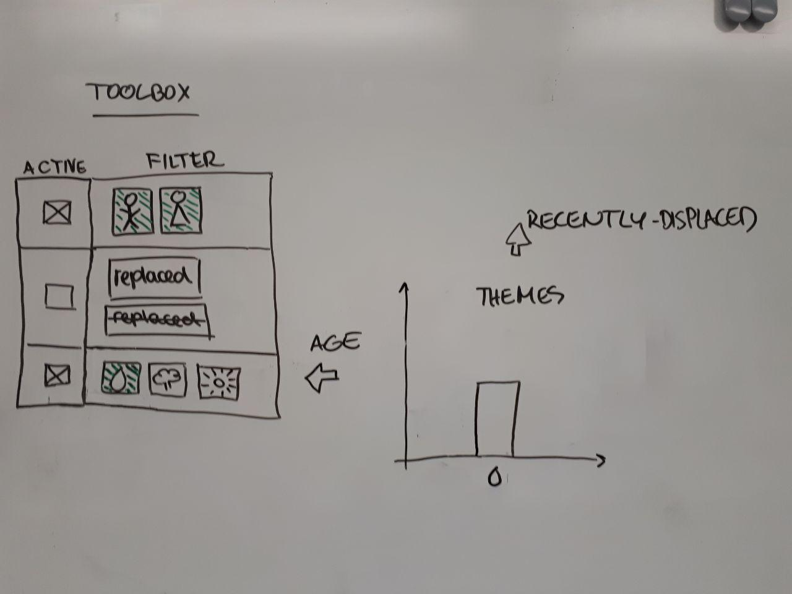
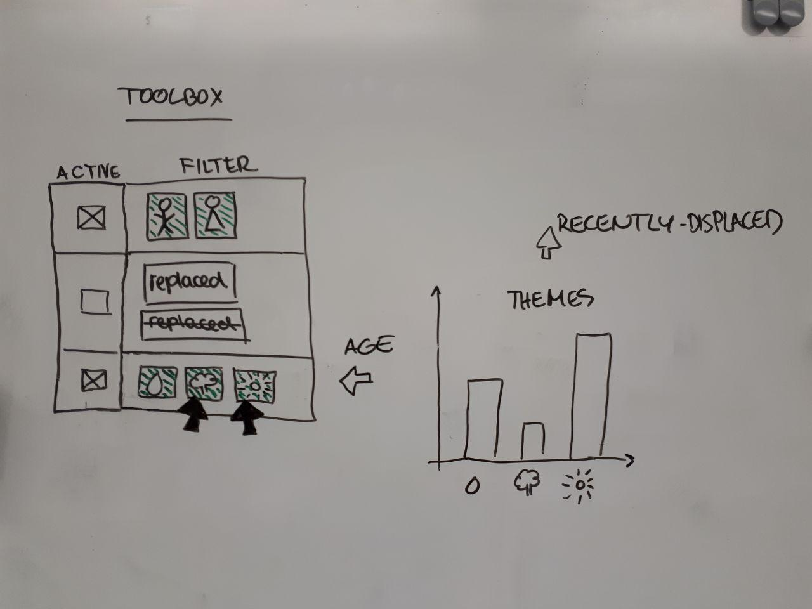

<!-- markdown-config presentation=true -->
<link rel="stylesheet" type="text/css" href="./style.css"  />

  BP2019RH1 - Introduction, Motivation, Current Status

  Wanda Baltzer, Theresa Hradilak, Lara Pfennigschmidt, Luc Prestin, Moritz Spranger, Simon Stadlinger, Leo Wendt

  2020 
   
  Software Architecture Group  Hasso Plattner Institute  University of Potsdam, Germany

---

---

---

---

---

---

---

