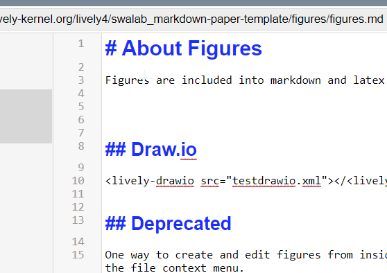

# About Figures

Figures are included into markdown and latex as png files. 

One can paste picures directly into markdown, a file will be uploaded and a link created.

{width=300px}

## Draw.io

generic syntax

and as tags...

<lively-drawio src="testdrawio.xml"></<lively-drawio>

## Deprecated

One way to create and edit figures from inside Lively4 is to work on a `figure.html` file and click on `save as png` in the file context menu. 

<lively-import src="example_figure.html"></lively-import>

