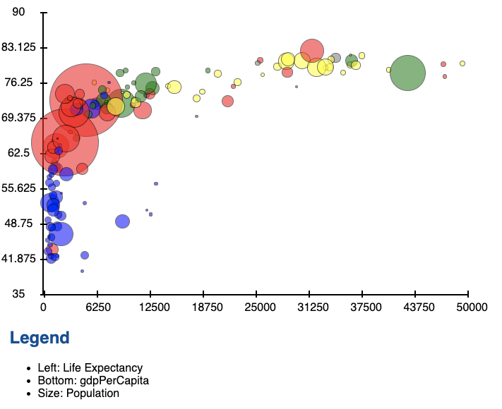
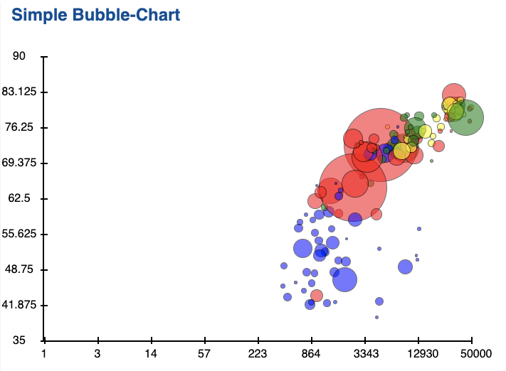
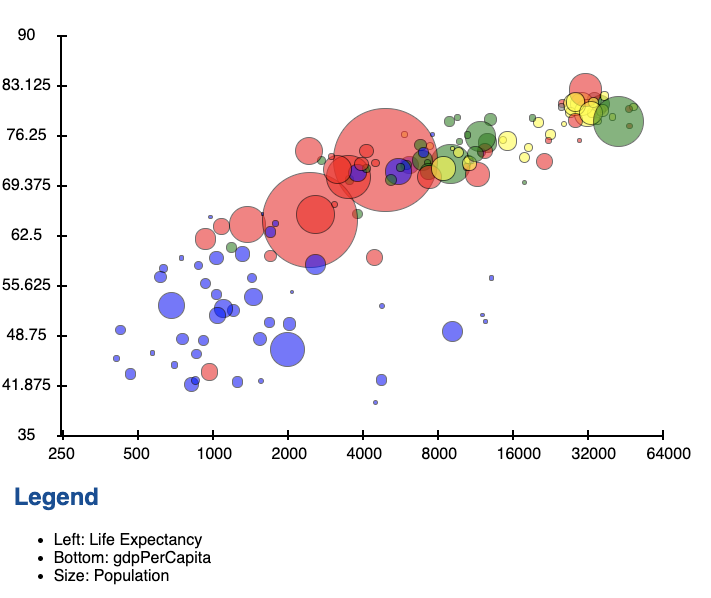

## Simple Bubble-Chart 

 

 

 <input type="number" onkeydown="updateXMax(this)"> 

## Legend
- Left: Life Expectancy
- Bottom: gdpPerCapita
- Size: Population

 

## Todos

- [X] Hover over bubble gives name and information
- [X] Fade out other bubbles when hovering over one bubble
- [ ] When hovering dotted lines indicated y and x value on the respective axes
- [X] logarithmic scales / correct area values
- [ ] move different scale calculations to functions
- [ ] user adjustable max and min values in diagram
- [ ] time slider

## Documentation

#### Different scales lead to vastly different visualizations

- Linear Scale:

- Purely Logarithmic Scale:

## Legend
- Left: Life Expectancy
- Bottom: gdpPerCapita
- Size: Population   

- Gapminder Logarithmic Scale:

