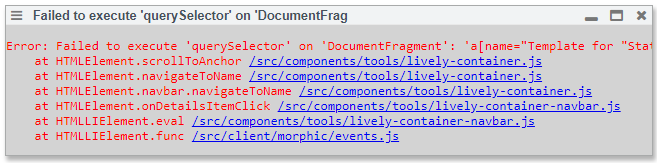
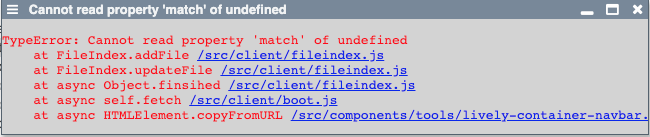

# kickoff.md 
  Seitenansicht funktionieren Links fuer "Template for State of the Art" und "State of the Art" in der Anschauansicht kaputt
  Bei Klick auf "Template ..." kommt folgende Fehlermeldung
  
  
  
# Dragging files doesn't work

beim move wird die Datei zum Subordner hinzugefügt, aber nicht aus dem Originalordner gelöscht. (möglicherweise aber auch nur ein temporärer Fehler, weil lively grad am indexieren war) 
beim drag and drop wird das genommen, was vorselected ist und nicht das, wo die Maus drüber ist.

# Löschen nicht gespeichert

Löschen eines Elementes löst kein Change aus

# Markdown editieren (what you see is what you get)
edit markdown: newlines are lost in what you see is what you get

# double execution active expression
active expression double execution of code

# file search open file in window 
when searching for a file or a string, one can try to open that file in a new window. Doesn't give you the file you wanted to open though, instead it gives you the lively README

# selections for methods are not updated
when clicking in the table of contents to find a method, it pre-selects the method. After editing the file, the pre-selections are offset by the length of the edit, meaning they are not updated
Or they are just wrong in themselves, without editing