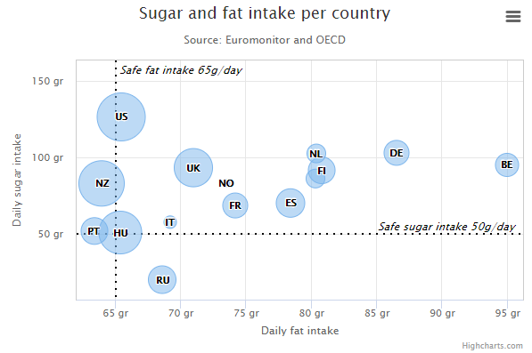
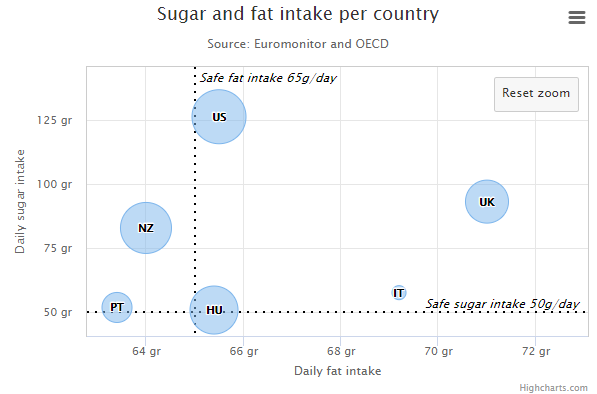
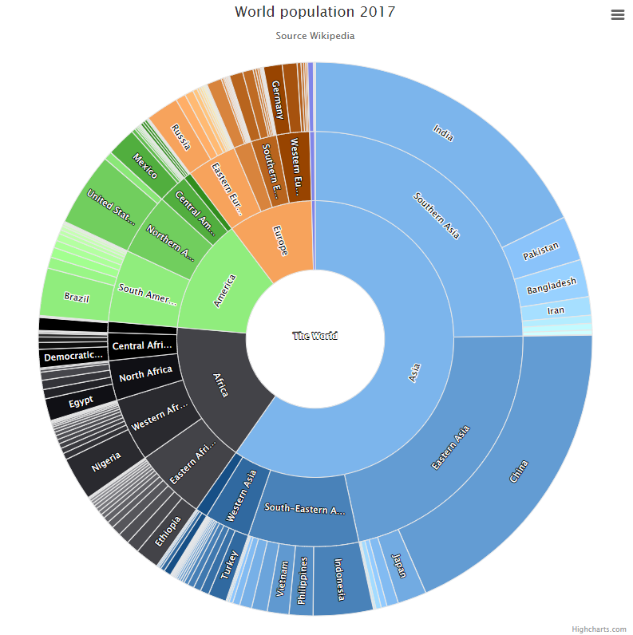
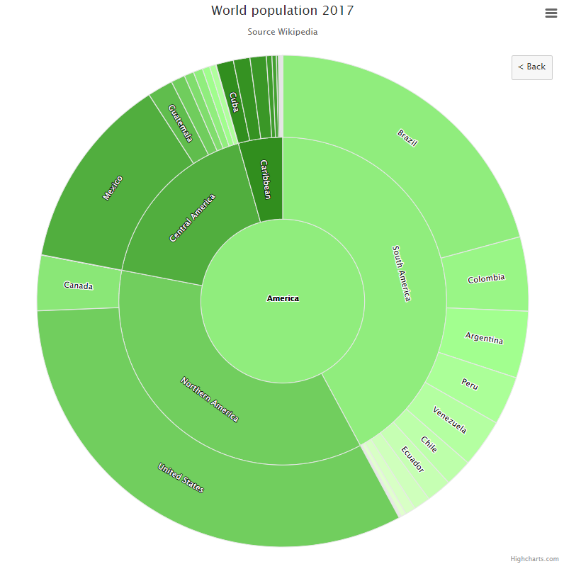
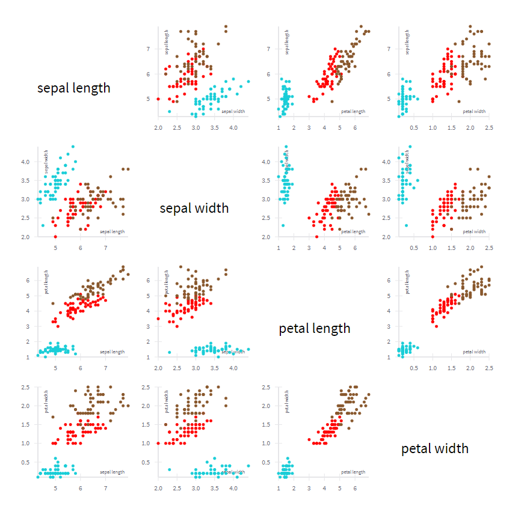
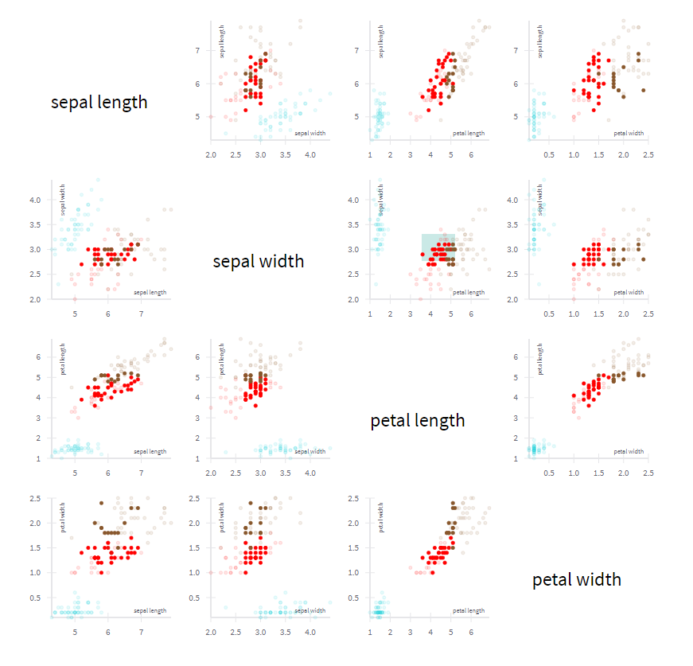

# Inspiration For User Interactions

## Zooming

<https://www.highcharts.com/demo/bubble>

- you can zoom into a selected area
- the graph readjusts and shows the selected area 

  

## Sunburst

<https://www.highcharts.com/demo/sunburst>

- clicking on a part of an inner circle, the diagram is readjusted
- it now only shows the parts on the outer circles that stand in relation to the selected one

  

## Dynamic Dashboard
<https://uber.github.io/react-vis/examples/charts/dynamic-dashboard>

- you can select some data in one diagram 
- this data is highlighted in all diagrams 

  
