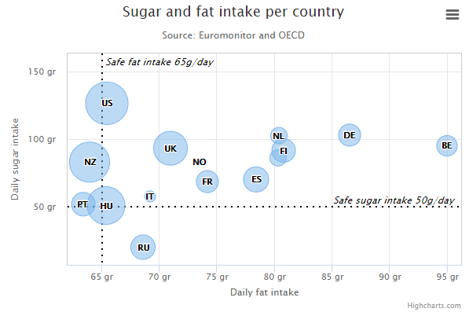
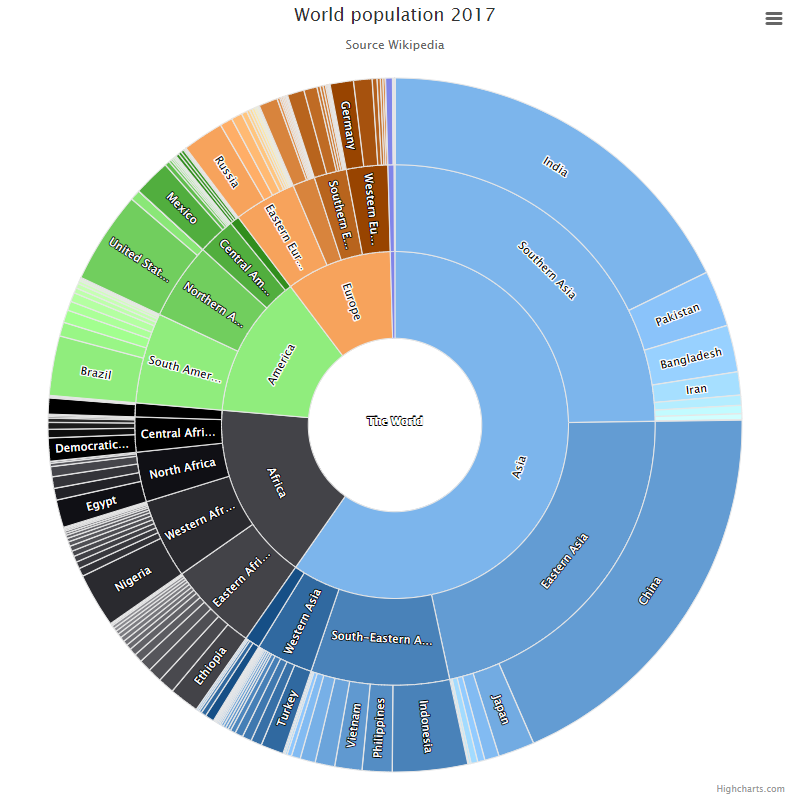
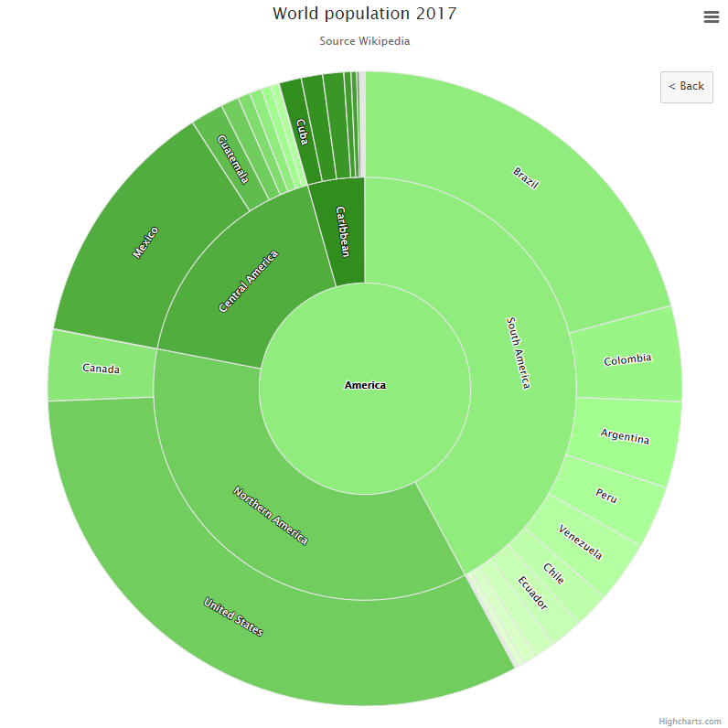
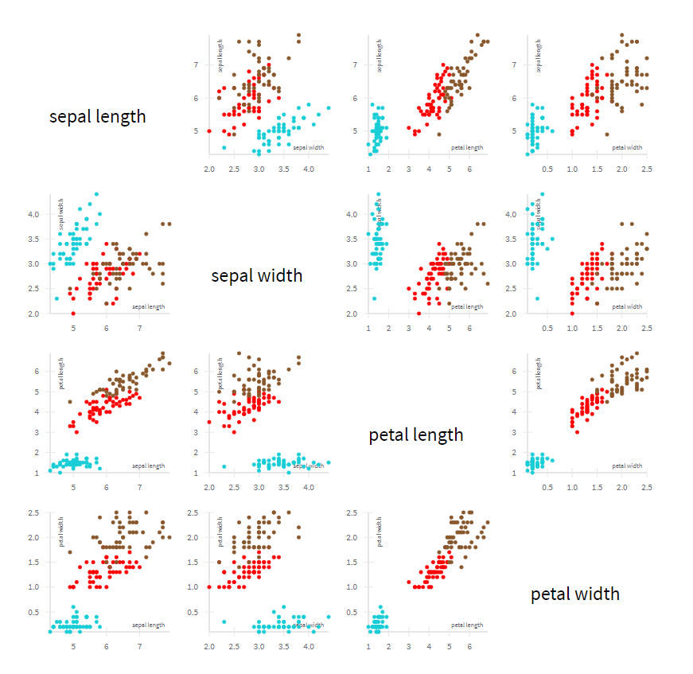
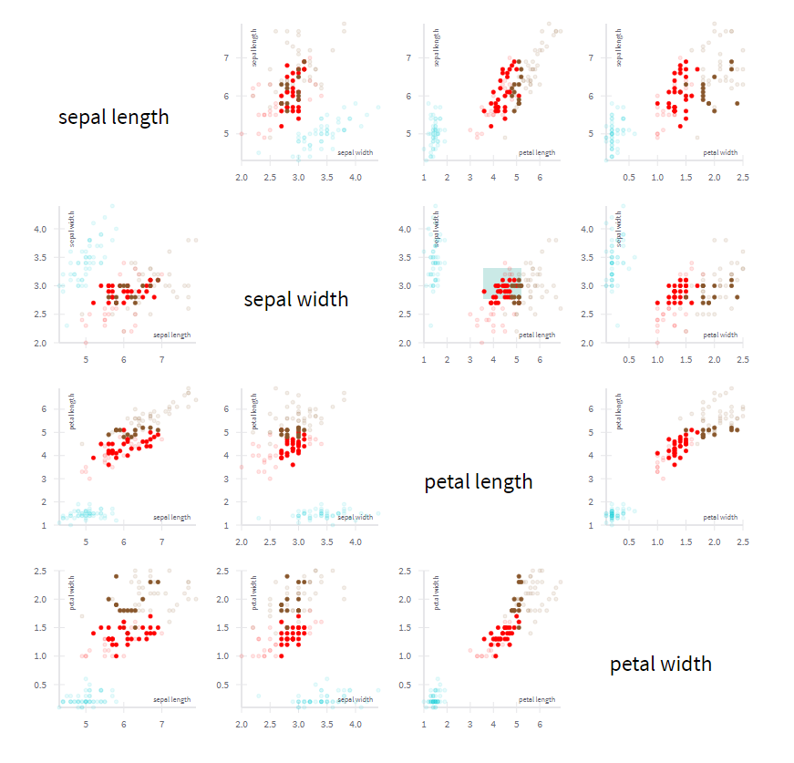
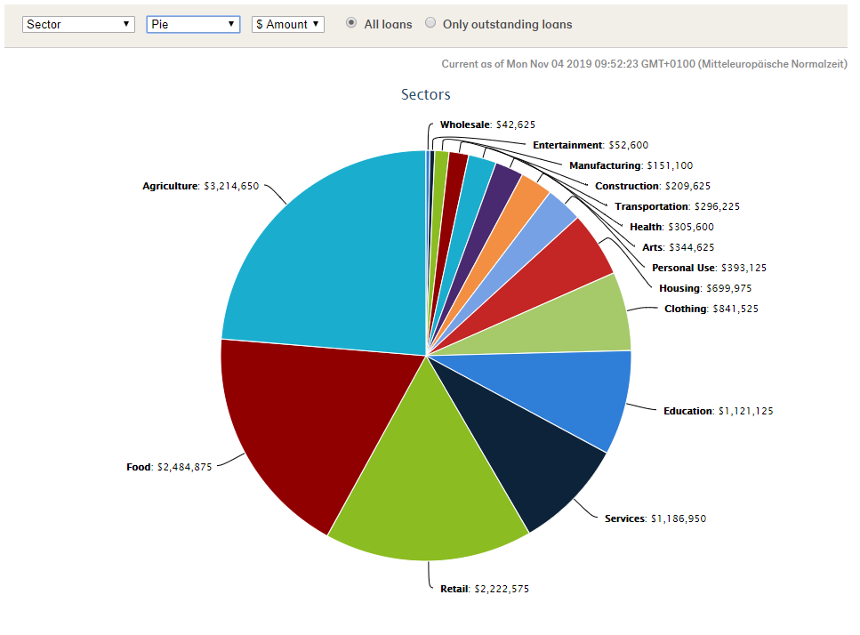
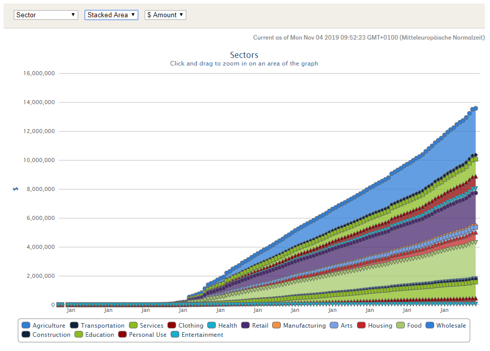
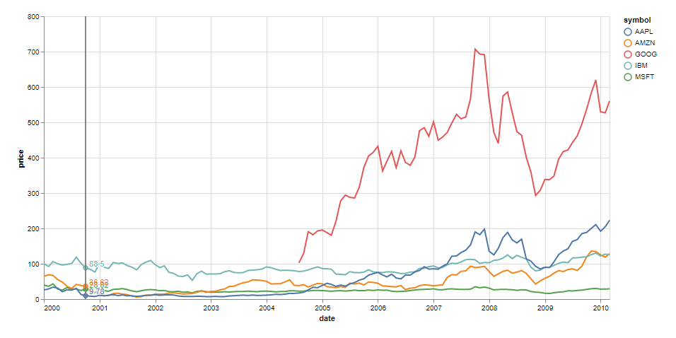

# Inspiration For User Interactions

## Zooming

<https://www.highcharts.com/demo/bubble>

- you can zoom into a selected area
- the graph readjusts and shows the selected area 

  

## Sunburst

<https://www.highcharts.com/demo/sunburst>

- clicking on a part of an inner circle, the diagram is readjusted
- it now only shows the parts on the outer circles that stand in relation to the selected one

  

## Dynamic Dashboard

<https://uber.github.io/react-vis/examples/charts/dynamic-dashboard>

- you can select some data in one diagram 
- this data is highlighted in all diagrams 

  

## Display data in different ways

<https://www.kiva.org/team/nerdfighters/graphs>

- the same data is displayed in different ways: 
  - different diagram types (pie, line, stacked area, % over time)
  - different units (amount $, count)

  

## Slicer

<https://vega.github.io/vega-lite/examples/interactive_multi_line_label.html>

- the slicer shows the values of all elements on the x-axis at the same time 

